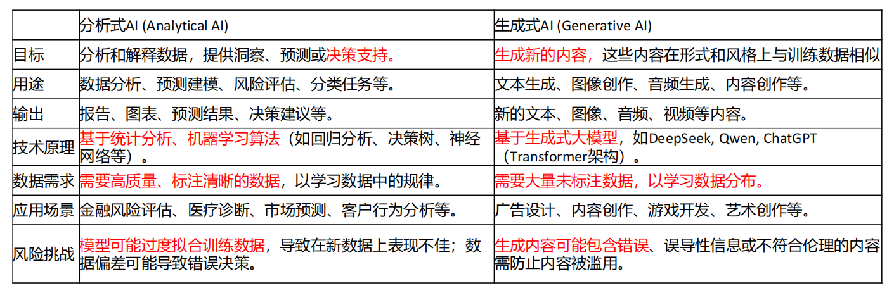

::: blog-post

## `分析式AI`与`生成式AI`

+ 分析式AI - (Analytical AI)
+ 生成式AI - (Generative AI)

### 二者的对比

+ 如果公司的数据资产主要是文字、图像或影片之类的非结构化内容，就应优先采用生成式AI。
+ 如果公司的数据大部分都是结构化、数字化，就应偏重分析式AI。
+ 生成式AI可以通过内容制作带来回报；
+ 分析式AI通常运用预测模型来预测需求、做出数据驱动的决策，从而带来更优异的经济回报。

### 二者结合使用

+ 企业内部，做的很多决策，不能用生成式 AI 来分析数据，很不稳定，不可信任，只能用机器学习，统计分析。
+ 用生成式 AI 来生成机器学习的算法，用生成的算法来进行数据分析。
+ 分析式 AI 来分析数据，更稳定、可靠，并且可溯源、可解释。

## 机器学习的模型

### 数据集

+ 国外的 kaggle , 有很多的数据集，都可以用来训练模型。
+ 国内的 阿里云的天池 , 有很多的数据集，都可以用来训练模型。

### 机器学习的十大经典模型 - kaggle 上投票选出来的模型

+ 分类算法：C4.5，朴素贝叶斯（Naive Bayes），SVM，KNN，Adaboost，CART
+ 聚类算法：K-Means，EM
+ 关联分析：Apriori
+ 连接分析：PageRank

### 经典模型的类型解释

+ 分类算法：预测一个样本属于某一类别的概率。 -- **按标准答案预测类别**
+ 聚类算法：将样本分组，使得组内的样本相似度高，组间的样本相似度低。 -- **按相似性自动分组**
+ 关联分析：发现数据中隐藏的关联规则。
+ 连接分析：发现数据中隐藏的连接关系。

### 分类算法和聚类算法的对比

> **分类是有监督学习，聚类是无监督学习。**

#### 📌 一、定义区别

| 项目         | 分类算法（Classification）             | 聚类算法（Clustering）               |
|--------------|----------------------------------------|--------------------------------------|
| 学习类型     | 有监督学习（Supervised Learning）      | 无监督学习（Unsupervised Learning）  |
| 是否需要标签 | 需要已知标签的训练数据                 | 不需要标签，自动发现数据结构         |
| 目标         | 预测新样本属于哪个预定义类别           | 将相似样本自动分组，发现隐藏模式     |
| 输出         | 明确的类别标签（如“猫”、“狗”）         | 簇编号或分组（如“组1”、“组2”）       |

#### 📌 二、简单举例说明

##### ✅ 分类算法例子：垃圾邮件识别
- **任务**：判断一封邮件是“垃圾邮件”还是“正常邮件”。
- **训练数据**：已有大量邮件被人工标记为“垃圾”或“正常”。
- **算法**：逻辑回归、决策树、SVM等。
- **过程**：模型从带标签的数据中学习特征（如关键词、发件人等），然后对新邮件进行分类。
- **关键**：必须有“正确答案”（标签）来训练模型。

##### ✅ 聚类算法例子：客户分群
- **任务**：将电商平台的客户自动分成不同群体，以便精准营销。
- **训练数据**：只有客户的购买行为、浏览记录等，**没有预先定义的群体标签**。
- **算法**：K-Means、层次聚类、DBSCAN等。
- **过程**：算法根据客户行为的相似性，自动分成若干组（比如“高消费活跃用户”、“低频低价用户”）。
- **关键**：没有标签，模型自己“发现”结构。

## 贝叶斯定理

+ 贝叶斯定理，是概率论中的一项重要原则。
+ 它提供了一种方法，让我们能够根据新的数据或证据来更新对某个事件发生概率的评估。
+ 简单来说，就是利用先验知识（对事件的初始认知）和新获得的观测数据，来计算后验概率（更新后的认知）。

在人工智能（AI）和机器学习领域，贝叶斯原理扮演着关键角色 。它被广泛应用于构建概率模型，这些模型能够根据新数据动态调整预测，从而持续改进性能 。具体的应用场景包括：

+ **分类任务**：这是贝叶斯方法非常有用的一个领域 。例如，朴素贝叶斯算法常用于文本分类，如垃圾邮件过滤、情感分析和新闻分类等自然语言处理任务 。它也用于文档分类  和信息检索 。
+ **处理不确定性与因果推理**：贝叶斯网络作为一种强大的工具，用于对不确定性进行建模和进行因果关系推理，并且相比一些深度学习“黑盒子”，它通常更具透明度和可解释性 。
+ **模型优化**：贝叶斯优化是一种利用贝叶斯原理的技术，用于优化机器学习模型的超参数、智能体策略等 。
+ **其他领域**：贝叶斯方法几乎可用于任何类型的学习任务，从单变量的分类与回归到多变量的结构化输出预测，从有监督学习到无监督及半监督学习 。它还被应用于医学诊断、金融风险评估等领域 。

总而言之，当你在学习AI应用时遇到“贝叶斯原理”，它很可能指的是利用贝叶斯定理来处理概率、更新信念、构建可学习模型或优化系统的一种核心思想和方法论。

:::
