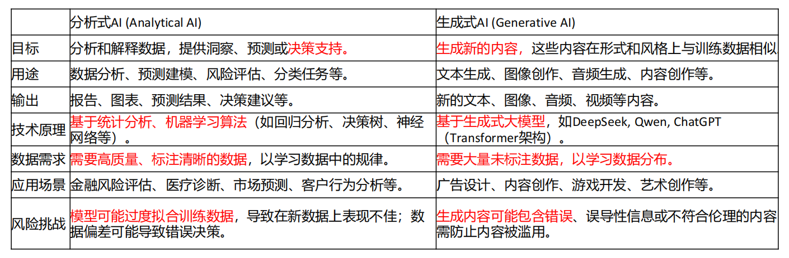
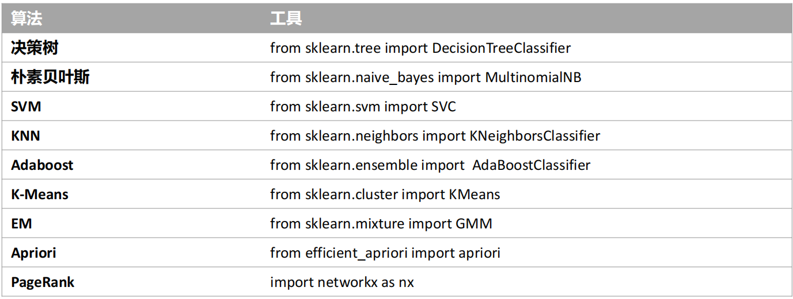
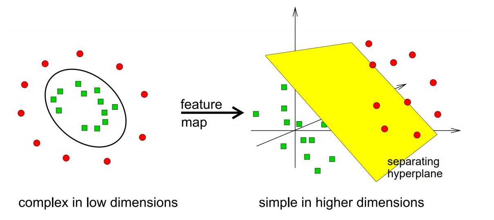
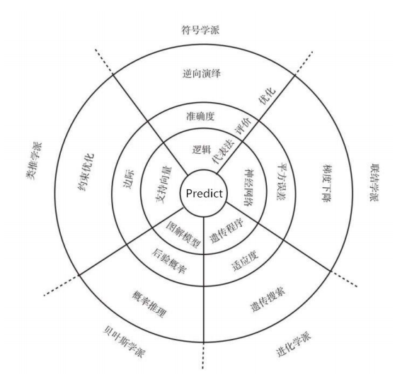

<BlogPost>

## `分析式AI`与`生成式AI`

+ 分析式AI - (Analytical AI)
+ 生成式AI - (Generative AI)

### 二者的对比

+ 如果公司的数据资产主要是文字、图像或影片之类的非结构化内容，就应优先采用生成式AI。
+ 如果公司的数据大部分都是结构化、数字化，就应偏重分析式AI。
+ 生成式AI可以通过内容制作带来回报；
+ 分析式AI通常运用预测模型来预测需求、做出数据驱动的决策，从而带来更优异的经济回报。

### 二者结合使用

+ 企业内部，做的很多决策，不能用生成式 AI 来分析数据，很不稳定，不可信任，只能用机器学习，统计分析。
+ 用生成式 AI 来生成机器学习的算法，用生成的算法来进行数据分析。
+ 分析式 AI 来分析数据，更稳定、可靠，并且可溯源、可解释。

## 机器学习的模型

### 数据集

+ 国外的 kaggle , 有很多的数据集，都可以用来训练模型。
+ 国内的 阿里云的天池 , 有很多的数据集，都可以用来训练模型。

### 机器学习的十大经典模型 - kaggle 上投票选出来的模型

+ 分类算法：C4.5，朴素贝叶斯（Naive Bayes），SVM，KNN，Adaboost，CART
+ 聚类算法：K-Means，EM
+ 关联分析：Apriori
+ 连接分析：PageRank

### 经典模型的类型解释

+ 分类算法：预测一个样本属于某一类别的概率。 -- **按标准答案预测类别** -- 御姐还是萝莉
+ 聚类算法：将样本分组，使得组内的样本相似度高，组间的样本相似度低。 -- **按相似性自动分组** -- 自动分组找规律
+ 关联分析：发现数据中隐藏的关联规则。 -- 找闺蜜 -- 例：酒和尿布
+ 链接分析：评估大型数据集中不同实体（或节点）之间的关系。-- Link Analysis Algorithm -- 找影响力

### 分类算法和聚类算法的对比

> **分类是有监督学习，聚类是无监督学习。**

#### 📌 一、定义区别

| 项目         | 分类算法（Classification）             | 聚类算法（Clustering）               |
|--------------|----------------------------------------|--------------------------------------|
| 学习类型     | 有监督学习（Supervised Learning）      | 无监督学习（Unsupervised Learning）  |
| 是否需要标签 | 需要已知标签的训练数据                 | 不需要标签，自动发现数据结构         |
| 目标         | 预测新样本属于哪个预定义类别           | 将相似样本自动分组，发现隐藏模式     |
| 输出         | 明确的类别标签（如“猫”、“狗”）         | 簇编号或分组（如“组1”、“组2”）       |

#### 📌 二、简单举例说明

##### ✅ 分类算法例子：垃圾邮件识别

+ **任务**：判断一封邮件是“垃圾邮件”还是“正常邮件”。
+ **训练数据**：已有大量邮件被人工标记为“垃圾”或“正常”。
+ **算法**：逻辑回归、决策树、SVM等。
+ **过程**：模型从带标签的数据中学习特征（如关键词、发件人等），然后对新邮件进行分类。
+ **关键**：必须有“正确答案”（标签）来训练模型。

##### ✅ 聚类算法例子：客户分群

+ **任务**：将电商平台的客户自动分成不同群体，以便精准营销。
+ **训练数据**：只有客户的购买行为、浏览记录等，**没有预先定义的群体标签**。
+ **算法**：K-Means、层次聚类、DBSCAN等。
+ **过程**：算法根据客户行为的相似性，自动分成若干组（比如“高消费活跃用户”、“低频低价用户”）。
+ **关键**：没有标签，模型自己“发现”结构。

### 聚类思想是降维

+ 将零售转变成批发
+ 将5万用户转化为5类用户来处理

## 机器学习算法工具包

> 我们都是调包侠

## 朴素贝叶斯分类器

> 朴素 - 说明是一种精简的模型

朴素贝叶斯（Naive Bayes）是一种基于贝叶斯定理的分类算法 。其核心思想是选择具有最高后验概率的类别作为预测结果 。算法名称中的“朴素”（Naive）源于一个关键假设：**即假设所有特征（或属性）之间是相互独立的，每个特征独立地对分类结果产生影响。** 这个独立性假设虽然在现实中往往不成立，但它极大简化模型的计算，使得算法简单且易于理解，尽管可能会牺牲一些准确性 。

朴素贝叶斯分类器是一种`监督式机器学习算法`，常用于`文本分类`等任务 。它通过给定的训练集，以特征之间相互独立为前提，学习输入（特征）到输出（类别）的联合概率分布 。在实际应用中，例如文本分类，多项式朴素贝叶斯会计算每个类别下各个单词出现的条件概率，并假设单词的出现是独立的 。

**举例说明：**

一个经典的例子是医院的病人诊断 。假设早上收治了六个病人，记录了他们的症状（如打喷嚏、头痛）和职业（如护士、农夫），以及最终诊断的疾病（如感冒、过敏）。

+ 病人1: 打喷嚏, 护士 -> 感冒
+ 病人2: 打喷嚏, 农夫 -> 过敏
+ ... (其他病人数据)

现在，来了一个新病人，症状是“打喷嚏”，职业是“建筑工人”。朴素贝叶斯算法会利用训练数据计算：

1. 先验概率：比如P(感冒)、P(过敏)。
2. 条件概率：比如P(打喷嚏|感冒)、P(打喷嚏|过敏)、P(建筑工人|感冒)、P(建筑工人|过敏)。（这里假设“打喷嚏”和“职业”这两个特征相互独立 ）。
3. 应用贝叶斯定理计算后验概率：P(感冒|打喷嚏, 建筑工人) 和 P(过敏|打喷嚏, 建筑工人)。
4. 选择后验概率更大的疾病作为预测结果。

另一个常见的应用是垃圾邮件过滤 。算法会学习垃圾邮件和正常邮件中各个词语（特征）出现的频率（条件概率），然后根据新邮件中包含的词语，计算其属于垃圾邮件和正常邮件的后验概率，从而进行分类。

### 朴素贝叶斯分类

+ 常用于文本分类，文本过滤、情感预测、推荐系统等，尤其是对于英文等语言来说，分类效果很好
+ 准备阶段，需要确定特征属性，属性值以及label => 训练集
+ 训练阶段，输入是特征属性和训练样本，输出是分类器，主要工作是计算每个类别在训练样本中的出现频率及每个特征属性划分对每个类别的条件概率
+ 应用阶段，使用分类器对新数据进行分类

#### 朴素贝叶斯的实际使用

+ 朴素贝叶斯最大的特点是简单、直接，因为每个概率都很容易算
+ 它的价值在于预估

## 决策树与随机森林

### 决策树

> 决策树是 AI 自动帮你画了一棵树，其实它会模拟出很多种树，自动帮你找一颗最优的树

+ 决策树基本上就是把我们以前的经验总结出来
+ 常见的决策树算法有C4.5、ID3和CART

### 信息、熵以及信息增益

> “决策树”是怎么做决定的。它背后靠的是三个词：信息、熵、信息增益。

+ 在决策树构建过程中，算法会计算每个特征的信息增益，选择增益最大的那个特征来划分数据，使得划分后的子集尽可能“纯净”（熵小）。这个过程会递归进行，直到满足停止条件，最终形成一棵决策树。

#### 什么是“信息”？—— 消除“不知道”

> 信息是用来消除随机不确定性的东西（香农）
  
+ “信息”的作用就是减少你对某件事的“不知道”程度。你越不确定一件事，知道它的结果后获得的信息就越多。

📌 **举例**

假设你抛一枚硬币：

+ 如果硬币是公平的（50%正面，50%反面），你完全不知道结果 → 不确定性高 → 得知结果后获得“信息量大”。
+ 如果硬币做了手脚，99%是正面 → 你几乎能猜到结果 → 不确定性低 → 得知结果后获得“信息量小”。

所以，“信息量”和“不确定性”成正比。

---

#### 越不可能发生的事，信息量越大

+ 对于机器学习中的决策树而言，如果带分类的事物集合可以划分为多个类别当中，则某个类（xᵢ）的信息可以定义为

$$
\boxed{I(X = x_i) = -\log_2 P(x_i)}
$$

> 这个公式告诉我们：一个事件发生时带来的“信息量”，等于它发生概率的负对数。越不可能发生的事，信息量越大 —— 它帮我们量化了“惊讶程度”，是整个信息论和决策树算法的基石。

📌 **举例**

设随机变量 X 表示“天气”，可能取值：

+ x₁ = “晴天”，P(x₁) = 0.6 → I(X = x₁) = -log₂(0.6) ≈ 0.74 bit
+ x₂ = “雨天”，P(x₂) = 0.3 → I(X = x₂) = -log₂(0.3) ≈ 1.74 bit
+ x₃ = “雪天”，P(x₃) = 0.1 → I(X = x₃) = -log₂(0.1) ≈ 3.32 bit

> 这里 P(x₁), P(x₂), P(x₃) 就是简写，实际就是 P(X=x₁) 等。

“雪天”最稀有，所以一旦发生，带来的“信息”最多。

---

#### 什么是“熵”？—— 衡量“乱不乱”

> 熵 = 信息的期望值，用来度量不确定性

+ 熵（Entropy）是所有可能事件的信息量按概率加权平均，也就是“平均不确定性”。

公式：  
**H(X) = - Σ P(xi) * log(P(xi))**

+ 熵越大 → 整体不确定性越高 → 越“混乱”
+ 熵越小 → 越确定 → 越“纯净”

📌 **举例**

还是成绩分类：

情况1：P(优秀)=0.1, P(良好)=0.3, P(及格)=0.6  
→ 熵 = -(0.1×log0.1 + 0.3×log0.3 + 0.6×log0.6) ≈ 1.29

情况2：P(优秀)=0.33, P(良好)=0.33, P(及格)=0.33  
→ 熵 = -3×(0.33×log0.33) ≈ 1.58

→ 情况2更“平均”，不确定性更高，熵更大。

在决策树中，我们希望划分后的子集“熵小”——也就是类别更“纯净”，比如全是“优秀”或全是“及格”。

---

#### 什么是“信息增益”？—— 哪个问题最能“拨开迷雾”

> 信息增益 = 选择特征的指标，越大越好

✅ **意思**：  
信息增益衡量的是：用某个特征划分数据后，不确定性（熵）减少了多少。

公式：  
**信息增益 = 划分前的熵 - 划分后的加权平均熵**

+ 增益越大 → 这个特征划分效果越好 → 越适合用来做决策节点

📌 **举例**

假设我们要预测学生是否“优秀”，有两个特征可选：“是否熬夜”和“是否复习”。

+ 用“是否复习”划分后，熵从 1.0 降到 0.3 → 信息增益 = 0.7
+ 用“是否熬夜”划分后，熵从 1.0 降到 0.8 → 信息增益 = 0.2

→ “是否复习”信息增益更大，说明它更能帮助我们判断学生是否优秀，决策树会优先选它作为分裂节点。

---

### 随机森林

+ 随机森林是决策树算法的集合，它通过集成多个决策树来提高预测的准确度。
+ 多棵树来进行投票
+ 用一群人做决策，可能好于一个主角 -- 随机森林的效果可能好于决策树

## SVM 工具

+ SVM 以前很火，现在用得不多。2012年之后，转向了新工具 -- 神经网络
+ 神经网络的特点是，层数可以很深。SVM 有点像浅层的神经网络，它只有一层

---

### SVM 里的 kernel 是`超参数`

+ 在机器学习中，**超参数（Hyperparameter）** 是指**在模型训练开始之前就需要人为设定的参数**，它们**不是通过训练数据自动学习得到的**，而是用来**控制模型结构或学习过程的行为** 。
+ **超参数是你在训练模型前“告诉模型怎么学”的设置，而模型参数是模型“自己从数据中学到的东西”。**  
+ 在 SVM 中，`kernel` 就是一个关键超参数，它决定了模型使用哪种几何方式去划分数据。

---

#### 举个例子：SVM 中的 kernel

在支持向量机（SVM）中， **`kernel`（核函数）** 就是一个典型的超参数。它决定了 SVM 如何将原始数据映射到高维空间以实现分类（或回归）：

+ 可选值如：`linear`（线性）、`poly`（多项式）、`rbf`（高斯径向基）、`sigmoid` 等。
+ 选择不同的 `kernel`，相当于使用**完全不同的模型结构**。

除了 `kernel`，SVM 还有其他常见超参数，比如：

+ **`C`**：正则化强度（惩罚系数），控制对误分类的容忍度 。
+ **`gamma`**（用于 RBF、poly 等核）：决定单个训练样本的影响范围。

---

#### 超参数 vs 模型参数（Parameters）

| 项目 | 超参数（Hyperparameters） | 模型参数（Parameters） |
|------|----------------------------|------------------------|
| **何时确定** | 训练前手动设定 | 训练过程中自动学习 |
| **是否从数据中学到** | 否 | 是 |
| **例子（SVM）** | `kernel`, `C`, `gamma` | 支持向量、权重向量 **w**、偏置 **b** |
| **作用** | 控制模型复杂度、学习方式 | 描述模型本身的具体决策边界  |

---

#### 如何选择超参数？

由于超参数不能通过训练直接优化，通常采用以下方法：

+ **网格搜索（Grid Search）**
+ **随机搜索（Random Search）**
+ **贝叶斯优化（Bayesian Optimization）**
+ **交叉验证（Cross-validation）** 评估不同超参数组合的效果

---

### SVM 里的 kernel 的设定方法

+ 系统里预先设定了4种 kernel：`linear`、`poly`、`rbf`、`sigmoid`
+ 也可以自己定义 kernel
+ 具体用哪一个，需要自己一个一个去试
+ 如果试下来，没有一个是适合的，就意味着我们从低维到高维中没有找到一个合适的映射关系

## 逻辑回归、线性回归、回归

### 一、基本定义

1. **回归（Regression）**  
   + 是**一类监督学习任务**的总称，目标是**预测连续数值型输出**（比如房价、温度、销售额等）。
   + 回归问题的输出变量是实数（可以是任意实数值）。
   + 是围绕一条线来去做预测的

2. **线性回归（Linear Regression）**  
   + 是**回归方法中最基础、最经典的一种**。
   + 假设输入特征与输出之间存在**线性关系**，即模型形式为：
     $$
     y = w_1x_1 + w_2x_2 + \dots + w_nx_n + b
     $$
   + 用于解决**连续值预测问题**，例如根据房屋面积预测房价。

3. **逻辑回归（Logistic Regression）**  
   + 虽然名字里有“回归”，但**实际上是一种分类算法**，主要用于**二分类问题**（也可扩展到多分类）。
   + 它通过**逻辑函数（Sigmoid函数）**将线性组合的结果映射到 (0, 1) 区间，表示属于某一类的**概率**：
     $$
     P(y=1|x) = \frac{1}{1 + e^{-(w^T x + b)}}
     $$
   + 输出的是**类别概率**，不是连续数值。

---

### 二、三者的关系

+ **线性回归 ⊂ 回归**：线性回归是回归的一种具体实现。
+ **逻辑回归 ≠ 回归（在任务类型上）**：尽管逻辑回归使用了“回归”一词，且内部包含线性组合（类似线性回归），但它的目标是**分类**，不是预测连续值。
+ **共同点**：两者都基于**线性模型**（即对输入特征做加权求和），但输出层不同（线性 vs Sigmoid）。

---

### 三、如何区分？

| 特征 | 回归（广义） | 线性回归 | 逻辑回归 |
|------|---------------|----------|----------|
| **任务类型** | 预测连续值 | 预测连续值 | **分类**（通常是二分类） |
| **输出范围** | 任意实数 | 任意实数 | (0, 1) 的概率 |
| **激活函数** | 无（恒等函数） | 无 | Sigmoid |
| **损失函数** | 均方误差（MSE） | 均方误差 | 交叉熵（Log Loss） |
| **典型应用** | 预测房价、温度 | 同左 | 判断邮件是否为垃圾邮件、用户是否会点击广告 |

## 回归函数可以是直线，也可以是曲线

> 我们常常误以为线性回归的线一定是一条直线，但其实一条弯曲的曲线也有可能是线性回归的线

+ 回归函数**不一定是直线**，它**完全可以是曲线**，这取决于你使用的回归模型类型。

---

### 1. **“回归” ≠ “直线”**

+ **回归（Regression）** 的本质是：**用一个函数去拟合数据点之间的关系**，这个函数可以是直线，也可以是曲线。
+ 维基百科指出：“回归分析目的在于找出一条最能够代表所有观测资料的**函数曲线**（回归估计式）”。

---

### 2. **线性回归 ≠ 只能拟合直线？**

这里有个关键概念容易混淆：

#### ✅ **线性回归中的“线性”指的是对参数线性，不是对输入变量线性。**

+ 例如：  
  $$
  y = \beta_0 + \beta_1 x + \beta_2 x^2
  $$
  虽然这个函数画出来是一条**抛物线（曲线）**，但它对参数 $(\beta_0, \beta_1, \beta_2)$ 是线性的，所以**仍属于线性回归** 。
+ 这种模型叫 **多项式回归（Polynomial Regression）**，是线性回归的扩展，能拟合曲线。

> 正如资料中所说：“如果曲线是一条二次曲线，就被称为二次回归”。

---

### 3. **非线性回归：真正的曲线模型**

+ 如果模型对参数也是非线性的，比如：
  $$
  y = a \cdot e^{bx}, \quad y = \frac{1}{1 + e^{-(ax + b)}}
  $$
  这些就是**非线性回归模型**，必须用非线性优化方法拟合。

---

### 4. **常见回归函数类型举例**

| 模型类型 | 回归函数形状 | 是否线性模型 |
|--------|-------------|------------|
| 简单线性回归 | 直线（\(y = ax + b\)） | 是 |
| 多项式回归 | 抛物线、三次曲线等 | 是（对参数线性） |
| 逻辑回归 | Sigmoid 曲线 | 是（对参数线性） |
| 指数回归 | 指数曲线 | 否 |
| 神经网络回归 | 任意复杂曲线 | 通常否 |

## 机器学习的五大门派

机器学习包括监督学习，无监督学习，半监督学习，强化学习

+ 符号学派，认为事情都是有**因果**的，机器可以自己摸索出规律，典型代表为决策树
+ 贝叶斯学派，因果之间不是必然发生，是有一定**概率**的，即P(A|B)，典型代表为朴素贝叶斯
+ 类推学派，通过类比可以让我们学习到很多未知的知识，所以我们需要先定义**相似度**，通过相似度进行发现
+ 联结学派，模仿人脑神经元的工作原理，所有模式识别和记忆建立在神经元的不同连接方式上，典型代表为神经网络，深度学习
+ 进化学派，上帝通过基因选择来适者生存，典型代表为遗传算法

</BlogPost>
