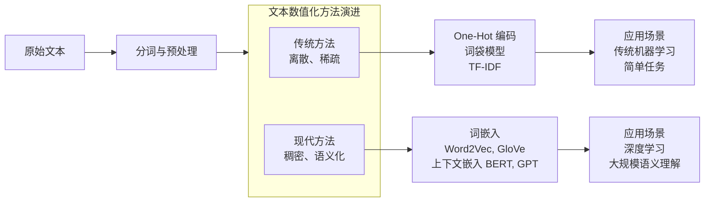

<BlogPost>

## 将文本数值化的解决方案

+ 将离散的`文本符号`转换为计算机能够处理的`数值向量`，并尽可能地在向量中保留和挖掘文本的语义信息
+ 一个流程图和表格来简要说明核心的解决方案和演进过程。

下面这个表格对比了这些主要方法的特点：

| 方法类别 | 代表技术 | 核心思想 | 向量特点 | 优点 | 缺点 |
| :--- | :--- | :--- | :--- | :--- | :--- |
| **传统方法** | One-Hot 编码【turn0search1】 | 词汇表有多大，向量就有多长，每个词唯一对应一个位置为1的向量【turn0search1】 | 高维、稀疏 | 简单，易于理解 | **维度灾难**，无法捕捉语义关系【turn0search1】 |
| | TF-IDF【turn0search11】 | 一个词在一个文档中出现次数越多，在所有文档中出现次数越少，越能代表该文档 | 高维、稀疏 | 能衡量词的重要性 | 依然稀疏，无法捕捉语义 |
| **现代方法** | **词嵌入** (Word2Vec, GloVe)【turn0search1】 | 通过训练将词映射到低维连续空间，**语义相近的词，其向量也相近**【turn0search1】 | **低维、稠密** | **解决维度灾难**，**捕捉语义关系**，计算高效【turn0search1】 | 无法解决一词多义问题 |
| | **上下文嵌入** (BERT, GPT)【turn0search11】 | **词的向量表示依赖于其所在的上下文**，同一个词在不同句子中可有不同表示【turn0search11】 | 低维、稠密、**动态** | **解决一词多义问题**，深度理解语境 | 计算资源和数据需求巨大 |

### 💡 核心思路与选择建议

文本数值化的核心思路，是**将离散的文本符号转换为计算机能够处理的数值向量，并尽可能地在向量中保留和挖掘文本的语义信息**。

*   对于**简单任务**或**传统机器学习模型**（如SVM、逻辑回归），**TF-IDF** 加上 **One-Hot** 有时仍然有效且计算开销可控。
*   对于绝大多数**深度学习任务**（如文本分类、情感分析），**预训练的词嵌入** 是当前的标准配置，它提供了很好的语义基础。
*   对于需要**深度理解语境和细微语义差别**的任务（如问答、机器翻译、摘要生成），则应优先考虑使用**上下文嵌入模型**（如BERT）。

希望这个解释能帮助你更好地理解文本数值化的解决方案。

### 📌 One-Hot 编码

**简要介绍**：
One-Hot 编码（独热编码）是一种将**分类变量**（如文本中的单词、商品类别等）转换为**二进制向量**的形式【turn0search2】。其核心思想是：向量的维度等于类别的总数，**每个类别对应一个唯一的向量，该向量中只有一个位置为1，其余位置均为0**【turn0search2】。这种方法确保了类别之间在数值上是相互独立的，避免了模型错误地引入类别间的大小或顺序关系【turn0search2】。

**简单示例**：
假设有一个特征“颜色”，包含三个类别：红、绿、蓝。使用 One-Hot 编码后：

| 原始值 | One-Hot 编码 |
| :--- | :--- |
| 红 | `[1, 0, 0]` |
| 绿 | `[0, 1, 0]` |
| 蓝 | `[0, 0, 1]` |

每个颜色都被映射到了一个三维的向量，向量的维度等于类别的总数（3个）。在这个向量中，**只有对应类别的那个位置是1，其他所有位置都是0**【turn0search1】【turn0search3】。

---

### 🔗 Embedding 向量

**简要介绍**：
Embedding（嵌入）是一种将**高维稀疏数据**（如 One-Hot 向量）映射到**低维稠密向量**的技术【turn0search1】【turn0search10】。这些低维向量（称为 Embedding 向量）是**实数向量**，其维度通常远小于原始类别的总数（例如50、100或300维）【turn0search1】。与 One-Hot 编码不同，Embedding 向量是通过**模型训练学习**得到的，能够**捕捉到类别之间的语义相似性**——在向量空间中，含义相近的类别，其向量也彼此靠近【turn0search1】。

**简单示例**：
假设经过训练后，“颜色”特征的 Embedding 向量（维度设为3）可能如下所示：

| 原始值 | Embedding 向量 (示例) |
| :--- | :--- |
| 红 | `[0.9, 0.1, -0.3]` |
| 绿 | `[0.1, 0.8, 0.2]` |
| 蓝 | `[-0.2, 0.3, 0.9]` |

可以看到：
*   向量的维度（3维）远小于类别的总数（如果有很多颜色的话）。
*   向量中的值是连续的实数，不再是0或1。
*   由于“红”和“绿”在某种语义属性（如“暖色调”）上可能比“红”和“蓝”更接近，它们的向量在空间中的距离（例如通过余弦相似度计算）也可能更近。**向量之间的相对距离蕴含了语义信息**【turn0search1】。

</BlogPost>
