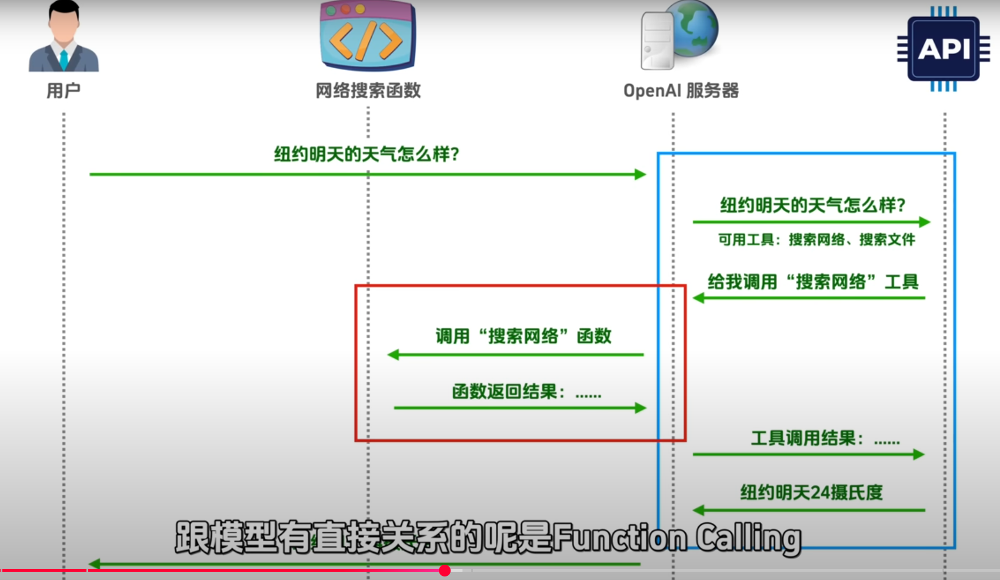
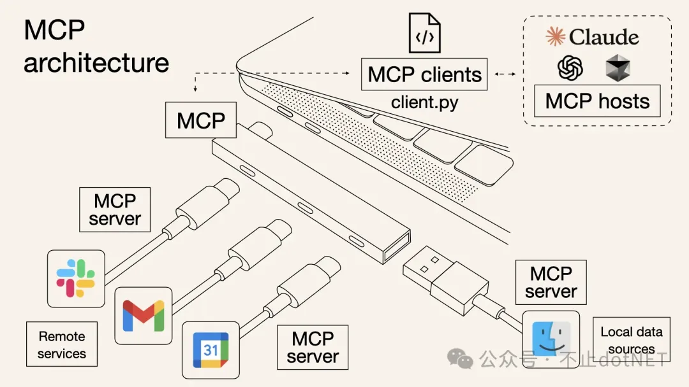
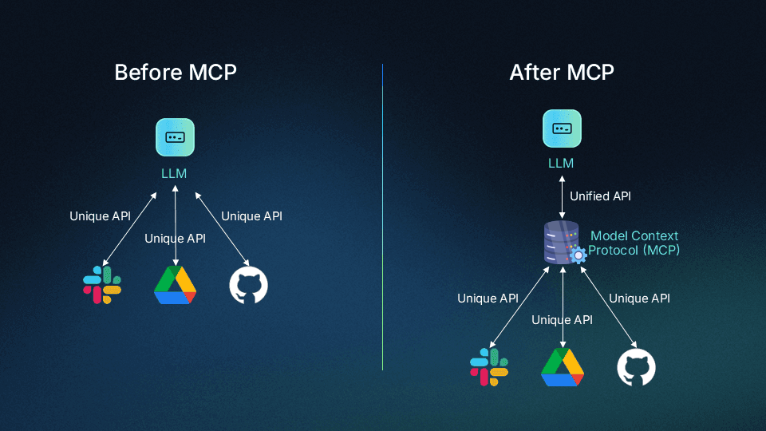

<BlogPost>

# Function Calling VS MCP

短视频里，总有人信誓旦旦认为，MCP 会取代 Function Calling ，这是真的吗？

## 1. 对 Function Calling 的误解

很多人对 Function Calling 的理解存在误区，比如像下图所示

如果是这样的话，那 Function Calling 和 MCP 是一样的，都是通过调用函数来执行任务。

## 2. Function Calling 真正的位置

Function Calling 的真正位置应该是下图的蓝色框的部分，就是模型判断是否要调用工具的环节。
而真正调用工具的环节，也就是红色框的部分，是属于对工具的真正调用。MCP其实就是在红框这个部分的。

## 3. MCP 与 Function Calling 到底什么关系 

理解了上图中蓝框和红框的关系后，我们就能理解了MCP 和 Function Calling 的关系了。
其实，二者是互补的关系。
在同一个链路中，二者是可以并存的。

### 3.1 功能定位不同

Function Calling 是 LLM 的一种能力，它允许模型识别何时应该调用函数，并以结构化的方式生成函数调用参数。它是模型输出的一种特殊形式，本质上是模型对函数调用的"建议"。

MCP（Model Context Protocol）则是一个通信协议，它定义了 AI 系统与外部工具/服务之间的交互方式。MCP 提供了一个标准化的接口，使 AI 能够与各种本地运行的服务进行通信。

### 3.2 工作流程不同

Function Calling 的工作流程：
1. 用户向 LLM 发送请求
2. LLM 分析请求并决定是否需要调用函数
3. LLM 生成函数名称和参数
4. 应用程序接收这些信息并执行实际的函数调用
5. 函数执行结果返回给 LLM
6. LLM 根据结果生成最终回复

MCP 的工作流程：
1. 用户向 AI 系统发送请求
2. AI 系统通过 MCP 与本地运行的服务器通信
3. 本地服务器提供工具和资源
4. AI 系统使用这些工具和资源处理请求
5. AI 系统生成回复

### 3.3 互补关系

Function Calling 和 MCP 并不是相互替代的关系，而是相互补充的：

1. **能力层面**：Function Calling 是模型的一种能力，而 MCP 是一种通信协议。
2. **集成方式**：Function Calling 需要应用程序开发者实现函数并处理调用，MCP 则提供了标准化的接口，简化了集成过程。
3. **应用场景**：Function Calling 适合于需要结构化输出的场景，而 MCP 适合于需要与本地服务交互的场景。
4. **组合使用**：在实际应用中，可以将两者结合使用，例如 AI 系统可以通过 MCP 与本地服务通信，然后使用 Function Calling 来生成结构化的函数调用。

## 4. MCP 架构

## 5. MCP 的意义

### 5.1 MCP 带来的变革

MCP 为 AI 系统带来了以下几个方面的变革：

1. **本地化处理**：通过 MCP，AI 系统可以与本地运行的服务进行交互，减少了对云服务的依赖，提高了数据隐私和安全性。
2. **扩展能力**：MCP 使 AI 系统能够访问更多的工具和资源，扩展了其处理问题的能力范围。
3. **标准化接口**：MCP 提供了标准化的接口，简化了 AI 系统与外部工具/服务的集成过程。
4. **实时交互**：通过 MCP，AI 系统可以与本地服务进行实时交互，提高了响应速度和用户体验。

### 5.2 未来发展

随着 AI 技术的发展，Function Calling 和 MCP 都将继续演进：

1. Function Calling 可能会支持更复杂的函数调用模式，如嵌套调用、条件调用等。
2. MCP 可能会扩展到支持更多类型的服务和资源，如硬件设备、专业软件等。
3. 两者的集成将更加紧密，为开发者提供更强大的 AI 应用开发工具。

总之，Function Calling 和 MCP 各自解决了 AI 系统不同层面的问题，它们共同构成了 AI 系统与外部世界交互的重要组成部分。

</BlogPost>