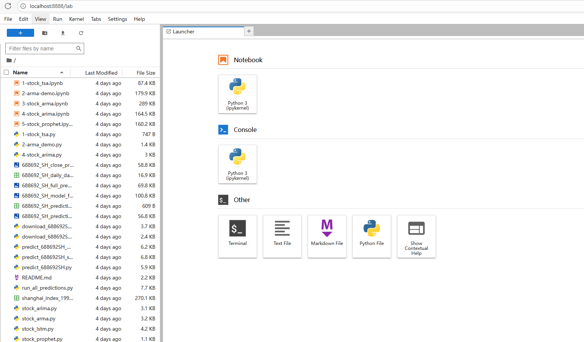

<BlogPost>

## Jupyter 简介

Jupyter 是一个开源的 Web 应用程序，主要用于创建和共享包含**实时代码、数学公式、可视化图表和 Markdown 文本**的交互式文档（通常称为 Jupyter Notebook）。

### Jupyter 的主要用途包括

- **数据清理与转换**：可以交互式地探索和处理数据。
- **数值模拟与统计建模**：支持 Python、R、Julia 等多种编程语言，适合科学计算。
- **机器学习与数据分析**：因其直观的交互界面，被广泛用于数据科学和 AI 领域。
- **教学与文档编写**：结合代码、文字说明和可视化结果，非常适合教学、演示和报告撰写。
- **多语言支持与扩展性**：作为 Project Jupyter 的一部分，它支持多种编程语言内核，并可扩展为更强大的开发环境，如 JupyterLab。

## 启动 Jupyter Lab

> **JupyterLab 是 Jupyter Notebook 的下一代升级版**，两者虽然核心功能相似（都能运行 `.ipynb` 笔记本），但在用户体验和功能上有显著区别。

- 如果你已安装 Jupyter（或通过 `pip install jupyterlab` 单独安装），只需在终端运行：

```bash
jupyter lab
```

它会启动一个更现代化的 Web 界面，默认地址通常是 `http://localhost:8888`（端口可能不同）。

- 如果是在一个目录中启动 cmd 或 power shell，直接运行 `jupyter lab` 即可。在 web 页面中左侧的文件列表中，显示的就是这个目录下的所有文件。



## `.ipynb 文件`和 `.py 文件`配合使用

### 1. `.ipynb` 和 `.py` 文件的定义

#### `.py` 文件

- 是标准的 **Python 脚本文件**。
- 纯文本格式，包含 Python 代码。
- 可直接通过命令行运行：`python script.py`
- 适合构建模块、库、应用程序等。

#### `.ipynb` 文件

- 是 **Jupyter Notebook** 文件。
- 采用 **JSON 格式** 存储，包含代码、文本（Markdown）、图像、输出结果等。
- 通常在 Jupyter 环境中交互式运行，适合数据分析、教学、探索性编程。
- 不能直接用 `python` 命令运行（除非转换）。

---

### 2. 它们的关系

- **功能互补**：`.ipynb` 适合探索和展示，`.py` 适合部署和复用。
- **可相互转换**：
  - 可将 `.ipynb` 转为 `.py`（只保留代码单元格）：

    ```bash
    jupyter nbconvert --to python notebook.ipynb
    ```

  - 也可将 `.py` 文件用特殊注释格式转换为 `.ipynb`（需使用工具如 `jupytext`）。

- **在项目中协同工作**：
  - 用 `.ipynb` 做数据探索和原型开发；
  - 将成熟逻辑提炼成 `.py` 模块供生产环境调用。

---

### 3. 举例说明

假设你正在做一个机器学习项目：

#### 步骤 1：探索性分析（使用 `.ipynb`）

文件：`exploration.ipynb`

```python
# Cell 1
import pandas as pd
df = pd.read_csv('data.csv')
df.head()

# Cell 2
df.describe()

# Cell 3
import matplotlib.pyplot as plt
df['target'].hist()
plt.show()
```

这个 Notebook 包含代码、输出图表和 Markdown 说明，便于理解数据。

#### 步骤 2：提炼核心逻辑（转为 `.py`）

你发现清洗数据的逻辑很稳定，于是创建一个模块：
文件：`data_utils.py`

```python
import pandas as pd

def load_and_clean_data(path):
    df = pd.read_csv(path)
    df = df.dropna()
    return df
```

#### 步骤 3：在 Notebook 中调用 `.py` 模块

回到 `model_training.ipynb`：

```python
# Cell 1
from data_utils import load_and_clean_data

df = load_and_clean_data('data.csv')
# 后续训练模型...
```

这样，`.ipynb` 负责交互式实验和可视化，`.py` 负责封装可复用的函数。

---

### 总结

- `.ipynb` 和 `.py` **不是必须成对出现**，但可以**协同工作**。
- 它们共同服务于 **同一个 Python 项目或任务**，各自发挥优势：
  - `.ipynb`：交互、展示、探索；
  - `.py`：结构化、可复用、可部署。

> ✅ 简单说：你可以把 `.ipynb` 看作“实验笔记本”，把 `.py` 看作“正式代码库”。它们共同构成的是一个**完整的数据科学或软件开发工作流**。

## 代码示例

``` python
#!/usr/bin/env python
# coding: utf-8

# In[1]:


# 使用tsa对沪市指数进行分析：trend, seasonal, residual
import statsmodels.api as sm
import matplotlib.pyplot as plt
import pandas as pd

# 数据加载
data = pd.read_csv('shanghai_index_1990_12_19_to_2020_03_12.csv', usecols=['Timestamp', 'Price'])
data.Timestamp = pd.to_datetime(data.Timestamp)
data = data.set_index('Timestamp')
data['Price'] = data['Price'].apply(pd.to_numeric, errors='ignore')
# 进行线性插补缺漏值
data.Price.interpolate(inplace=True)
#  返回三个部分 trend（趋势），seasonal（季节性）和residual (残留)
result = sm.tsa.seasonal_decompose(data.Price, period=250)
result.plot()
plt.show()


# In[5]:


#help(sm.tsa.seasonal_decompose)


```

</BlogPost>
