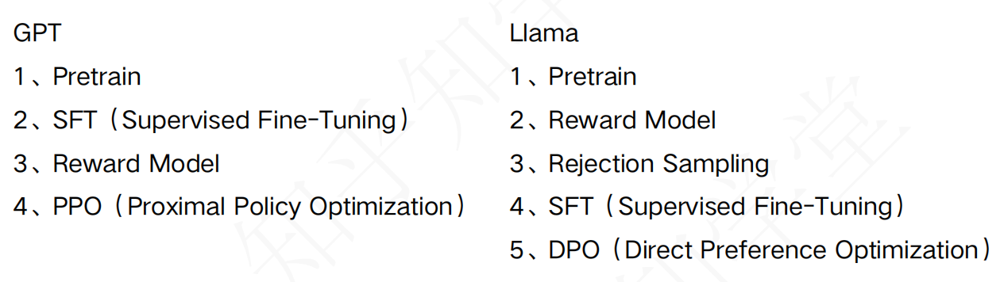
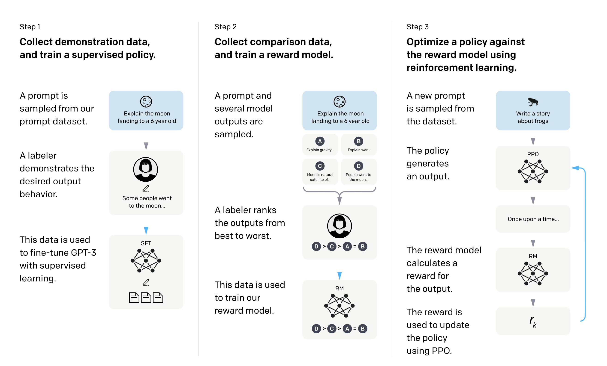

::: blog-post

> 站在大模型外部看它的训练流程，它的训练流程可以分为几个阶段？

## LLM 训练阶段的划分

### LLM 训练的两种技术路线

+ 事实上，只有 Llama 3 采用了不同于 GPT 的训练流程，但当 Llama 4 训练时，也采用了 GPT 风格的训练流程。
+ 其他主流 LLM （如 DeepSeek、Qwen）也都采用了 GPT 风格的训练流程。
+ 一般认为，LLM 厂商无法跑通 PPO 训练流程前，才会使用 Llama 3 风格的训练流程，因为 PPO 真的很难。

### GPT 风格的训练流程

| 阶段 | 子阶段 | GPT (DeepSeek, Qwen, Llama 4) | 阶段成果 | 备注 |
|---|---|---|---|---|
| 预训练 | - | Pretrain | 模型说起话来像“接话茬”，但不能“做任务” |
| 后训练 | 指令微调（Instruction Tuning） | SFT（Supervised Fine-Tuning） | 模型能“做任务”，但深度不够 |
| 后训练 | 对齐训练（Alignment Training） | Reward Model | 奖励模型需要多轮迭代 | 迭代多轮，每次都在新的奖励模型的指导下微调 |
| 后训练 | 对齐训练（Alignment Training） | PPO（Proximal Policy Optimization） | 模型能“做任务”，深度达到人类偏好 | 迭代多轮 |

现代大语言模型（LLM）的训练通常分为`预训练`和`后训练`两个阶段，所有主流 LLM 基本都遵循这一模式。
> 预训练教会模型`如何说话`，后训练教会它`如何帮助人`

- 预训练（pre-training）：从大规模无监督语料中学习语言建模能力，这是基础。
  - 在大量未标注的原始文本数据上进行`自监督学习`，目标是学习语言的基本结构、常识和世界知识
  - 这个阶段计算成本高，但产出的是一个“通才”基础模型，虽然知识丰富，但未必能很好地遵循指令或与用户有效互动

- 后训练（post-training）：在预训练基础上，使用人类标注指令数据进行`对齐`，优化模型在特定任务上的性能。
  - 通过`有监督微调`（Supervised Fine-Tuning, SFT）、`人类反馈强化学习`（Reinforcement Learning from Human Feedback, RLHF）等技术，使模型更符合`人类偏好`
  - 目标是使 LLM 具备`指令遵循`、`对话能力`、`安全性`等特性

### **GPT 与 Llama 训练流程对比**

截至 2025 年公开的技术资料（特别是关于 **Llama 3** 的后训练方法），我们可以整理出如下对比表格，并进行简要分析。

| 阶段 | GPT（典型流程） | Llama（以 Llama 3 为代表） | 说明 |
|------|------------------|----------------------------|------|
| 1. 预训练（Pretrain） | ✅ | ✅ | 两者都从大规模无监督语料中学习语言建模能力，这是基础。 |
| 2. 监督微调（SFT） | ✅（第2步） | ✅（在后训练中多次出现，如第4步） | GPT 在早期就引入人类标注指令数据进行对齐；Llama 3 的 SFT 是**迭代式后训练的一部分**，常与偏好学习交替进行 。 |
| 3. 奖励模型（Reward Model） | ✅（第3步） | ✅（第2步） | 两者都训练一个独立的 RM 来评估生成结果的质量。但 Llama 更强调**多轮 RM 更新**以适应迭代优化 。 |
| 4. 强化学习优化 | ✅（PPO） | ❌（未用 PPO） | GPT 系列（如 InstructGPT）依赖 **PPO** 进行策略梯度更新；Llama 3 **放弃了 PPO**，因其训练不稳定且计算开销大。 |
| 5. 采样/生成策略 | — | ✅（Rejection Sampling，第3步） | Llama 使用**拒绝采样**：用当前策略生成多个回答，由 RM 选出最佳样本用于后续训练 。GPT 通常不显式使用此步骤。 |
| 6. 偏好优化方法 | — | ✅（DPO，第5步） | Llama 3 采用 **DPO**（Direct Preference Optimization），直接从偏好数据优化策略，**无需训练奖励模型或使用强化学习**，更稳定高效 。 |

> 注：Llama 3 的后训练是**多轮迭代**的，每轮通常包含：**Reward Modeling → Rejection Sampling → SFT → DPO**，共进行约 6 轮 。

---

### **简要分析**

1. **GPT 路线**：  
   - 采用经典的 **“SFT + RM + PPO”** 三段式对齐流程，源自 InstructGPT。  
   - 优点是理论成熟；缺点是 **PPO 训练复杂、不稳定、对超参敏感**，且需要大量计算资源。

2. **Llama 路线**（尤其是 Llama 3）：  
   - 采用**迭代式后训练**，融合多种对齐技术。  
   - **放弃 PPO**，转而使用 **Rejection Sampling + DPO**，提升训练稳定性和数据效率。  
   - DPO 可直接从人类偏好数据中优化模型，**绕过奖励模型的显式训练和强化学习的复杂性**，更适合大规模开源模型的部署 。

3. **趋势对比**：  
   - GPT 流程代表早期对齐范式，适合闭源、资源充足的商业模型。  
   - Llama 的流程反映**2024–2025 年开源社区的主流演进方向**：**简化 RL、提升可复现性、强调迭代优化与数据质量**。

## 预训练

### 段落联合概率

#### 什么是段落联合概率

在概率语言模型中，一个段落（或句子、文本序列）的**联合概率**是指模型对整段文本 $x_1, x_2, ..., x_T$ 同时出现的概率：

$$
P(x_1, x_2, ..., x_T)
$$

由于 LLM 通常采用**自回归建模**（如 GPT 系列）或**掩码建模**（如 BERT），它们通过链式法则将联合概率分解为：

$$
P(x_1, ..., x_T) = \prod_{t=1}^T P(x_t \mid x_1, ..., x_{t-1})
$$

这就是自回归模型的核心——**逐词预测下一个词的条件概率**。

#### 举例说明

- 假设有一段文本：“今天天气很好。” 我们按**字**来切分（这是简化处理，实际模型可能用词或子词）：

> 词元序列：`["今", "天", "天", "气", "很", "好", "。"]`

##### 第一步：模型预测每个位置的**条件概率**

大模型是**自回归**的，它逐字预测，每次基于前面所有字：

| 当前字 | 前面的上下文 | 模型预测的条件概率（假设值） |
|--------|---------------|------------------------|
| 今     | （开头）       | P(今) = 0.01           |
| 天     | 今             | P(天 \| 今) = 0.90     |
| 天     | 今天           | P(天 \| 今天) = 0.80   |
| 气     | 今天天         | P(气 \| 今天天) = 0.85 |
| 很     | 今天天气       | P(很 \| 今天天气) = 0.70 |
| 好     | 今天天气很     | P(好 \| 今天天气很) = 0.90 |
| 。     | 今天天气很好   | P(。\| 今天天气很好) = 0.95 |

> 💡 这些数值是**编的**，只为演示。真实模型会输出 softmax 概率，比如对“好”的预测可能是 0.0012，但我们这里用合理值方便理解。

##### 第二步：计算联合概率

根据**概率链式法则**，整个句子的联合概率是所有条件概率的乘积：

$$
\begin{align*}
P(\text{今, 天, 天, 气, 很, 好, 。})
&= P(\text{今}) \times P(\text{天} \mid \text{今}) \times P(\text{天} \mid \text{今天}) \\
&\quad \times P(\text{气} \mid \text{今天天}) \times P(\text{很} \mid \text{今天天气}) \\
&\quad \times P(\text{好} \mid \text{今天天气很}) \times P(\text{。} \mid \text{今天天气很好}) \\
&= 0.01 \times 0.9 \times 0.8 \times 0.85 \times 0.7 \times 0.9 \times 0.95 \\
&\approx \mathbf{0.00366}
\end{align*}
$$

所以，这个句子的**联合概率 ≈ 0.00366**（即约 **0.366%**）。

##### 为什么实际不用直接算这个？

- 对于长文本，概率会**指数级变小**（比如 0.000...01），计算机容易“下溢”（变成 0）。
- 所以实际训练时，模型**不直接优化联合概率**，而是优化它的**对数**（log）：
  $$
  \log P = \log 0.01 + \log 0.9 + \log 0.8 + \dots \approx -5.61
  $$
  这个值就是**负对数似然**（NLL）损失的相反数。训练目标是**最大化 log P**（即最小化损失）。

### 预训练的过程

> **预训练不是“算整段概率然后调参”，而是“边读边猜，猜错就微调，反复几十亿次”。**

> **预训练是一个大规模随机梯度下降过程：**
>
> 1. 从海量语料中**不断随机采样小批次**（batch）；
> 2. 对每个 batch 中的每个 token，计算模型预测其为正确 token 的 log 概率；
> 3. 用这些 log 概率的平均值（取负）作为 loss；
> 4. 通过反向传播**微调模型参数**，让 loss 下降；
> 5. 重复几十万到几百万步，直到：
>    - 达到预定训练步数，**或**
>    - loss 不再明显下降（收敛）。
>
> **整个过程从未计算“段落联合概率”，但数学上等价于最大化训练数据的对数联合概率。**

### 预训练的结果

- 得到了一个非常熟悉人类语言的模型
- 阅读过大量的人类文献资料
- 模型的语言能力与人类近似
- 只要给出一些初始的文字，猜下一个字的能力也与人类近似

- 核心问题：**预训练模型（Pretrain）说起话来非常像“接话茬”，并不是在“做任务”**

## SFT - 有监督的微调训练

- Supervised Fine-Tuning

### 几个概念 - 监督学习

- 有监督学习 - 使用有标签的数据进行训练的学习过程
- 无监督学习 - 使用无标签的数据进行训练的学习过程
- 自监督学习 - 自己给自己出题、自己批改（无标签也能学）
- 半监督学习 - 老师教几道题，自己琢磨剩下的（少量标签 + 大量自学）

> 自监督 -  Pretrain 阶段的处理方式
> 半监督 - Pretrain + SFT 两个阶段组合起来就叫做半监督（不缺数据，但缺标签）

### SFT阶段解决什么问题

- 解决预训练模型（Pretrain）遗留的问题 - 说起话来非常像“接话茬”，并不是在“做任务”

- 如果未来你希望做什么类型的任务，就用什么样的数据去做“指令微调（Instruction Tuning）”
  - 对话任务
  - 分类任务
  - 判断任务
  - 推理任务
  - 代码生成任务

- 本阶段的训练数据会非常少（和预训练相比）

## RLHF - 基于人类反馈的强化学习

## 奖励模型 - Reward Model

- 奖励模型 - 是额外训练出来的模型
- 奖励模型是需要多次更新迭代的 - 随着 LLM 模型的不断改进，奖励模型也需要不断更新迭代。
- 奖励模型的终点 - 当奖励模型不再能生效时，说明 LLM 模型已经足够好，不需要再用奖励模型进行微调。

:::
