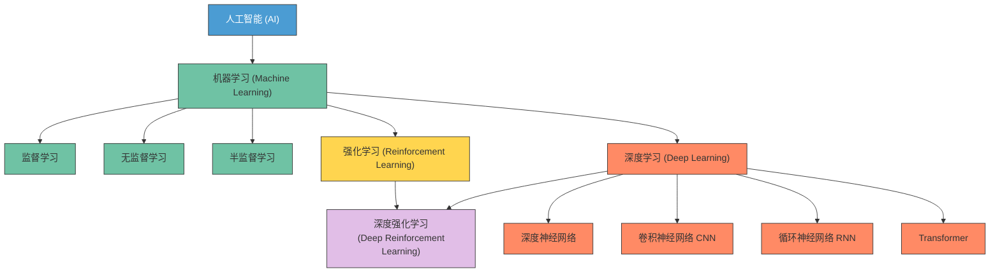

<BlogPost>

+ 所有跟`算法、模型`有关的都叫`机器学习`
+ 应用了`神经网络`的机器学习，叫`深度学习`
+ 没有神经网络的，就是传统的机器学习，如 逻辑回归、决策树、朴素贝叶斯
+ 强化学习中依赖`奖励`来衡量行为的好坏，它可以使用神经网络，也可以不使用神经网络

在人工智能（AI）领域中，**机器学习（Machine Learning）**、**深度学习（Deep Learning）** 和 **强化学习（Reinforcement Learning）** 是三个核心概念，它们之间既有区别又有紧密联系。下面我们逐一解释它们的定义、特点以及相互关系。

## 基本概念

### 1. 机器学习（Machine Learning, ML）

**定义**：  
机器学习是人工智能的一个子领域，其核心思想是让计算机系统从数据中“学习”规律，从而在没有被明确编程的情况下完成任务。

**关键点**：

+ 通过训练数据构建模型。
+ 模型可以对新数据做出预测或决策。
+ 常见任务包括分类、回归、聚类等。

**主要类型**：

+ **监督学习（Supervised Learning）**：有标签数据，如图像分类。
+ **无监督学习（Unsupervised Learning）**：无标签数据，如聚类。
+ **半监督学习**：部分有标签，部分无标签。
+ **强化学习**：见下文。

✅ **机器学习是这三者中最广泛的概念，是深度学习和强化学习的“上层分类”**。

### 2. 深度学习（Deep Learning, DL）

**定义**：  
深度学习是机器学习的一个子集，主要使用**深层神经网络**（如深度神经网络 DNN、卷积神经网络 CNN、循环神经网络 RNN 等）来自动提取数据的特征并进行学习。

**关键点**：

+ 基于人工神经网络，尤其是“深度”（多层）结构。
+ 能自动从原始数据中学习特征，无需人工设计特征。
+ 在图像、语音、自然语言处理等领域表现突出。

**典型应用**：

+ 图像识别（如人脸识别）
+ 语音识别（如 Siri）
+ 自然语言处理（如 GPT、BERT）

✅ **深度学习是机器学习的一种方法，特别适合处理高维、非结构化数据（如图像、文本、音频）**。

### 3. 强化学习（Reinforcement Learning, RL）

**定义**：  
强化学习是一种通过与环境交互来学习“最优策略”的机器学习方法。智能体（Agent）通过尝试动作、获得奖励或惩罚，逐步学会在特定环境中做出最佳决策。

> 强化学习（Reinforcement Learning, RL）本质上必须依赖“奖励”信号来衡量行为的好坏（即“对错”），从而指导学习。区别在于：
>
> + 传统 RL：使用预定义的奖励函数（Reward Function）
> + 现代 RL（尤其是大模型场景）：使用学习得到的奖励模型（Reward Model）

**关键点**：

+ 核心是“试错”和“延迟奖励”。
+ 智能体 → 动作 → 环境反馈（奖励/状态变化）→ 更新策略。
+ 目标是最大化长期累积奖励。

**典型应用**：

+ 游戏 AI（如 AlphaGo）
+ 机器人控制
+ 自动驾驶决策系统

✅ **强化学习是机器学习的另一种范式，强调“决策”和“序列行为”**。

## 三者的关系（图示逻辑）

``` text
人工智能 (AI)
    └── 机器学习 (ML)
           ├── 监督学习
           ├── 无监督学习
           ├── 半监督学习
           ├── 深度学习（DL）← 可应用于各类学习范式
           └── 强化学习 (RL)
                   └── 深度强化学习（如 DQN, PPO）← 深度学习 + 强化学习
```

 Mermaid 的图如下：



## 联系与区别

| 维度 | 机器学习 | 深度学习 | 强化学习 |
|------|----------|----------|----------|
| 所属关系 | 最大范畴 | 机器学习的子集 | 机器学习的子集 |
| 核心思想 | 从数据中学习规律 | 使用深层神经网络自动提取特征 | 通过试错和奖励机制学习最优策略 |
| 是否需要标签 | 监督学习需要，无监督不需要 | 通常需要大量数据，可有可无标签 | 不需要标签，但需要奖励信号 |
| 典型模型 | 决策树、SVM、随机森林 | CNN、RNN、Transformer | Q-learning、Policy Gradient、DQN |
| 适用任务 | 分类、回归、聚类 | 图像、语音、文本处理 | 决策、控制、游戏、路径规划 |
| 与环境交互 | 通常不交互（批处理） | 通常不交互 | 必须与环境持续交互 |

## 交叉融合：深度强化学习（Deep Reinforcement Learning）

当**深度学习**与**强化学习**结合时，就产生了**深度强化学习**（Deep RL），它用深度神经网络来表示强化学习中的策略或价值函数。

**例子**：

+ **AlphaGo**：使用深度神经网络评估棋局 + 强化学习优化走棋策略。
+ **自动驾驶**：用深度学习感知环境（视觉识别），用强化学习做驾驶决策。

</BlogPost>
