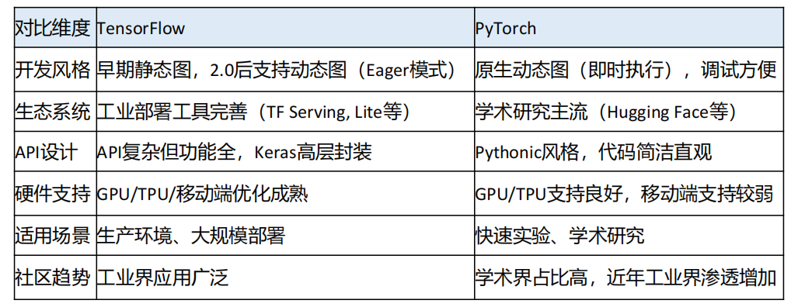
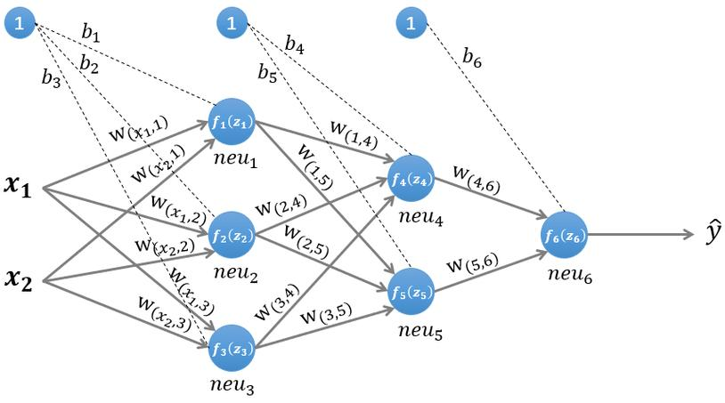
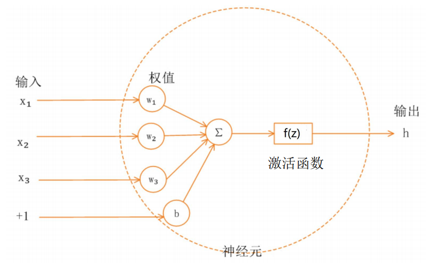
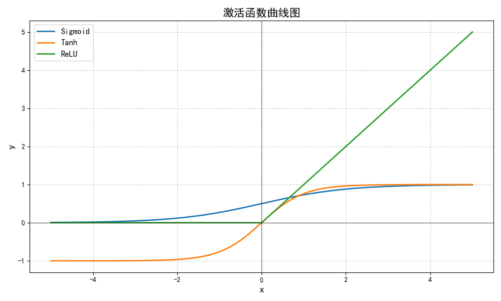

<BlogPost>

## `深度学习`和`神经网络`

> 深度学习强调的是深度，也就是很多层的神经网络。

深度学习和神经网络之间是**包含与被包含**的关系：

- **神经网络**（Neural Networks）是一种受生物神经系统启发的计算模型，由多个相互连接的“神经元”组成，用于对输入数据进行非线性变换和特征提取。
- **深度学习**（Deep Learning）则是**基于深层神经网络**（即包含多个隐藏层的神经网络）的机器学习方法，是机器学习的一个子领域。

换句话说，**神经网络是深度学习的基础和核心模型**，而深度学习是神经网络发展到“深度”（多层）结构后形成的一种强大技术范式。深度学习通过堆叠多个隐藏层，能够自动学习数据的层次化特征表示，从而在图像识别、自然语言处理等领域取得突破性成果 。

简要关系链为：  
**人工智能 ⊃ 机器学习 ⊃ 深度学习 ⊃（基于）神经网络** 。

## TensorFlow 和 PyTorch



## NumPy 简介

在 AI（人工智能）领域，**NumPy** 是一个非常基础且重要的 Python 库，全称为 **Numerical Python**。它主要用于高效处理**多维数组**（尤其是数值型数据），并提供了大量用于**数学、科学和工程计算**的函数。

### NumPy 的核心特点

1. **N 维数组对象（ndarray）**  
   NumPy 的核心是 `ndarray`（N-dimensional array），它是一种高效的多维数组结构，比 Python 原生的列表（list）在存储和计算上更节省内存、速度更快，尤其适合处理大规模数值数据。

2. **向量化运算**  
   NumPy 支持对整个数组进行数学运算（如加、减、乘、除、三角函数、指数等），而无需显式写 for 循环，这种“向量化”操作极大提升了代码效率和可读性。

3. **广播机制（Broadcasting）**  
   允许不同形状的数组之间进行算术运算，自动扩展较小的数组以匹配较大数组的形状。

4. **与 C/C++ 和 Fortran 兼容**  
   NumPy 底层用 C 语言实现，运行速度快，并可与 C/C++ 或 Fortran 代码集成。

5. **生态系统基础**  
   NumPy 是许多 AI/ML 库的基础依赖，例如：
   - **SciPy**（科学计算）
   - **Pandas**（数据分析）
   - **Matplotlib**（数据可视化）
   - **Scikit-learn**（机器学习）
   - **TensorFlow / PyTorch**（深度学习框架也大量使用或兼容 NumPy 数组）

---

### 简单示例

```python
import numpy as np

# 创建一个 2x3 的数组
a = np.array([[1, 2, 3],
              [4, 5, 6]])

# 对整个数组加 10（向量化操作）
b = a + 10

print(b)
# 输出：
# [[11 12 13]
#  [14 15 16]]

# 计算所有元素的平均值
mean_val = np.mean(a)
print(mean_val)  # 输出：3.5
```

---

### 为什么 AI 领域离不开 NumPy？

- AI 模型的输入数据（如图像、文本向量、传感器数据）通常表示为**高维数组**（例如图像为 3D：高度×宽度×通道）。
- 模型训练中的矩阵运算（如线性代数、梯度计算）依赖高效的数组操作。
- NumPy 提供了统一的数据结构和接口，使得不同 AI 工具之间可以无缝协作。

因此，**NumPy 被视为 Python 科学计算和 AI 开发的基石之一**。

## PyTorch 是 GPU 上运行的 NumPy

### 1. **PyTorch 与 NumPy 在 API 设计上高度相似**

- PyTorch 的张量（Tensor）操作在语法和功能上与 NumPy 的 ndarray 非常相似。
- 例如：

```python
# NumPy
import numpy as np
a = np.array([1, 2, 3])
b = np.array([4, 5, 6])
c = a + b

# PyTorch
import torch
a = torch.tensor([1, 2, 3])
b = torch.tensor([4, 5, 6])
c = a + b
```

两者在基本操作（加减乘除、索引、reshape、广播等）上几乎一致，学习成本低。

---

### 2. **PyTorch 支持 GPU 加速，NumPy 默认只支持 CPU**

- NumPy 的计算只能在 CPU 上进行。
- PyTorch 的 Tensor 可以轻松地在 CPU 和 GPU 之间切换，只需指定设备：

```python
device = torch.device("cuda" if torch.cuda.is_available() else "cpu")
a = torch.tensor([1, 2, 3]).to(device)
```

一旦 Tensor 被放到 GPU 上，后续的运算就会自动在 GPU 上执行，从而获得显著的加速（尤其在深度学习中处理大规模数据时）。

---

### 3. **PyTorch 不仅是“GPU 版 NumPy”，还包含自动微分等深度学习特性**

虽然这句话强调了“GPU 上的 NumPy”，但 PyTorch 实际上远不止于此：

- **自动微分（Autograd）**：支持通过 `.backward()` 自动计算梯度，这是训练神经网络的核心。
- **神经网络模块（torch.nn）**：提供构建深度学习模型的高级接口。
- **动态计算图**：PyTorch 使用动态图（define-by-run），使得调试和控制流更灵活。

所以更准确地说：
> **PyTorch 是一个以 GPU 加速张量计算为基础，并支持自动微分和深度学习的框架，其张量操作 API 与 NumPy 高度兼容。**

---

### 4. **互操作性：PyTorch 与 NumPy 可以无缝转换**

- 你可以轻松地在 NumPy 数组和 PyTorch Tensor 之间转换：

```python
# NumPy → PyTorch
np_array = np.array([1, 2, 3])
torch_tensor = torch.from_numpy(np_array)

# PyTorch → NumPy（注意：必须在 CPU 上）
torch_tensor = torch.tensor([1, 2, 3])
np_array = torch_tensor.numpy()
```

这进一步说明两者在设计理念上的紧密联系。

## TPU 是什么

> **TPU -- Tensor Processing Unit**（张量处理单元）的缩写，是 Google 为加速神经网络计算而定制的 AI 芯片，专精于张量运算，在大规模训练和推理任务中具有高性能和高能效的优势，但生态相对封闭，主要通过 Google Cloud 使用。**

### 1. TPU 的背景

- TPU 最初由 Google 在 2015 年秘密部署，2016 年正式对外公布。
- 它是为了高效运行 **TensorFlow**（Google 开发的深度学习框架）中的大规模神经网络计算而设计的。
- “张量”（Tensor）是深度学习中数据的基本表示形式（如多维数组），TPU 就是专门用来高效处理这类张量运算的硬件。

---

### 2. TPU 与 GPU 的区别

| 特性 | GPU（如 NVIDIA） | TPU（Google） |
|------|------------------|---------------|
| 设计目标 | 通用并行计算（图形渲染、科学计算、AI 等） | 专为神经网络推理和训练优化 |
| 架构 | 通用性强，灵活 | 高度定制化，针对矩阵乘加（MatMul）等操作优化 |
| 精度支持 | 支持 FP32、FP16、INT8 等多种精度 | 主要优化低精度（如 bfloat16、INT8），适合大规模模型 |
| 能效比 | 较高 | **更高**（尤其在批量推理和训练时） |
| 编程生态 | CUDA、PyTorch、TensorFlow 等广泛支持 | 主要通过 **TensorFlow / JAX** 使用，对其他框架支持有限 |
| 可用性 | 可购买（消费级/数据中心） | **仅通过 Google Cloud 提供**（不能单独购买芯片） |

---

### 3. TPU 的优势

- **高吞吐量**：特别适合大规模批量处理（如训练大模型）。
- **高能效**：每瓦性能优于 GPU，适合数据中心大规模部署。
- **与 TensorFlow/JAX 深度集成**：自动优化计算图，简化分布式训练。

---

### 4. TPU 的应用场景

- 大规模语言模型训练（如 Google 的 PaLM、BERT）
- 图像识别、语音识别等深度学习任务
- 云端 AI 服务（通过 Google Cloud 的 TPU v2/v3/v4/v5 提供）

---

### 5. 举个例子

如果你在 Google Colab（免费或付费版）中选择 **TPU 运行时**，你的 TensorFlow 或 JAX 代码就会在 Google 的 TPU 硬件上运行，速度可能比普通 CPU 或 GPU 快很多（前提是代码适配 TPU）。

## 神经网络的层数

> “N层神经网络” = N 个 带权重的层（即包含权重 W 和偏置 b 的层）

- 输入层、隐藏层、输出层
- GoogleNet 网络为22层，ResNet 可以达到50，101，152层
- 一般输入层是不计算在层级中

### 计算公式 `y = x·W + b`

### 一、**W 和 b 是什么单词？**

- **W** 是 **Weight**（权重）的缩写  
- **b** 是 **Bias**（偏置）的缩写

这两个词来源于**线性模型**（如线性回归）和**人工神经元模型**（如感知机）。

---

### 二、**为什么计算公式是：`y = x·W + b`？**

这个公式其实是**人工神经元的基本计算方式**，源于对生物神经元的简化模拟。我们一步步解释：

---

#### 1. **从生物神经元类比**

- 生物神经元接收多个输入信号（来自其他神经元）
- 每个输入信号有“强度”（类似 **权重 Weight**）
- 当总输入超过某个“阈值”，神经元就被激活（发放信号）

人工神经元模仿这个过程：

- 输入：$x_1, x_2, ..., x_n$
- 权重：$w_1, w_2, ..., w_n$（表示每个输入的重要性）
- 偏置：$b$（相当于“激活阈值”的负值）

---

#### 2. **数学表达：加权求和 + 偏置**

神经元的**总输入（也叫“净输入”或“线性组合”）** 为：

$$
y = w_1 x_1 + w_2 x_2 + \cdots + w_n x_n + b
$$

用**向量/矩阵形式**写就是：

$$
\mathbf{y} = \mathbf{x} \cdot \mathbf{W} + \mathbf{b}
$$

其中：

- $\mathbf{x}$ 是输入向量（如 `[1.0, 0.5]`）
- $\mathbf{W}$ 是权重矩阵（每列对应一个神经元的权重）
- $\mathbf{b}$ 是偏置向量（每个神经元一个偏置）
- $\mathbf{y}$ 是线性变换后的结果（也叫“pre-activation”）

---

#### 3. **为什么需要偏置 b？**

如果没有偏置，所有决策边界（如分类线）**必须经过原点 (0,0)**，这会严重限制模型的表达能力。

**举个简单例子**（线性分类）：

- 假设我们想用一条直线分开两类点
- 如果没有偏置，直线只能是 $w_1 x_1 + w_2 x_2 = 0$（过原点）
- 但加上偏置后，可以是 $w_1 x_1 + w_2 x_2 + b = 0$，**任意位置的直线都可以表示**

👉 **偏置让模型更灵活，能拟合更复杂的数据分布。**

---

#### 4. **为什么用矩阵乘法 `x @ W`？**

- 当有多个神经元时（比如隐藏层有3个神经元），每个神经元都有自己的权重向量
- 把这些权重向量并排组成矩阵 **W**，就可以**一次性计算所有神经元的加权和**
- 这就是**向量化计算**，高效且简洁

例如你的代码中：

```python
x = [1.0, 0.5]          # (1×2)
W1 = [[0.1, 0.3, 0.5], 
      [0.2, 0.4, 0.6]]  # (2×3)
```

`x @ W1` 的结果是：

- 第1个神经元：1.0×0.1 + 0.5×0.2 = 0.2
- 第2个神经元：1.0×0.3 + 0.5×0.4 = 0.5
- 第3个神经元：1.0×0.5 + 0.5×0.6 = 0.8  
→ 得到 `[0.2, 0.5, 0.8]`，再加上 `b1 = [0.1, 0.2, 0.3]` → `[0.3, 0.7, 1.1]`

---

### 三、总结：公式的意义

| 符号 | 含义 | 作用 |
|------|------|------|
| **W (Weight)** | 权重 | 控制每个输入对输出的**影响程度** |
| **b (Bias)** | 偏置 | 控制神经元的**激活难易程度**（相当于阈值） |
| **y = x·W + b** | 线性变换 | 将输入映射到一个新的空间，为非线性激活做准备 |
| **z = activation(a)** | 非线性激活 | 引入非线性，使网络能拟合复杂函数 |

> 💡 **没有非线性激活函数，多层神经网络就等价于单层线性模型**（因为线性组合的线性组合还是线性）。

---

### 3层神经网络



## 激活函数



激活函数（Activation Function） 是一个关键组件，它的主要作用是为**模型引入非线性因素**。如果没有激活函数，无论神经网络有多少层，其整体仍然只是一个线性变换，无法拟合复杂的非线性关系。

### 激活函数的作用

- 决定一个神经元是否应该被“激活”（即是否将信号传递给下一层）
- 对输入信号进行非线性变换，使网络能够学习和表示复杂的函数关系
- 模拟生物神经元的行为：当输入信号足够强时，神经元才会“放电”输出

### 激活函数的混用

- 同一个网络可以（也常常）使用多种激活函数 -- 在不同层中选择不同的激活函数
- 不同任务应选择不同的激活函数，尤其是输出层
- 隐藏层的选择相对灵活，但 ReLU 及其变体是当前主流
- 同一层一般使用同一种激活函数。同一层混合多种激活函数，技术上允许，但需谨慎使用

### 激活函数的意义

如果不用激活函数，就相当于激励函数f(x) = x，此时每一层节点的输入都是上层输出的线性函数，那么无论神经网络有多少层，输出都是输入的线性组合 => 与没有隐藏层效果相当

类比：
> 你用无数个直尺（线性）拼接，永远画不出曲线；但如果你允许在连接处“弯一下”（非线性），就能逼近任意形状。

### 3种常见的激活函数



## 神经网络的训练

- 循环若干次，每次根据训练数据，计算误差，再通过反向传播算法，更新权重和偏置
- 前向传播是为了得出训练数据的预测结果
- 根据预测结果和真实标签，计算损失函数值，找到每一层的误差（即梯度）
- 反向传播是为了根据误差，更新所有参数（W和b），使损失函数值最小化

</BlogPost>
