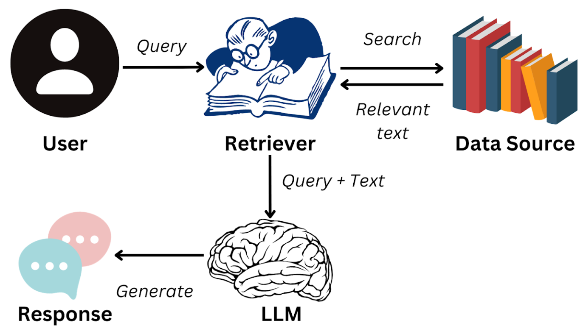

<BlogPost>

## RAG 概览

## RAG 流程

### Step1，数据预处理

+ 知识库构建：收集并整理文档、网页、数据库等多源数据，构建外部知识库。 -- 数据治理
+ 文档分块：将文档切分为适当大小的片段（chunks），以便后续检索。分块策略需要在语义完整性与
检索效率之间取得平衡。
+ 向量化处理：使用嵌入模型（如BGE、M3E、Chinese-Alpaca-2等）将文本块转换为向量，并存储在向量数据库中。

### Step2，检索阶段

+ 查询处理：将用户输入的问题转换为向量，并在向量数据库中进行相似度检索，找到最相关的文本片段。
+ 重排序：对检索结果进行相关性排序，选择最相关的片段作为生成阶段的输入。

### Step3，生成阶段

+ 上下文组装：将检索到的文本片段与用户问题结合，形成增强的上下文输入。
+ 生成回答：大语言模型基于增强的上下文生成最终回答。

## Native RAG

+ “**Native RAG**” 通常指的是最基础、标准的 RAG 实现方式，也常被称为 **Naive RAG** 或 **Traditional RAG**。它代表的是一个端到端的、线性的流程：接收用户查询 → 对查询进行向量化 → 从向量数据库中检索相关文档 → 将检索结果与原始查询一起输入大语言模型（LLM）生成答案 。

### Native RAG 的核心特点包括

- 使用**未结构化文本**和**向量表示**进行检索；
- **不对查询进行复杂处理**（如分解、意图识别、多跳推理等）；
- 整个流程是**标准化、固定流水线**：嵌入（embedding）→ 检索（retrieval）→ 重排序（reranking，可选）→ 生成（generation）。

### Native RAG 主要与以下几种更高级或不同范式的 RAG 方法相对

1. **Advanced RAG**（高级 RAG）  
   - 引入查询改写、多轮检索、上下文压缩、结果重排序等机制；
   - 更适合**复杂、真实场景**，在灵活性、可扩展性和性能上优于 Native RAG 。

2. **Agentic RAG**（智能体式 RAG）  
   - 将 RAG 流程嵌入到一个具备**规划、工具调用、记忆和反思能力**的智能体框架中；
   - 能动态决定是否检索、何时检索、如何组合多个信息源等，远比 Native RAG 灵活 。

3. **Graph RAG**（图结构 RAG）  
   - 利用知识图谱或从文本中构建的图结构进行检索，支持**多跳推理**和**语义关系理解**；
   - 相比 Native RAG 仅依赖向量相似度，Graph RAG 能更好地处理复杂查询 。

</BlogPost>
