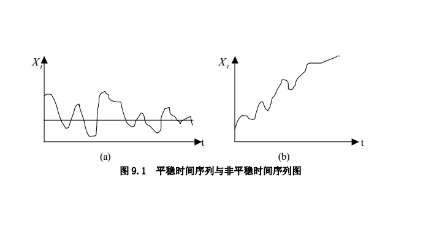
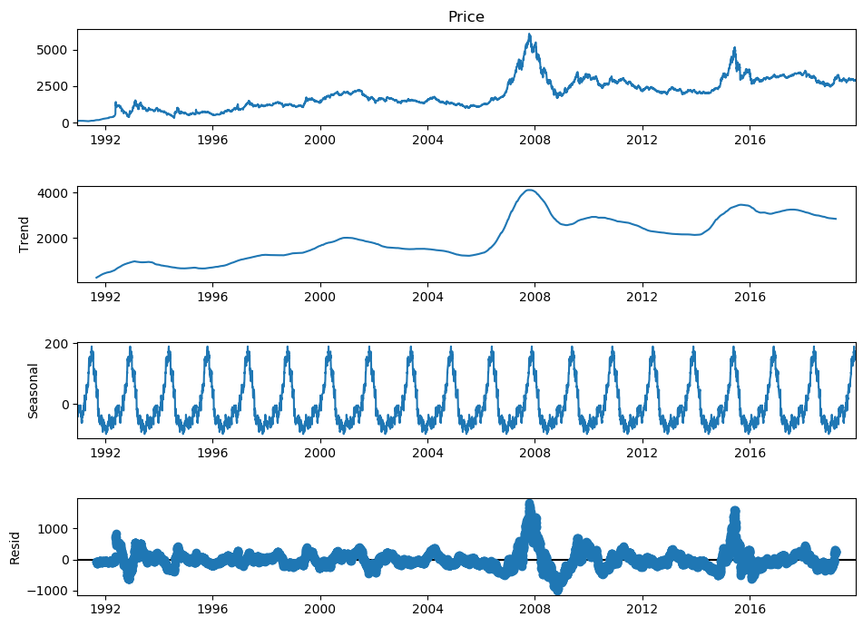

<BlogPost>

## 时间序列

### 什么是时间序列

+ 在AI开发中，**时间序列**（Time Series）是指**按时间顺序记录的一系列观测值**，这些数据点通常具有**时间依赖性**，即当前值可能受到过去值的影响。
+ 在AI开发中，时间序列不仅是数据的一种组织形式，更是许多预测、分类和生成任务的基础。
+ 为了用于机器学习或深度学习模型，时间序列通常需要通过**滑动窗口**（Sliding Window）等技巧，将长序列切分为多个短序列样本 。

### 核心概念

+ **定义**：时间序列是一组按照时间先后顺序排列的离散数据点，是日常生活中最常见的数据形式之一 。
+ **典型特征**：
  + **趋势**（Trend）：数据在长期内呈现的上升或下降方向；
  + **季节性**（Seasonality）：以固定周期重复出现的模式 。
+ **应用场景广泛**：如金融股价、天气预报、交通流量预测、心电图、机器人轨迹、音频视频等 。

### 时间序列分析与回归分析的区别

+ 在选择模型前，我们需要确定`结果与变量之间的关系`。
+ 回归分析训练得到的是目标变量y与自变量x（一个或多个）的相关性，然后通过新的自变量x来预测目标变量y。而时间序列分析得到的是目标变量y与时间的相关性
+ 回归分析擅长的是**单变量与目标结果之间的分析**，多变量与目标结果之间的分析，即便是单一变量，也往往与时间无关。
+ 时间序列分析建立在**时间变化**的基础上，它会分析目标变量的趋势、周期、时期和不稳定因素等。这些趋势和周期都是在时间维度的基础上，是我们要观察的重要特征

> 时间序列也可以算是一种特殊的回归，因为 y 只和一个特征时间 x （时间）有关，所以时间序列分析也可以看作是一种回归分析。

### 相关模型

+ 传统时间序列模型，包括 AR、MA、ARMA、ARIMA -- 属于计量经济学/统计学范畴
+ 神经网络，时序大模型都可以进行时间序列预测 -- 属于机器学习/深度学习范畴

## 时间序列模型

+ 平稳序列，stationary series
  基本上不存在趋势（Trend）的序列，各观察值基本上在某个固定的水平上波动
+ 非平稳序列，non-stationary series
  + 包含趋势、季节性或周期性的序列，可以只有一种成分，也可能是多种成分的组合

## 时间序列分析

+ 趋势（trend）：时间序列在长时期内呈现出来的某种持续上升或持续下降的变动，也称长期趋势
+ 季节性（seasonality）：时间序列在一年内重复出现的周期波动。销售旺季，销售淡季，旅游旺季、旅游淡季
  + 季节，可以是任何一种周期性变化，不一定是一年中的四季含有季节成分的序列可能含有趋势，也可能不含有趋势
+ 周期性（cyclicity）：通常是由经济环境的变化引起
  + 不同于趋势变动，不是朝着单一方向的持续运动，而是涨落相间的交替波动
  + 不同于季节变动，季节变动有比较固定的规律，变动周期大多为一年。周期性的循环波动无固定规律，变动周期多在一年以上，且周期长短不一
+ 随机性（Irregular）: 指受偶然因素影响所形成的的不规则波动，在时间序列中无法预估。又称 Residual（残差项）
  + 随机性是不规则波动，除去趋势、周期性、季节性的偶然性波动

## 时间序列工具（statsmodels）

+ statsmodels 工具包提供统计计算，包括描述性统计以及统计模型的估计和推断

+ statsmodels主要包括如下子模块：
  + 回归模型：线性回归，广义线性模型，线性混合效应模
  + 方差分析（ANOVA）
  + 时间序列分析：AR，ARMA，ARIMA等

</BlogPost>
