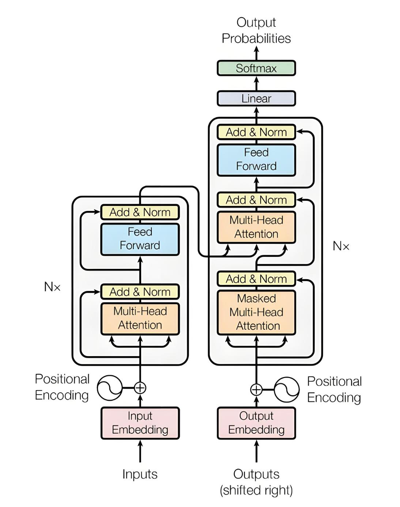

<BlogPost>

## Transformer 概览

### Transformer 结构图

---

### Transformer 是一种框架（Framework）

+ 它提供了一个通用的、可扩展的架构，这个架构定义了`处理序列数据`的一种新范式，而具体的模型则是在此基础上进行的实现和改进。
+ Transformer 框架的核心是其`自注意力（self-attention）机制`，它解决了传统`循环神经网络（RNN）`和`卷积神经网络（CNN）`在处理长序列时遇到的问题，如长距离依赖和并行计算的限制。

### Transformer 框架的基本组件

+ **编码器（Encoder）**: 负责将输入序列（如句子中的每个词）转化为一系列上下文向量。它由多个相同的层堆叠而成，每一层包含一个自注意力子层和一个前馈神经网络子层。
+ **解码器（Decoder）**: 负责根据编码器的输出和已生成的序列来生成新的输出序列。它也由多个相同的层堆叠而成，并额外增加了一个跨注意力（cross-attention）子层，用于关注编码器的输出。
+ **位置编码（Positional Encoding）**: 这是一个关键部分，因为自注意力机制本身不包含序列顺序信息。位置编码通过给每个词的输入向量添加位置信息，解决了这个问题。

### Transformer 具体的实现

+ **BERT (Bidirectional Encoder Representations from Transformers)**: BERT 只使用了 Transformer 的 **编码器部分**。它的核心思想是**双向**学习上下文信息。通过训练模型来预测句子中被遮蔽（masked）的词，BERT 能够学习到语言的深层表示。它主要用于理解文本，而不是生成文本，因此在问答、情感分析和命名实体识别等任务上表现出色。
+ **GPT (Generative Pre-trained Transformer)**: GPT 只使用了 Transformer 的 **解码器部分**。它通过**单向**学习来预测序列中的下一个词。这种架构非常适合文本生成任务，因为它在训练时只能看到当前词之前的所有词。因此，它被广泛应用于文章续写、对话生成和代码生成等领域。
+ **T5 (Text-to-Text Transfer Transformer)**: T5 采用了完整的 **Encoder-Decoder 架构**。它的独特之处在于，它将所有自然语言处理任务都统一成“文本到文本”的形式。无论任务是翻译、摘要还是分类，模型都将输入文本转换成输出文本。例如，对于翻译任务，输入是“英文句子”，输出是“中文句子”；对于分类任务，输入是“句子”，输出是“标签名称”。
+ **Vision Transformer (ViT)**: ViT 将 Transformer 框架应用于计算机视觉领域。它将图像切分成一系列小块，并将这些小块视为序列中的“词”。然后，它使用标准的 Transformer 编码器来处理这些图像块序列，从而进行图像分类等任务。这证明了 Transformer 框架不仅限于处理文本数据。
+ **Transformer-XL**: 针对处理超长序列的挑战而设计。它引入了“循环”机制，允许模型在处理下一个分段时重用上一个分段的隐藏状态，从而有效捕捉更长距离的依赖关系，而不会像传统 Transformer 那样受固定上下文窗口大小的限制。

### 输出每个字的不同环节，用不同的神经网络来实现

+ Transformer 框架下，人们将输出每个字的不同环节，用不同的神经网络来实现
+ 核心思想：将复杂的任务分解成可管理的、专门化的子任务，并用不同的神经网络模块来分别处理。
+ 准确表述：在 Transformer 框架下，模型通过`多层堆叠`的`自注意力机制`和`前馈神经网络`来处理`输入序列`，并生成`输出序列`。这个过程通常由一个`编码器（用于理解输入）`和一个`解码器（用于生成输出）`协同完成。模型输出的单位是`词元` (tokens)，而非仅仅是“字”，这些词元可以是词、子词或字符，具体取决于预训练时的`分词策略`。

## 基础概念解析

### 向量、空间、特征

+ `特征`定义了向量的维度，而`向量`则生活在由这些维度所定义的`空间`里

#### 特征

特征（Features）是你用来描述一个对象或一个事件的属性。
例如，如果要描述一个人的外貌，你可以用“身高”、“体重”和“年龄”作为特征。这些特征是构成描述的基础。

#### 向量

当你把这些特征组合在一起，按照一定的顺序排列时，它们就形成了一个向量（Vector）。向量是一个有序的数字列表，可以看作是对象或事件的数学表示。
例如，如果一个人的身高是180cm，体重是75kg，年龄是30岁，那么这个人就可以用向量 [180,75,30] 来表示。这个向量包含了所有用于描述这个人的特征信息。

#### 空间

空间（Space）是所有可能的向量的集合。它是一个数学上的抽象概念，提供了一个框架来容纳和比较向量。
在上面的例子中，我们有“身高”、“体重”和“年龄”三个特征。每个特征可以看作是一个维度。这样，我们就创建了一个三维空间，也称为“特征空间”。在这个空间里，每一个点都代表着一个特定的人，而这个点的坐标就是由这个人的身高、体重和年龄组成的向量。

---

### 标量、向量

#### 标量 Scalar - 一个只有**大小**，没有**方向**的量

#### 向量 Vector - 一个既有**大小**，又有**方向**的量

---

### 点积、叉积

#### 乘积 Product - 乘法的结果

#### 点积 Dot Product = 点乘 Scalar product = 表示两个`向量`相乘得到一个`标量`

+ **Dot product** 这个名称来自其运算符号——一个**点**（•），例如 A • B。
+ **Scalar product** 这个名称则强调运算的结果是一个**标量**（scalar）。

#### 叉积 Cross Product = 叉乘 Vector product = 表示两个`向量`相乘得到一个`向量`

+ **Cross product** 这个名称来自其运算符号——一个**叉**（×），例如 $A \cdot B$。
+ **Vector product** 这个名称则强调运算的结果是一个**向量**（vector）。

#### 用途

+ 点积主要用来衡量向量之间的投影关系
+ 叉乘主要用来找到与两个向量都垂直的新向量。

---

### AI 中`点积`的用途

点积在AI领域，尤其是深度学习中，扮演着核心角色。它主要用于解决以下几个问题：

#### 1. 向量相似度计算

点积可以衡量两个向量的相似度。在 AI 中，数据（如词语、图像特征、用户偏好等）通常被表示成高维向量。通过计算这些向量的点积，我们可以判断它们在方向上的接近程度：

+ **正值**：两个向量方向相近，代表它们所表示的概念或数据很相似。
+ **负值**：两个向量方向相反，代表它们不相似。
+ **零**：两个向量正交（夹角90度），代表它们不相关。

这种相似度计算在**推荐系统**中尤为常见，例如，通过计算用户向量和电影向量的点积，可以预测用户对某部电影的喜好程度。

#### 2. 神经网络中的权重和输入

在神经网络的基本单元——神经元中，点积是核心计算。每个神经元接收来自上一层神经元的输入信号（向量），并将其与自身的权重（另一个向量）进行点积运算。这个点积的结果，加上一个偏置项，构成了神经元的总输入，随后通过激活函数进行非线性转换。

$$\text{总输入} = \text{权重} \cdot \text{输入} + \text{偏置}$$

这个过程实际上是在寻找输入数据中与该神经元“关注”的模式最匹配的部分。点积越大，意味着输入数据与神经元的权重模式越契合。

#### 3. 注意力机制（Attention Mechanism）

在现代的自然语言处理（NLP）模型（如 Transformer）中，点积被广泛用于实现“注意力机制”。它通过计算查询（Query）向量和多个键（Key）向量的点积，来衡量查询与每个键之间的相关性。点积结果越大，表明该查询对该键的“注意力”越高，从而赋予其更高的权重。

例如，在机器翻译中，当模型翻译一个单词时，它会通过点积计算当前单词（查询）与源语言句子中所有单词（键）的相似度，以决定“关注”哪些源单词来更好地理解和翻译。

## token 化（tokenization） - 对用户输入的内容进行初始化

+ Tokenization 本身是一个很基础的文本处理过程，它的主要目的就是将一段连续的文本分解成更小的、有意义的单元，这些单元就叫做“token”。
+ 现代 NLP 中用于大模型的 tokenization，会通过对大量文本数据的统计和学习，来决定如何创建和分割 token，从而达到更好的压缩和表示效果。
+ 示例中，GPT 将用户输入的的650个字，转换成大概1300个Token

## Embedding - Token 变成向量

+ 示例中，GPT 将用户输入的的650个字，转换成大概1300个 `Token`，然后再把1300个 Token 变成1300个 `Embedding向量`，每个向量12288维

## Positional Encoding

+ 在向量中加入位置信息
+ 示例中，上一步中的650个字转化出来的1300个向量，每个向量都只表示了一个文字，还需要加入位置信息

## Encoder & Decoder

### 针对中心主题词的多轮聚合

在 Transformer 架构中，Encoder 和 Decoder 的核心思想是对每个 token 进行多轮的**聚合（aggregation）**。这个聚合过程主要是通过**自注意力机制（self-attention）**实现的。

简单来说，每个 token 都会像一个中心词一样，在每一层中与其他所有 token 进行交互，并吸收（或说聚合）它们的信息，从而得到一个更加丰富的、包含了上下文信息的**新表示（new representation）**。这个过程会重复多轮，也就是经过多层，让每个 token 的表示越来越完善。

我们用一个简单的句子来举例说明这个过程，假设句子是：“我喜欢吃苹果。”

#### 1. Encoder 的聚合过程

Encoder 的主要任务是理解整个句子。它会把句子中的每个 token 都处理一遍。

+ **第一层自注意力（以“苹果”为例）**:
  + “苹果”会去“看”句子中的所有其他词：**“我”**、**“喜欢”**、**“吃”**、**“苹果”**。
  + “苹果”会计算它与每个词之间的**注意力分数（attention score）**。例如，它可能会发现自己和“吃”之间的关系最紧密（因为“吃”直接作用于“苹果”），和“喜欢”的关系也比较密切，而和“我”的关系稍远。
  + 然后，“苹果”会根据这些注意力分数，从“我”、“喜欢”、“吃”以及自身中**加权聚合**它们的信息。
  + 经过这一层处理后，“苹果”这个 token 的表示就不再是孤立的，它已经融入了“我喜欢吃”这些词的上下文信息。比如，它的新表示可能会包含“被吃的东西”这样的概念。

+ **第二层及后续层**:
  + 这个过程会重复，每一层都会在前一层的基础上，让每个 token 的表示变得更丰富。
  + 例如，在第二层，“苹果”的新表示可能会再次聚合信息。这一次，它聚合的不再是原始的词，而是第一层处理后的、已经包含了部分上下文信息的词的表示。这样，它可能学到更深层次的语义，比如“苹果”在这个句子中是“我”喜欢的、被“我”吃的东西。

这个多层聚合的过程，就像是让每个词反复“讨论”，最终达成一个共识，使得每个词的表示都包含了整个句子的全局信息。

---

#### 2. Decoder 的聚合过程

Decoder 的任务是**生成**新的 token。它的聚合过程和 Encoder 类似，但有两点关键区别：

##### 1. 自注意力机制的限制

Decoder 在生成第 N 个 token 时，为了不“偷看”未来的词，它只能看到并聚合**前面已生成的 token**（1 到 N-1）的信息。这被称为**带掩码的自注意力（masked self-attention）**。

##### 2. 交叉注意力机制（Cross-Attention）

这是一个非常重要的聚合步骤。Decoder 的每一层都包含一个**交叉注意力层**，这个层会把 Decoder 正在处理的 token 和 **Encoder 的所有输出**进行聚合。

我们以机器翻译为例，假设我们要翻译“I like apple”到“我喜欢吃苹果”。

+ Decoder 正在生成“苹果”这个词。
+ 在生成“苹果”之前，它已经生成了“我”、“喜欢”、“吃”。
+ **自注意力**: “苹果”会先对前面已生成的“我”、“喜欢”、“吃”进行聚合，理解它们之间的关系。
+ **交叉注意力**: 这一步是关键。“苹果”会去“看”Encoder 输出的、已经包含了**“I like apple”整个句子上下文信息**的所有表示。
  + “苹果”会计算它和“I”、“like”、“apple”这三个词的 Encoder 输出之间的注意力分数。
  + 它可能会发现自己和“apple”这个词的原始表示最相关，和“like”次之。
  + 然后，它会根据这些分数，从 Encoder 的输出中**聚合信息**。
  + 通过这个过程，Decoder 不仅理解了自己已经生成的“我喜欢吃”这些词，还**将这些信息与源语言的“I like apple”的信息联系起来**，确保生成的内容与原文匹配。

---

#### 总结

+ **聚合**是 Transformer 的核心概念，它通过**自注意力**和**交叉注意力**实现。
+ **Encoder** 的每一层都让每个 token 与**句子中的所有其他 token**进行聚合，形成一个包含全局上下文的新表示。
+ **Decoder** 的聚合过程分两步：
    1. **带掩码的自注意力**: 让当前 token 只与**前面已生成的 token**聚合。
    2. **交叉注意力**: 将当前 token 与 **Encoder 的全部输出**进行聚合，从而连接源语言和目标语言的语义。

这个多轮聚合的过程，就像是一场持续的“头脑风暴”，每个词都在反复地从其他词那里汲取信息，并贡献自己的信息，最终形成一个更加精准和全面的理解。

+ 在实现层面，会对 中心主题词 一轮聚合，经过多轮聚合后

### 简单要记住的结论

+ Encoder 适合做分析 做一次就停了
+ Decoder 适合做生成 每蹦一个字，都要算一次
+ 最新的大语言模型，几乎都采用了 `Decoder Only` 的架构

## Linear & Softmax

在 Transformer 架构中，**Linear** 和 **Softmax** 是两个关键的数学操作，它们通常出现在网络的末端，特别是在**生成任务**中，如机器翻译或文本摘要。这两个环节共同协作，将模型的内部表示（representation）转化为人类可读的、有意义的输出。

简单来说：
+ **Linear (线性层)** 负责将复杂的内部表示，**映射**到一个巨大的、包含所有可能词汇的向量空间中。
+ **Softmax (归一化指数函数)** 负责将这个向量中的值，**转换**成概率分布，告诉我们每个词被选中的可能性有多大。

我们继续以一个机器翻译任务为例，假设我们正在将“I like apples”翻译成“我喜欢吃苹果”，并且 Decoder 已经处理完所有步骤，准备生成最后一个词：“苹果”。

---

### 1. Linear 层：从表示到词汇表

经过 Transformer Decoder 的层层处理后，模型已经为下一个要生成的词创建了一个非常复杂的、高维度的向量表示。这个向量包含了源语言（“I like apples”）和已生成的目标语言（“我喜欢吃”）的所有上下文信息。

这个向量本身没有直接的意义，它无法直接告诉我们下一个词是“苹果”还是“香蕉”。**Linear 层的任务就是解决这个问题**。

假设我们的词汇表（vocabulary）有 50,000 个词（比如，“我”、“喜欢”、“吃”、“苹果”、“香蕉”……一直到第 50,000 个词）。

+ **操作**：Linear 层本质上是一个全连接层（fully connected layer），它会对 Decoder 输出的那个向量进行一次**矩阵乘法**。
+ **输出**：它会把这个高维度的向量，**映射**成一个同样大小为 50,000 的新向量。这个新的向量被称为 **logits 向量**。

**举例**：
如果我们的词汇表大小是 50,000，那么 Linear 层会输出一个长度为 50,000 的向量。这个向量的每一个位置都对应词汇表中的一个词，其值（logits）代表了模型对该词的“偏好”或“倾向性”。

例如，这个 logits 向量可能看起来像这样：
+ ...
+ logits["苹果"] = 8.5
+ ...
+ logits["香蕉"] = 2.1
+ ...
+ logits["橘子"] = 1.5
+ ...

**注意**：这些值（8.5, 2.1, 1.5）本身没有直观的意义，它们可以是任何实数，甚至是负数。值越大，代表模型越“倾向于”选择这个词。

---

### 2. Softmax 层：从偏好到概率

Linear 层的输出告诉我们模型的“偏好”，但这不是一个概率分布。为了让这些值变成可解释的概率，并且所有概率加起来等于 1，我们需要使用 **Softmax 函数**。

+ **操作**：Softmax 会对 Linear 层输出的 logits 向量进行处理。它会先对每个值取指数（$e^x$），然后用这个值除以所有值的指数和。
+ **数学公式**：对于第 $i$ 个词，其概率计算为：
    $$
    P(\text{word}_i) = \frac{e^{\text{logit}_i}}{\sum_{j=1}^{V} e^{\text{logit}_j}}
    $$
    其中 $V$ 是词汇表的大小。

**举例**：
继续使用上面 Linear 层的输出。Softmax 会对这些值进行处理：

1. 对每个 logits 值取指数：
    + $e^{8.5} \approx 4914.77$
    + $e^{2.1} \approx 8.17$
    + $e^{1.5} \approx 4.48$
2. 计算所有指数值的总和。
3. 用每个指数值除以总和，得到概率：
    + $P(\text{"苹果"}) = \frac{e^{8.5}}{e^{8.5} + e^{2.1} + ...} \approx 0.95$
    + $P(\text{"香蕉"}) = \frac{e^{2.1}}{e^{8.5} + e^{2.1} + ...} \approx 0.01$
    + $P(\text{"橘子"}) = \frac{e^{1.5}}{e^{8.5} + e^{2.1} + ...} \approx 0.005$

最终，Softmax 层的输出是一个**概率分布**，告诉我们模型预测下一个词是每个词的几率。在这个例子中，模型预测下一个词是“苹果”的几率高达 95%。

最后，模型会根据这个概率分布做出决策，通常是选择概率最高的词（“苹果”），然后将其作为下一个生成的 token，并继续下一个循环。

总结来说，**Linear 层**负责将模型的内部理解**投射**到词汇表中，而 **Softmax 层**则将这种投射结果**转化为**清晰的、可选择的概率，完成了从抽象表示到具体词汇的最终转换。

+ `softmax 函数`也被称为`归一化函数`，它的作用是将一个向量中的值，映射到一个概率分布上。

</BlogPost>
