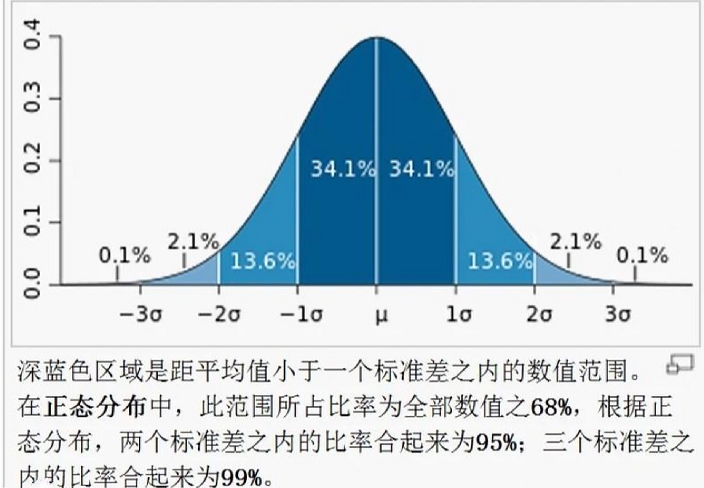

<BlogPost>

## 事件的概率

+ “事件的概率”是**概率论**中的核心概念，用于**量化某个事件发生的可能性大小**。它是一个介于 0 和 1 之间的数值（包括 0 和 1），用来表示在某种条件下，某件事情发生的“机会”或“可能性”。
+ **概率 = 0**：表示事件**不可能发生**（不可能事件）。
+ **概率 = 1**：表示事件**必然发生**（必然事件）。
+ **概率 **0 < 概率 < 1**：表示事件**可能发生，也可能不发生**，数值越大，发生的可能性越高。

### 🧮 数学定义（古典概型）

在“古典概型”中（即所有结果等可能、有限），事件 A 的概率定义为：

$$
P(A) = \frac{\text{事件A包含的样本点数}}{\text{样本空间中的总样本点数}}
$$

✅ 举例：
掷一枚均匀的六面骰子，求“掷出偶数”的概率。

+ 样本空间：{1, 2, 3, 4, 5, 6} → 共6种可能
+ 事件A（偶数）：{2, 4, 6} → 3种有利结果
+ 所以：P(A) = 3/6 = 0.5

---

### 📊 更广义的概率定义（公理化定义，Kolmogorov）

现代概率论建立在**公理化体系**之上，由苏联数学家柯尔莫哥洛夫（Kolmogorov）在1933年提出：

对一个样本空间 Ω 上的事件集合 F，概率 P 是一个函数，满足：

1. **非负性**：对任意事件 A，P(A) ≥ 0
2. **规范性**：P(Ω) = 1（整个样本空间的概率为1）
3. **可列可加性**：对互斥事件 A₁, A₂, ...，有  

$$
   P\left(\bigcup_{i=1}^{\infty} A_i\right) = \sum_{i=1}^{\infty} P(A_i)
$$

---

### 🌰 生活中的例子

+ 明天下雨的概率是 30% → 表示根据气象数据，明天有30%的可能性会下雨。
+ 抽奖中奖概率是 1% → 表示每100次抽奖，平均约有1次中奖（长期频率意义）。
+ 医生说手术成功率95% → 表示在类似条件下，100个病人中大约95个会成功。

### 💡 概率的本质理解

概率不是“保证”，而是“可能性”的度量。它可以从不同角度理解：

+ **频率派观点**：概率 = 长期重复试验中事件发生的频率极限。
+ **贝叶斯派观点**：概率 = 对事件发生可能性的主观信念度（可随信息更新）。
+ **公理化观点**：概率是满足三条公理的数学对象，不依赖具体解释。

## `独立事件`和`相关事件`

> **独立事件**：你发生你的，我发生我的，互不干扰。  
> **相关事件**：你发生了，我就更容易（或更难）发生 —— 咱俩有“关系”。

+ “**独立事件**”和“**相关事件**”（更准确地说，是“**不独立事件**”或“**相依事件**”）描述的是**两个或多个事件之间是否相互影响**。

### 独立事件（Independent Events）

> **定义**：两个事件 A 和 B 是独立的，如果其中一个事件的发生**不影响**另一个事件发生的概率。

#### 数学定义

事件 A 和 B 独立，当且仅当：

$$
P(A \cap B) = P(A) \cdot P(B)
$$

或者等价地（当 P(B) > 0）：

$$
P(A|B) = P(A)
$$

👉 也就是说：**知道 B 发生了，对 A 发生的概率没有影响。**

---

#### 🌰 例子1：掷骰子 + 抛硬币

+ 事件 A：掷骰子得到6点 → P(A) = 1/6
+ 事件 B：抛硬币得到正面 → P(B) = 1/2
+ 事件 A ∩ B：掷出6点**且**抛出正面 → P(A∩B) = (1/6) × (1/2) = 1/12

✅ 满足 P(A∩B) = P(A)·P(B)，所以 A 和 B 是**独立事件**。

#### 🌰 例子2：连续抛硬币

+ 第一次抛硬币得正面，和第二次抛硬币得正面，是独立的（假设硬币是公平的、无记忆的）。

---

### 相关事件 / 相依事件（Dependent Events）

> **定义**：两个事件 A 和 B 是相关的（或相依的），如果其中一个事件的发生**会影响**另一个事件发生的概率。

+ **“相关” ≠ “因果”**！  
  两个事件概率上相关，不代表一个导致另一个（比如：冰淇淋销量和溺水人数正相关，是因为夏天热 —— 隐藏变量是“气温”）。

+ 判断是否独立，不能只靠直觉，有时要靠数据或数学验证！

#### ✅ 数学定义

$$
P(A \cap B) \neq P(A) \cdot P(B)
$$

或者：

$$
P(A|B) \neq P(A)
$$

👉 也就是说：**知道 B 发生了，会改变我们对 A 发生可能性的判断。**

---

### 🌰 例子1：抽扑克牌（无放回）

+ 事件 A：第一次抽到红心A
+ 事件 B：第二次抽到红心A

➡️ 如果第一次抽到了红心A，那第二次**不可能**再抽到它（因为牌不放回），所以：

+ P(B|A) = 0 ≠ P(B) （原本 P(B) 是 1/52）

✅ 所以 A 和 B 是**相关事件（相依事件）**。

### 🌰 例子2：天气与迟到

+ 事件 A：今天下雨
+ 事件 B：你上班迟到

➡️ 如果下雨，交通可能拥堵，迟到概率上升 → P(B|A) > P(B)

✅ 所以“下雨”和“迟到”通常是**相关事件**。

---

### 🎯 应用场景

+ **独立事件**：用于建模无记忆过程，如密码破解、独立实验、机器学习中的朴素贝叶斯假设。
+ **相关事件**：用于建模现实世界复杂关系，如金融风险、疾病传播、推荐系统等。

## 联合概率

### ✅ 一、联合概率的基本概念

> **联合概率（Joint Probability）**：指**两个或多个事件同时发生**的概率。

+ 联合概率有多种写法，但意义是相同的

例如：

+ 事件 A 和事件 B 同时发生 → 记作 P(A 且 B)
+ 在数学上，这等价于 A 与 B 的交集：A ∩ B

---

### 📝 二、常见的联合概率表示法

#### 1. **P(A ∩ B)** —— 集合论写法（最严谨）

这是最“数学化”的写法，用集合的“交集”符号 ∩ 表示“同时发生”。

✅ 举例：
掷骰子，A = “点数为偶数”，B = “点数 > 3”
→ A ∩ B = {4, 6}，P(A ∩ B) = 2/6 = 1/3

📌 适用场景：概率公理化体系、数学证明、集合论背景。

---

#### 2. **P(A, B)** —— 简洁写法（最常用）

这是概率论、统计学、机器学习中最常见的写法。逗号“,”表示“和”或“同时”。

✅ 举例：
P(下雨, 迟到) —— 表示“既下雨又迟到”的概率。

📌 适用场景：

+ 机器学习（如联合分布 P(X, Y)）
+ 贝叶斯网络
+ 数据科学、统计建模

💡 为什么用逗号？  
→ 简洁、易扩展（如 P(A, B, C, D)），避免写一堆 ∩ 符号。

---

#### 3. **P(A and B)** —— 自然语言写法（教学/科普常用）

直接用英文单词 “and” 或中文 “且”、“和” 表示同时发生。

✅ 举例：
P(A and B) = P(A 且 B)

📌 适用场景：

+ 教材入门、科普文章、非数学专业课程
+ Excel 或商业分析中也常见这种写法

---

#### 4. **P(AB)** —— 缩略写法（部分教材/文献）

有些文献或老教材中会省略符号，直接写 P(AB)，表示 A 和 B 同时发生。

⚠️ 注意：这种写法容易和“事件 AB”（如两个变量相乘）混淆，现代文献中较少使用。

---

### 📌 三、扩展：多个事件的联合概率

+ 三个事件：P(A ∩ B ∩ C) 或 P(A, B, C)
+ n 个事件：P(A₁, A₂, ..., Aₙ) —— 机器学习中非常常见！

✅ 举例（机器学习）：
P(天气=晴, 温度=高, 是否打网球=是) —— 表示这三个状态同时出现的概率。

## 条件概率

+ **条件概率（Conditional Probability）** ：在已知某个事件发生的前提下，另一个事件发生的概率。
+ **条件概率 P(A|B) 是“在 B 发生的前提下，A 发生的概率”，它用已知信息 B 来更新对 A 的认知，是概率推理的基石。

---

### 🎯 一、直观理解

> **“已知 B 发生了，A 发生的可能性有多大？”**

这就是条件概率要回答的问题。

🔹 举例：

+ 已知“今天下雨”，那么“我上班迟到”的概率是多少？
+ 已知“某人发烧”，那么“他患流感”的概率是多少？
+ 已知“抽到一张红色牌”，那么“它是红心”的概率是多少？

👉 条件概率的本质是：**利用已知信息，更新我们对另一个事件可能性的判断。**

---

### 📐 二、数学定义

事件 A 在事件 B 发生条件下的条件概率，记作：

$$
P(A|B) = \frac{P(A \cap B)}{P(B)} \quad \text{（前提是 } P(B) > 0\text{）}
$$

#### 🔍 公式解读

+ **P(A ∩ B)**：A 和 B **同时发生**的概率（联合概率）
+ **P(B)**：条件事件（已知事件）发生的概率
+ **P(A|B)**：在 B 已经发生的前提下，A 发生的概率

✅ 这个公式也叫 **条件概率公式** 或 **乘法公式的变形**。

---

### 🌰 三、经典例子

#### 例1：抽扑克牌

从一副52张扑克牌中随机抽一张：

+ 事件 A：抽到“红心”
+ 事件 B：抽到“红色牌”

我们知道：

+ P(B) = 26/52 = 1/2（红桃+方块）
+ P(A ∩ B) = P(抽到红心) = 13/52 = 1/4（因为红心就是红色）

所以：

$$
P(A|B) = \frac{P(A \cap B)}{P(B)} = \frac{1/4}{1/2} = \frac{1}{2}
$$

#### 🔍 解释：**已知抽到的是红色牌，那么它是红心的概率是 50%** —— 因为红色牌只有红心和方块两种，各占一半

---

#### 例2：疾病检测（贝叶斯思维启蒙）

假设：

+ 某病发病率 P(病) = 1% → P(D) = 0.01
+ 检测准确率：
  + 如果有病，99% 检出阳性 → P(Pos|D) = 0.99
  + 如果没病，95% 检出阴性 → P(Neg|¬D) = 0.95 → 所以 P(Pos|¬D) = 0.05（假阳性）

现在问：**如果一个人检测为阳性，他真得病的概率是多少？**

→ 这就是求 **P(D|Pos)**，典型的条件概率！

---

### 🆚 四、条件概率 vs 联合概率 vs 边缘概率

| 类型         | 符号          | 含义                           | 举例                     |
|--------------|---------------|--------------------------------|--------------------------|
| 联合概率     | P(A, B)       | A 和 B 同时发生                | 既下雨又迟到             |
| 边缘概率     | P(A)          | A 发生（不管 B）               | 下雨的概率               |
| 条件概率     | P(A&#124;B)   | 在 B 发生的前提下 A 发生       | 已知迟到，下雨的概率     |

📌 条件概率 ≠ 联合概率！

👉 P(A&#124;B) 是“比例”或“更新后的可能性”，而 P(A,B) 是“同时发生的绝对概率”。

---

### ⚠️ 五、重要性质和注意事项

#### 1. 条件概率也是概率

它满足概率三公理：

+ 0 ≤ P(A|B) ≤ 1
+ P(Ω|B) = 1
+ 对互斥事件可加

#### 2. P(A|B) ≠ P(B|A) —— **别搞反了！**

这是最常见的错误！

✅ 举例：

+ P(阳性|得病) = 99% → 检测很准
+ P(得病|阳性) = ? → 可能只有 10%~20%（因为假阳性+发病率低）

→ 这就是著名的“**医生悖论**”或“**基础率谬误**”。

#### 3. 独立事件的条件概率

如果 A 和 B 独立，则：

$$
P(A|B) = P(A)
$$

👉 意思是：B 发不发生，对 A 没影响 —— 这也是独立事件的定义之一！

---

### 🧩 六、可视化理解 —— 用“面积”或“样本空间收缩”

想象整个样本空间是一个面积为 1 的正方形：

+ 事件 B 占据其中一部分面积 → P(B)
+ 事件 A ∩ B 是 A 和 B 重叠的部分 → P(A ∩ B)
+ 那么 P(A|B) 就是：**在 B 的范围内，A 占的比例**

🟦 相当于把样本空间“缩小”到 B，然后看 A 在这个新空间中的占比！

---

### 🧭 七、为什么条件概率重要？

+ **现实决策的基础**：我们总是在已知部分信息下做判断（如诊断、投资、推荐系统）。
+ **贝叶斯定理的基础**：P(A|B) = P(B|A)P(A)/P(B) —— 人工智能、医学、金融的核心公式。
+ **机器学习建模**：分类问题本质是求 P(标签|特征)，如 P(垃圾邮件|包含“免费”)。
+ **因果推断、统计推断**都依赖条件概率。

## 贝叶斯定理 - 从条件概率推导而来

+ **贝叶斯定理（Bayes’ Theorem）本质上就是从“条件概率的定义”直接推导出来的** —— 它不是新发明，而是对条件概率的“重新整理”和“视角转换”。
+ **贝叶斯定理就是把条件概率公式“倒过来用” —— 用“结果发生的条件下原因的概率”去求“原因发生的条件下结果的概率”，并用先验知识和证据进行理性更新。**

---

### 🧩 一、从条件概率出发

我们先回顾**条件概率的定义**：

对两个事件 A 和 B（且 P(B) > 0），有：

$$
P(A|B) = \frac{P(A \cap B)}{P(B)} \quad \text{→ 公式①}
$$

同样，如果 P(A) > 0，也可以写出：

$$
P(B|A) = \frac{P(A \cap B)}{P(A)} \quad \text{→ 公式②}
$$

---

### 🔄 二、把两个公式联立 → 得到联合概率

从公式②，我们可以解出：

$$
P(A \cap B) = P(B|A) \cdot P(A) \quad \text{→ 公式③}
$$

现在，把这个表达式代入公式①：

$$
P(A|B) = \frac{P(A \cap B)}{P(B)} = \frac{P(B|A) \cdot P(A)}{P(B)}
$$

---

### 🎉 三、这就是贝叶斯定理

$$
\boxed{P(A|B) = \frac{P(B|A) \cdot P(A)}{P(B)}}
$$

这就是著名的 **贝叶斯定理（Bayes’ Theorem）**！

---

### 📌 四、术语解释（贝叶斯语言）

在贝叶斯语境中，这几个部分有专门的名字：

| 符号         | 名称             | 含义                                 |
|--------------|------------------|--------------------------------------|
| **P(A)**     | 先验概率（Prior） | 在看到数据 B 之前，对 A 的信念       |
| **P(B&#124;A)**   | 似然（Likelihood）| 如果 A 为真，观察到 B 的可能性       |
| **P(B)**     | 证据 / 边缘概率   | B 发生的总概率（标准化常数）         |
| **P(A&#124;B)**   | 后验概率（Posterior） | 看到 B 之后，对 A 的更新信念        |

👉 贝叶斯定理的核心思想：

> **用观察到的证据 B，来更新我们对假设 A 的信念。**

---

### 🌰 五、经典例子：疾病检测（再回顾）

假设：

+ 某病发病率：P(病) = 0.01 → **先验**
+ 检测准确率：
  + 有病 → 99% 阳性：P(阳性|病) = 0.99 → **似然**
  + 无病 → 5% 假阳性：P(阳性|无病) = 0.05

求：检测阳性后，真得病的概率 → **P(病|阳性)**

### ✅ 用贝叶斯定理

$$
P(\text{病}|\text{阳性}) = \frac{P(\text{阳性}|\text{病}) \cdot P(\text{病})}{P(\text{阳性})}
$$

先计算分母 P(阳性) —— 用**全概率公式**：

$$
P(\text{阳性}) = P(\text{阳性}|\text{病})P(\text{病}) + P(\text{阳性}|\text{无病})P(\text{无病})
= 0.99×0.01 + 0.05×0.99 = 0.0099 + 0.0495 = 0.0594
$$

代入：

$$
P(\text{病}|\text{阳性}) = \frac{0.99 × 0.01}{0.0594} ≈ \frac{0.0099}{0.0594} ≈ 0.1667
$$

👉 **即使检测阳性，真实得病的概率只有约 16.7%！**

💡 原因：发病率太低 + 假阳性干扰 → 这就是为什么医生不会仅凭一次阳性就下结论！

---

### 🧠 六、为什么贝叶斯定理重要？

+ **从“已知结果”反推“可能原因”**：比如从症状推断疾病、从邮件内容推断是否垃圾邮件。
+ **机器学习核心**：朴素贝叶斯分类器、贝叶斯网络、生成模型等。
+ **人工智能推理基础**：让机器“根据证据更新信念”。
+ **科学研究方法论**：贝叶斯统计 vs 频率统计。

---

### 🔄 七、贝叶斯 vs 条件概率的关系总结

|                | 条件概率                         | 贝叶斯定理                          |
|----------------|----------------------------------|-------------------------------------|
| 出发点         | 定义：P(A&#124;B) = P(A∩B)/P(B)       | 从条件概率推导而来                  |
| 目的           | 描述“在B下A的概率”               | **用 P(B&#124;A) 反推 P(A&#124;B)**           |
| 是否需要 P(A)  | 不一定                           | **必须知道先验 P(A)**               |
| 应用           | 基础概率计算                     | 推理、更新信念、机器学习、医学诊断  |

## `正向概率`和`逆向概率`

### 正向概率 - 站在上帝视角，去做的统计分析

**正向概率（Forward Probability）**，也叫“先验概率”或“条件概率的正向推导”，是指：

> **已知原因，求结果发生的概率。**

换句话说：**如果我知道某个前提条件成立，那么某个结果发生的可能性有多大？**

🔹 公式表达（条件概率）：
P(结果 | 原因) —— 读作“在原因发生的条件下，结果发生的概率”

---

#### ✅ 举个例子：掷骰子

假设你有一个标准的六面骰子。

**问题**：如果你掷一次骰子，掷出“偶数”的概率是多少？

+ 原因（前提）：骰子是公平的，六个面等可能。
+ 结果：掷出偶数（2, 4, 6）

计算：
P(偶数) = 3个偶数面 / 6个总面 = 1/2 = 50%

👉 这就是正向概率：我们知道骰子的性质（原因），推算某个结果（偶数）出现的概率。

---

### 逆向概率 - 实际大多场景下，只能反过来，根据结果推算原因 - 是数理统计的重要组成部分

**逆向概率（Inverse Probability）**，也叫“后验概率”，是指：

> **已知结果，反推原因发生的概率。**

换句话说：**我观察到了某个结果，那么造成这个结果的“可能原因”是哪一个？它的可能性有多大？**

🔹 公式表达（贝叶斯定理）：
P(原因 | 结果) = [ P(结果 | 原因) × P(原因) ] / P(结果)

这是贝叶斯公式，是逆向概率的核心！

---

#### ✅ 举个生活化的例子：医学检测

假设有一种疾病，发病率是1%（即每100人中有1人得病）。

医院有一种检测方法：

+ 如果一个人**真的有病**，检测结果**呈阳性**的概率是99%（准确率高）。
+ 如果一个人**没病**，检测结果**误报为阳性**的概率是5%（假阳性）。

现在，小明去检测，结果是**阳性**。

**问题**：小明**真的得病**的概率是多少？

——注意！这里我们是**看到结果（阳性）**，想反推**原因（是否真得病）**，这就是逆向概率！

---

### 🧮 我们来计算一下

假设总人数：10,000人

+ 得病人数：1% × 10,000 = 100人
  + 检测呈阳性：99% × 100 = 99人（真阳性）
+ 没病人数：9,900人
  + 误报阳性：5% × 9,900 = 495人（假阳性）

👉 所以，检测呈阳性总人数 = 99 + 495 = 594人

其中，**真正得病的只有99人**

所以，小明阳性后真正得病的概率 = 99 / 594 ≈ **16.7%**

❗ 是不是和你直觉不一样？虽然检测准确率很高，但由于疾病本身很罕见，假阳性人数反而更多！

——这就是逆向概率的威力：**不能只看检测结果，还要结合先验概率（发病率）来判断！**

---

### 总结对比

| 类型       | 正向概率                     | 逆向概率                          |
|------------|------------------------------|-----------------------------------|
| 方向       | 原因 → 结果                  | 结果 → 原因                       |
| 例子       | 已知骰子公平，求掷出6的概率 | 检测阳性，求真得病的概率          |
| 数学工具   | 条件概率 P(结果&#124;原因)         | 贝叶斯定理 P(原因&#124;结果)           |
| 应用场景   | 预测、模拟                   | 诊断、推理、机器学习、AI决策等    |

## 分布

> 概率论中存在多种概率分布，通常可以分为`离散概率分布`和`连续概率分布`两大类 。

+ 常见的离散分布包括伯努利分布、二项分布和两点分布等 。
+ 常见的连续分布则包括正态分布（也称高斯分布）、均匀分布 、指数分布 、伽玛分布 、t分布、F分布和卡方分布等 。
+ 正态分布被认为是非常常见且在统计学上十分重要的分布 。
+ 此外，还有多元正态分布等其他类型 。

---

### 高斯分布（Gaussian Distribution）

高斯分布，又称正态分布（Normal Distribution），是概率论和统计学中最重要的连续型概率分布之一。它在自然界、社会科学、工程等领域广泛存在，比如人的身高、测量误差、考试分数等往往近似服从正态分布。

#### 概率密度函数（PDF）：
对于一个服从正态分布的随机变量 $X \sim N(\mu, \sigma^2)$，其概率密度函数为：

$$ f(x) = \frac{1}{\sqrt{2\pi\sigma^2}} e^{-\frac{(x - \mu)^2}{2\sigma^2}} $$

其中：
- $\mu$ 是均值（期望），决定分布的中心位置；
- $\sigma^2$ 是方差，决定分布的"胖瘦"（离散程度）；
- 曲线呈钟形，对称于均值 $\mu$。

#### 特点：
- 对称性：关于均值对称；
- 68-95-99.7法则：约68%数据落在 $\mu \pm \sigma$，95%在 $\mu \pm 2\sigma$，99.7%在 $\mu \pm 3\sigma$；
- 中心极限定理：大量独立随机变量之和近似服从正态分布。

#### 额外说明

$X \sim N(\mu, \sigma^2)$
这是概率论中描述**随机变量服从某种分布**的标准写法。

##### 1. **X**
这是**随机变量（Random Variable）**，表示一个可以取不同数值的量，其取值具有不确定性，服从某种概率规律。比如：
- X 可以表示“某地区成年男性的身高”；
- 或者“某次考试的分数”；
- 或者“测量某个物体长度时的误差”。

##### 2. **∼** （读作 “服从” 或 “distributed as”）
这个符号表示“服从……分布”。  
所以 “X ∼ …” 的意思是：“随机变量 X 服从……分布”。

##### 3. **N(μ, σ²)**
这是**正态分布（Normal Distribution）**的简写，也叫**高斯分布（Gaussian Distribution）**。

- **N** 代表 “Normal”；
- **μ**（读作 “缪”）是这个分布的**均值（Mean）或期望（Expectation）**，表示分布的中心位置；
- **σ²**（读作 “西格玛平方”）是这个分布的**方差（Variance）**，表示数据围绕均值的离散程度；
  - **σ** 是标准差（Standard Deviation），衡量波动大小。

#### 高斯分布的图形表示

---

### 二项分布（Binomial Distribution） - 亦称`二项式分布`

**二项分布**是一种**离散型概率分布**，描述的是在 \(n\) 次独立伯努利试验中，成功次数 \(k\) 的概率分布。每次试验只有“成功”或“失败”两种结果，成功概率为 \(p\)。

#### 概率质量函数（PMF）：
$$
P(X = k) = \binom{n}{k} p^k (1-p)^{n-k}, \quad k = 0,1,2,\dots,n
$$

其中：
- $n$ 是试验总次数；
- $k$ 是成功的次数；
- $p$ 是单次试验成功的概率；
- $\binom{n}{k}$ 是组合数，表示从 $n$ 次中选 $k$ 次成功的方式数。

#### 举例：
抛10次硬币（\(n=10\)），正面朝上概率 \(p=0.5\)，问恰好出现3次正面的概率？这就是一个二项分布问题。

#### 特点：
- 离散分布；
- 期望：$E[X] = np$；
- 方差：$\text{Var}(X) = np(1-p)$；
- 当 $n$ 很大、$p$ 不接近0或1时，可用正态分布近似（De Moivre–Laplace定理）。

#### 例子：抛硬币实验

##### 🧪 场景设定

你抛一枚**公平的硬币**（正面和反面概率各为 0.5），一共抛 **10 次**。  
你关心的是：**在这 10 次中，恰好出现 6 次正面的概率是多少？**

##### ✅ 为什么这是二项分布？

因为满足二项分布的**四个基本条件**：

1. **试验次数固定**：n = 10 次 ✔️  
2. **每次试验只有两种结果**：“成功”（正面）或“失败”（反面）✔️  
3. **每次“成功”概率相同**：p = 0.5 ✔️  
4. **各次试验相互独立**：前一次结果不影响后一次 ✔️

👉 所以，设随机变量  
> **X = “10次抛硬币中出现正面的次数”**，  
则  
> **X ∼ B(n=10, p=0.5)**，即服从二项分布。

</BlogPost>
