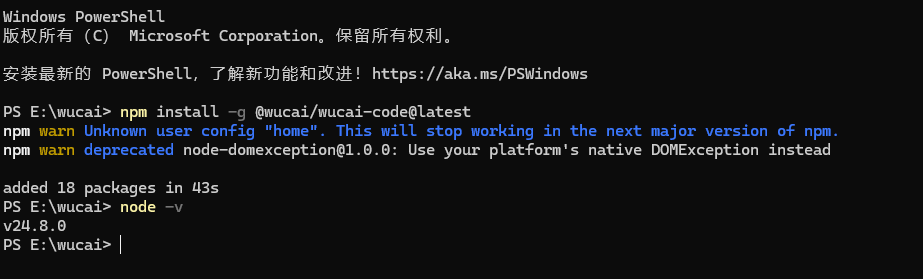

<BlogPost>

## wucai-code 介绍

+ <https://github.com/cystanford/wucai-code>
+ Yang Chen 博士开发，他的培训课程中推荐使用
+ 基于 gemini-cli 开发的一款 AI Agent 工具

## 安装 wucai-code

+ 建议使用 nvm 管理 node.js 版本
+ 升级 node.js 到至少 v22.19.0 或更高版本。
+ 执行 `npm install -g @wucai/wucai-code@latest`
+ 在任何一个目录下，执行 `cmd` 命令，在命令行窗口中，输入`wucai`

</BlogPost>
