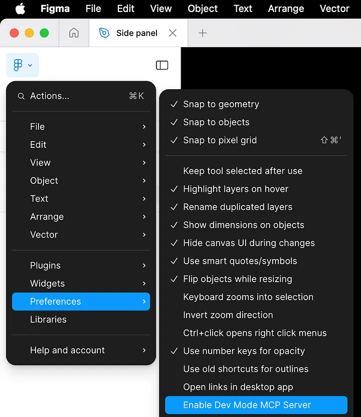
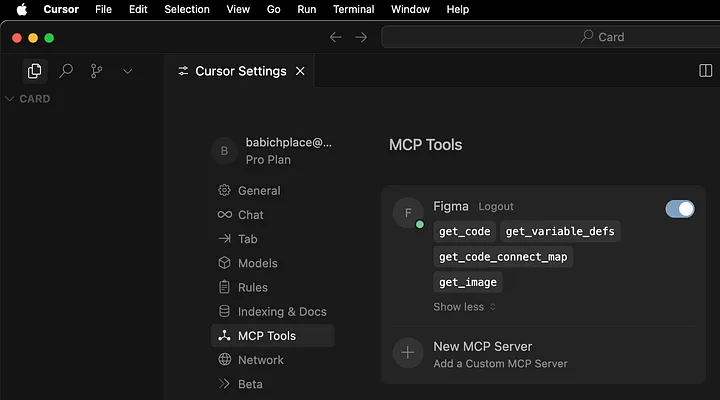

<BlogPost>

> AI 和 MCP 配合使用，将革命性地改变设计师和开发者之间的协作方式。

## Figma 官方提供的 MCP

### 官方描述

+ 2025-06，Figma 正式宣布推出其 Dev Mode MCP（Model Context Protocol）服务器的Beta版，标志着设计与开发工作流的进一步融合。这一服务通过标准化协议将Figma的设计数据直接传递给AI编码工具，显著提升了从设计到代码的转换效率与准确性。

### 官方说明

[Introducing our Dev Mode MCP server: Bringing Figma into your workflow](https://www.figma.com/blog/introducing-figmas-dev-mode-mcp-server/)

### 操作指南

如果你的 Figma 账号没有开启 Dev Mode MCP 服务器，请按照以下步骤启用：

### 重要说明

如果你看不到上图，说明你的账号不符合条件：

+ Pro 版本 Figma 账号，且 Dev or Full seat 才可以使用
+ 教育版该功能不可用

### MCP 工具

官方 MCP 服务提供了4个工具。下图是 Cursor 中 MCP 配置截图，绿色小圆表示该 MCP 工具已启用，截图中显示了4个工具：

### 参考文章

[Figma MCP: Complete Guide](https://uxplanet.org/figma-mcp-complete-guide-c45af0975ab8)

## 第三方 MCP - Figma-Context-MCP

### Github

[Figma-Context-MCP](https://github.com/GLips/Figma-Context-MCP/)

</BlogPost>
