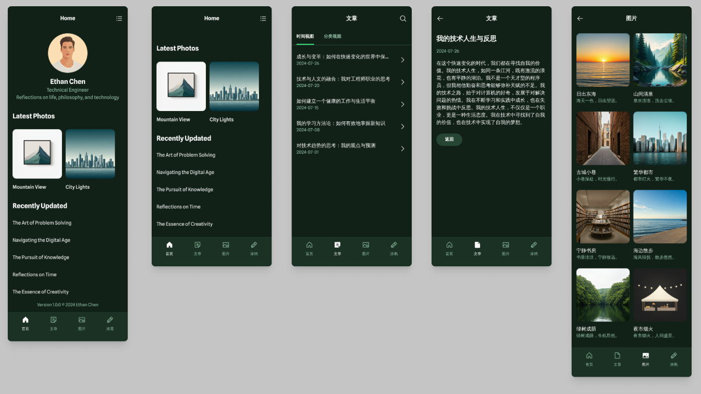
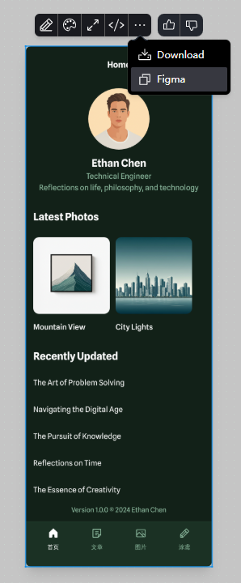
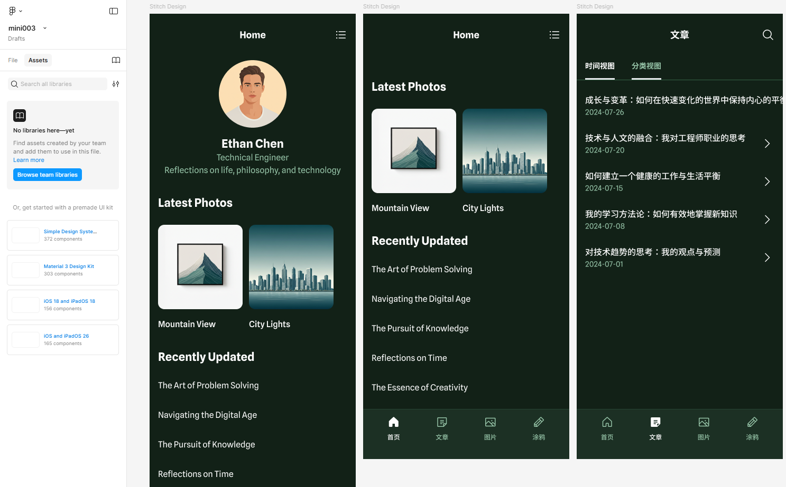
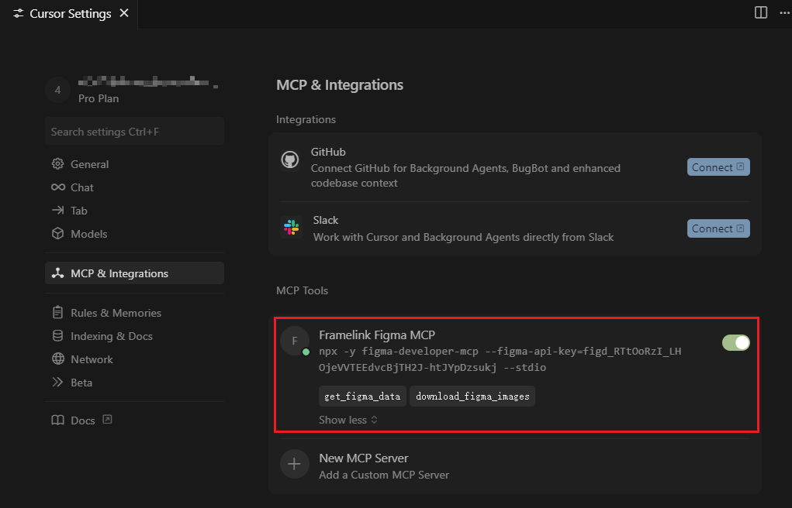
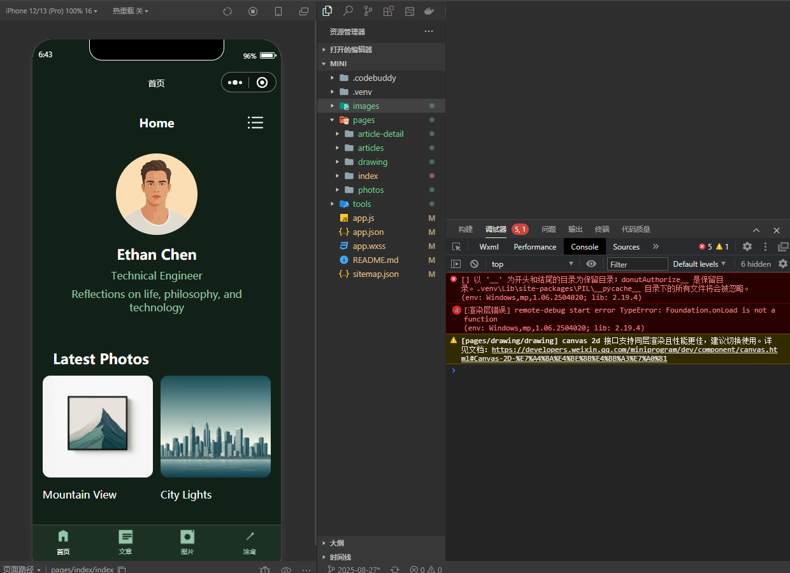
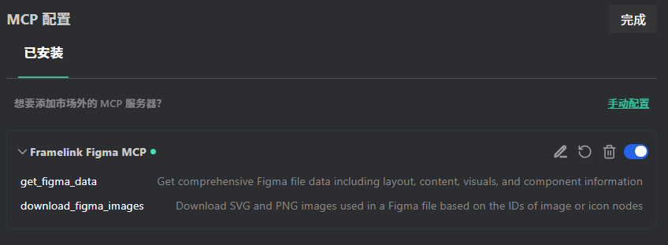
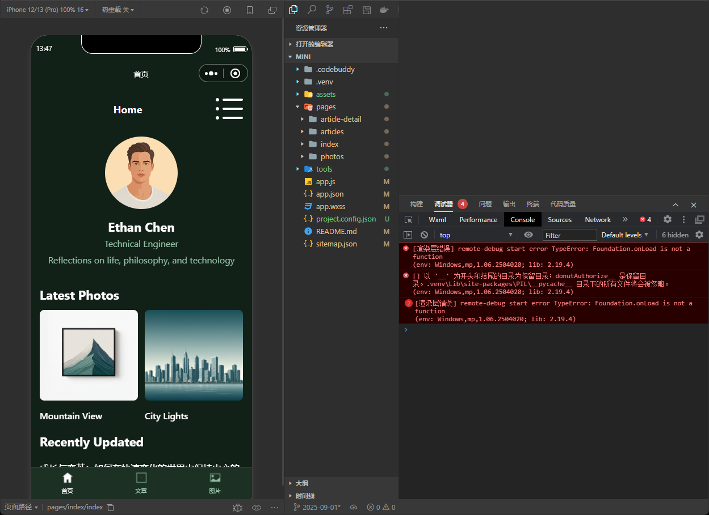

<BlogPost>

> AI 和 MCP 配合使用，将革命性地改变设计师和开发者之间的协作方式。

## Qwen - 需求整理

+ [Qwen 官网](https://chat.qwen.ai)
+ 经过多轮对话，聊清楚你的需求，最终要求它给出一个完整的说明，并告知要去其他地方生成原型用的用途
+ 小程序的设计，在 AI 设计制作中，属于小众品类，因此我们告诉 AI 是`手机上使用的App应用`

+ 示例提示词：

``` prompt
我想开发一个手机上使用的web应用。我想生成的是：一个中年技术工程师对生活，对人生，对技术的思考

## 内容包括：
导航按钮：首页，文章，图片，涂鸦
首页，自我介绍。最新的照片（2张）点击能看到图片详情。最近更新的列表（5篇），点击能查看文章详情。
文章，分2种不同视图：按时间倒序排列的所有文章列表，按不同栏目中倒序排列的文章列表。栏目有4个：学习笔记、技术文章、技术思考、前端开发。每篇文章内容有图片和文字。文章最后有返回按钮  
图片，就是一个瀑布流的形式，点击可以看到大图，下面是标题及可能的描述
涂鸦，列表，点击显示详情，详情可能是一篇文章或一个图之类。

## 网站设计风格
1. 导航按钮放在页面的最下方，一行展示
2. 所有内容基本都是中文，因此设计稿以中文展示，应符合中文审美习惯
3. 页面整体风格不要太暗，我希望阳光一点，但也不要太白
4. 文章可能有图，但大多数文章没图，因此文章列表里不要出现图
5. 网站的主人是一个中年男，48岁，资深软件开发工程师，健身爱好者，居住在中国上海。设计风格请反应出主人的气质：理性、严谨、运动、健康。

## 前端HTML代码要求：
1. 使用现代HTML5结构
2. 通过CDN引入Google Fonts字体
3. 图标使用Font Awesome CDN
4. 响应式设计，适配移动设备
5. 当网站设计需要图片时，可以使用以下可靠的图片源：
   - Unsplash: https://images.unsplash.com/ (例如: https://images.unsplash.com/photo-1506905925346-21bda4d32df4?w=800)
   - Picsum: https://picsum.photos/ (例如: https://picsum.photos/800/600)
6. 思考这个主体网站best practice所采用的色彩、布局方案，并加以借鉴与设计
7. 选择和网站主题相匹配的字体
8. 使用语义化标签（header/main/footer等）
9. 包含内联CSS样式，使网页美观

## 请生成对网站设计的描述，我将会用这些描述作为提示词，在其他网站进行页面设计
```

+ 最终给出的描述如下

``` response
# 网站设计描述：中年技术工程师的个人思考空间

## 整体风格与氛围
设计一个阳光、温暖但不刺眼的个人博客APP，反映一位48岁上海资深软件开发工程师的气质。整体风格应体现理性、严谨、运动与健康的特点，避免过于花哨或年轻化的设计元素。色彩方案应沉稳中带有活力，如同一位经验丰富的工程师既专业又充满生活热情。

## 色彩方案
- **主色调**：深蓝色(#2c3e50)，代表理性与专业
- **辅助色**：
  - 温暖橙色(#e67e22)，象征活力与热情
  - 柔和灰蓝(#3498db)，传递技术感
  - 浅灰(#ecf0f1)，作为背景色，提供舒适阅读体验
- **强调色**：健康绿色(#27ae60)，代表生活与健康
- **文字颜色**：深灰(#2c3e50)与黑色(#333333)结合，确保可读性

## 字体选择
- **标题**：Google Fonts的"Noto Sans SC"，现代清晰的无衬线字体
- **正文**：Google Fonts的"Noto Serif SC"，适合长文阅读的衬线字体
- **点缀**：少量"Roboto"英文字体用于技术术语或标签

## 布局结构
### 整体框架
- 采用单列布局，优化移动设备浏览体验
- 使用语义化HTML5标签(header, main, footer, nav, section, article)
- 底部固定导航栏，包含首页、文章、图片、涂鸦四个主要按钮

### 首页布局
- **顶部区域**：简洁的自我介绍，包含姓名、职业简介和简短个人宣言
- **中部区域**：最新照片展示(2张)，采用并排卡片式设计，带圆角和轻微阴影
- **底部区域**：最近更新的文章列表(5篇)，仅显示标题和日期，无缩略图

### 文章页布局
- **顶部**：筛选切换按钮(按时间倒序/按栏目分类)
- **主体**：文章列表，每篇文章包含标题、日期、所属栏目和简短摘要
- **文章详情页**：标题、日期、栏目标签、正文内容(文字与图片混合)、底部返回按钮
- **栏目分类**：学习笔记、技术文章、技术思考、前端开发，可用不同颜色标签区分

### 图片页布局
- **瀑布流展示**：每行1-2张图片，根据屏幕大小自适应
- **图片卡片**：圆角设计，带轻微阴影，下方显示标题和简短描述
- **图片详情**：点击后全屏显示大图，下方为标题和完整描述

### 涂鸦页布局
- **列表展示**：简洁的列表形式，每项包含标题、日期和类型标签
- **详情页**：根据内容类型自适应布局(文章或图片)

## 设计细节
- **卡片设计**：统一使用8px圆角，2px轻微阴影，增加层次感
- **按钮设计**：圆角矩形，主色调为深蓝色，悬停时变为橙色，过渡效果平滑
- **导航设计**：底部固定导航，图标+文字组合，当前页面高亮显示
- **间距与留白**：合理的行高(1.6)和段落间距，确保内容呼吸感
- **响应式设计**：使用媒体查询，适配不同屏幕尺寸，最小宽度320px

## 交互设计
- **过渡效果**：页面切换、按钮点击使用平滑过渡动画
- **触摸友好**：按钮和链接区域足够大，方便触摸操作
- **加载状态**：图片加载时显示占位符，提升用户体验
- **返回机制**：每个详情页底部提供明确的返回按钮

## 技术实现建议
- 使用HTML5语义化标签构建页面结构
- 通过CDN引入Google Fonts和Font Awesome
- 采用CSS Grid和Flexbox实现响应式布局
- 使用CSS变量管理色彩主题，便于维护
- 图片使用Unsplash或Picsum提供的可靠图片源
- 添加适当的meta标签，优化移动设备显示

这个设计旨在为一位中年技术工程师打造一个既专业又充满个人特色的网络空间，既能展示他的技术思考，又能体现他对生活的热爱和追求。
```

## Stitch - AI 原型设计粗稿

+ [Stitch 官网](https://stitch.withgoogle.com/)
+ 使用版本，仅对部分地区开放。建议使用北美区域路线，东南亚可能都不能用。
+ `标准模式`下生成的设计稿才允许`复制到 Figma`，`实验模式`下生成的设计稿可能更惊艳
+ 最好讲清楚后让它一次生成所有页面的设计稿，否则多轮生成的设计稿可能会风格前后不一致，甚至连背景色都无法保持一致
+ 生成的设计稿，如图

+ 复制到 Figma，如图


## Figma - AI 原型设计精细控制

+ [Figma 官网](https://www.figma.com/)
+ 将 Stitch 生成的设计稿，逐一复制到 Figma 中，放在同一个 Figma 文件中，如图

+ 在 Figma 中，可以做细节上的修改
+ 由于 MCP 本质上是和你本机上的 Figma 桌面 App 进行交互，因此，安装并打开它，找到你的设计稿文件
+ 在 Figma 桌面 App 中，选择目标 frame, 鼠标右键点击, 选择 "Copy link to selection"，将链接复制到剪贴板

## 第三方 MCP - Figma-Context-MCP

+ [Figma-Context-MCP](https://github.com/GLips/Figma-Context-MCP/)
+ 全局安装它，后续我们的 AI 工具，可以调用它
+ Figma 中配置一个 token
+ 在你的 AI 工具中，配置 Figma-Context-MCP 服务器，按官网的示例，配置 Windows 版本，如：

``` shell
{
  "mcpServers": {
    "Framelink Figma MCP": {
      "command": "cmd",
      "args": ["/c", "npx", "-y", "figma-developer-mcp", "--figma-api-key=YOUR-KEY", "--stdio"]
    }
  }
}
```

## 在 Cursor 中还原设计稿的代码

+ 确保 MCP 配置正确，并能正确连上 Figma


+ 提示词里要清晰明确让它意识到要去调用这个 figma 的 MCP

``` prompt
@https://www.figma.com/design/bNc1sc9VLFjumKp1SpRR14/mini02?node-id=1-2&t=8mB8G0cLD046OKcF-4 -- 这是 首页 的设计稿，
https://www.figma.com/design/bNc1sc9VLFjumKp1SpRR14/mini02?node-id=1-99&t=8mB8G0cLD046OKcF-4 -- 这是 文章列表 的设计稿，
https://www.figma.com/design/bNc1sc9VLFjumKp1SpRR14/mini02?node-id=1-246&t=8mB8G0cLD046OKcF-4 -- 这是 文章内容 的设计稿，
https://www.figma.com/design/bNc1sc9VLFjumKp1SpRR14/mini02?node-id=1-372&t=8mB8G0cLD046OKcF-4 -- 这是 照片列表 的设计稿，
https://www.figma.com/design/bNc1sc9VLFjumKp1SpRR14/mini02?node-id=1-452&t=8mB8G0cLD046OKcF-4 -- 这是 照片内容 的设计稿，

请根据这个 figma 设计稿，生成一个微信小程序的代码项目。要求:

1. 项目的根目录就是当前目录，不要在当前目录下在创建子目录作为项目的根目录
2. 使用原生的微信小程序开发方式，不使用其他前端开发框架
```

+ 从 Figma 中获取到的图片，默认会保存到你本机用户账号目录下，需要后续让它移动到项目中
+ 从 Figma 中获取到的图片，有些是 svg 格式，需要额外转换成 png 格式，因为小程序不支持 svg 图片
+ Cursor 的 AI 对话速度很慢，难以忍受，这是最大的问题
+ 最终还原后的结果如下，可见还原度比较高


## 在 CodeBuddy 中还原设计稿的代码

### MCP 配置



+ 提示词里要清晰明确让它意识到要去调用这个 figma 的 MCP

### CodeBuddy 的提示词似乎有些不同要求，这是它给的实例

#### 方式1：直接指定服务器名称

``` prompt
请使用 "Framelink Figma MCP" 服务器获取这个Figma文件的数据：
https://www.figma.com/design/KAZBLhvhSCzcPaMTQTZTWZ/mini003?node-id=1-2

然后下载其中的所有图片到 ./images 目录
```

#### 方式2：明确说明MCP工具使用

``` prompt
使用MCP工具完成以下任务：

1. 从Figma获取设计稿数据（文件ID: KAZBLhvhSCzcPaMTQTZTWZ，节点ID: 1-2）
2. 下载设计稿中的所有图片资源
3. 保存到当前项目的images文件夹

注意：使用系统中已配置的Figma MCP服务器
```

#### 方式3：最简洁有效的写法

``` prompt
从这个Figma链接下载所有图片：
https://www.figma.com/design/bNc1sc9VLFjumKp1SpRR14/mini02?node-id=1-2

保存到 ./images 目录
```

#### 关键要点

+ 不需要指定具体的服务器命令，我会自动识别可用的MCP服务器
+ 提供完整的Figma URL，我会自动解析fileKey和nodeId
+ 明确指定保存路径，避免路径问题
+ 如果有多个页面，可以提供多个URL或明确说明需求

#### 最佳实践示例

``` prompt
请帮我从以下Figma设计稿中下载所有图片资源：

首页：https://www.figma.com/design/KAZBLhvhSCzcPaMTQTZTWZ/mini003?node-id=1-2
文章列表：https://www.figma.com/design/KAZBLhvhSCzcPaMTQTZTWZ/mini003?node-id=2-2

将图片保存到 ./assets/images/ 目录，并创建一个说明文档。
```

### 还原遇到的问题

#### 无法一次性将程序生成和图片生成完成

``` prompt
请使用 "Framelink Figma MCP" 服务器，获取以下这些 Figma 文件的数据。根据这些 Figma 设计稿，请帮我生成生成一个微信小程序的代码项目。

首页： https://www.figma.com/design/KAZBLhvhSCzcPaMTQTZTWZ/mini003?node-id=1-2&t=k451nghq0qxBoRcm-4
文章列表： https://www.figma.com/design/KAZBLhvhSCzcPaMTQTZTWZ/mini003?node-id=2-2&t=k451nghq0qxBoRcm-4
文章内容： https://www.figma.com/design/KAZBLhvhSCzcPaMTQTZTWZ/mini003?node-id=2-212&t=k451nghq0qxBoRcm-4
照片列表： https://www.figma.com/design/KAZBLhvhSCzcPaMTQTZTWZ/mini003?node-id=2-109&t=k451nghq0qxBoRcm-4

生成项目的要求:

1. 项目的根目录就是当前目录，不要在当前目录下在创建子目录作为项目的根目录
2. 使用原生的微信小程序开发方式，不使用其他前端开发框架
3. 从这些 Figma 设计稿中下载所有图片资源，将图片保存到 ./assets/images/ 目录，并创建一个说明文档。
4. 生成小程序项目整体的说明文档
```

+ 结果不行，要分2次做。第一次生成程序，图片保存其他路径下。第二次专门处理图片。据说是 MCP 这里的安全机制不允许，只允许将图片放到某些安全的指定目录下。

#### SVG 图片的处理：转换为Base64编码作为背景图

+ 转换为Base64编码作为背景图：这是最推荐和常用的方法。将SVG文件转换成Base64编码的字符串，然后在WXSS样式中将其设置为元素的background-image。这种方法可以很好地利用SVG的矢量特性，并且方便控制大小和颜色。
优点：保持矢量、可缩放不失真、可通过CSS控制颜色（如果SVG内未定义颜色）。
操作：使用在线工具或构建工具将SVG文件转为Base64，然后在CSS中使用 background-image: url('data:image/svg+xml;base64,...');。

#### TabBar 图标转换: SVG 转换为 PNG 格式

+ 小程序的tabBar不支持CSS背景图，需要将以下SVG转换为PNG格式
+ 单独写 python 脚本来实现格式转换

### 还原的效果图



### 使用体验

+ 比 cursor 快很多
+ 最终还原后的结果凑合，能接受吧

## 结论

+ 如果 cursor 的龟速不变，CodeBuddy 是个平替，至少不浪费那么多时间。

</BlogPost>
