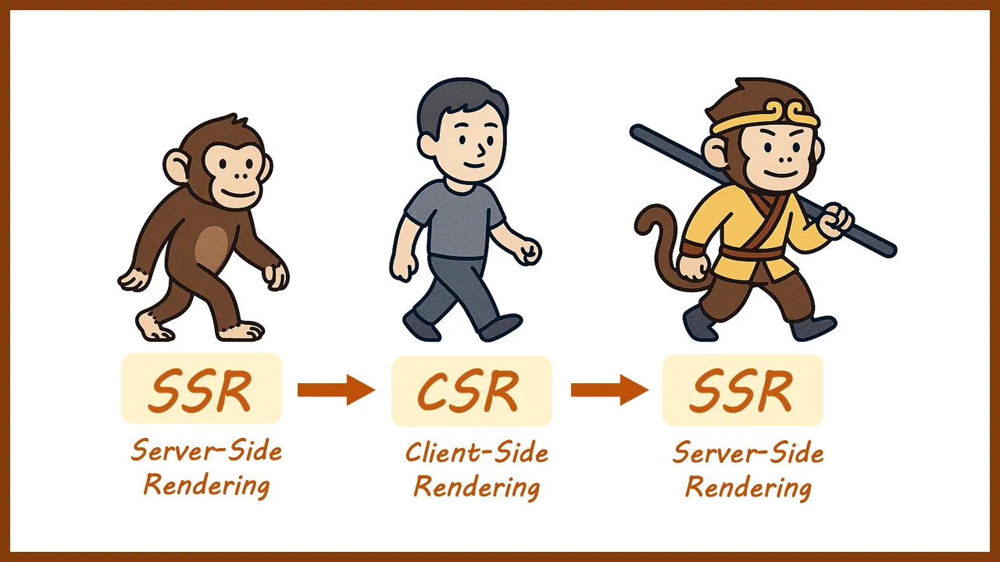
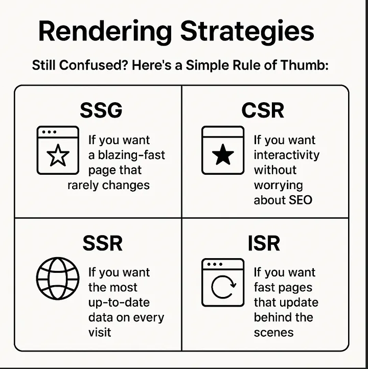
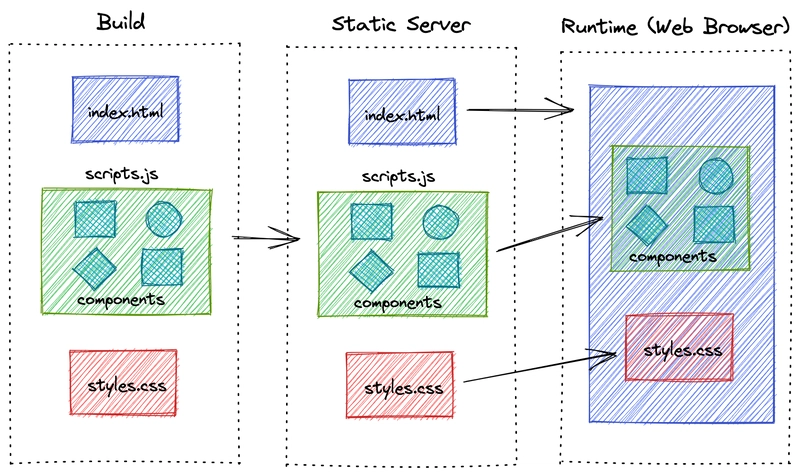
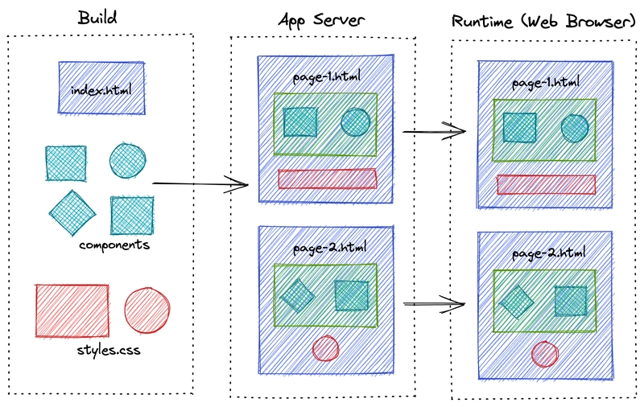
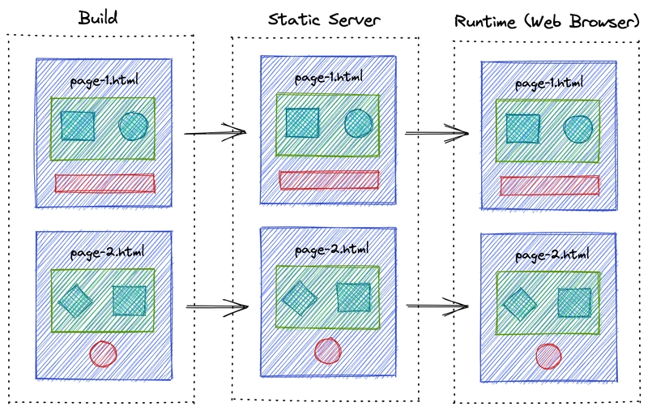
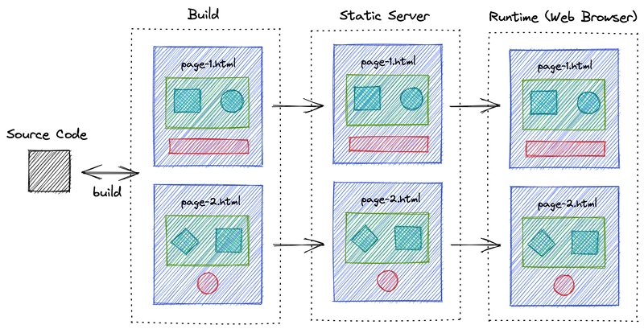

<BlogPost>

# web 网站的混合渲染

> 服务端渲染重新卷土重来，但这次带来的却是不一样的风景。



在现代Web开发中，渲染策略的选择已经不再是非此即彼的问题。随着技术的发展，我们可以在同一个应用中结合使用多种渲染方式，根据不同页面或组件的需求选择最合适的渲染策略。这种方法被称为"混合渲染"（Hybrid Rendering）。

主要有以下几种渲染策略：

+ CSR - Client Side Rendering
+ SSR - Server Side Rendering
+ SSG - Static Site Generation
+ ISR - Incremental Static Regeneration



## CSR - Client Side Rendering（客户端渲染）

客户端渲染（Client-Side Rendering）是在浏览器中使用JavaScript动态生成页面内容的技术。



### CSR的优势

1. **丰富的交互体验**：一旦JavaScript加载完成，页面交互非常流畅。
2. **服务器负载较轻**：服务器只需提供API和静态资源。
3. **前后端分离**：前端开发可以独立进行，不依赖后端渲染。
4. **缓存效率高**：静态资源可以有效缓存，减少网络请求。

### CSR的劣势

1. **SEO挑战**：搜索引擎可能无法正确索引依赖JavaScript渲染的内容。
2. **首屏加载较慢**：用户需要等待JavaScript下载、解析和执行后才能看到完整内容。
3. **白屏问题**：在JavaScript执行前，用户可能会看到空白页面。
4. **对设备性能要求较高**：在低性能设备上可能表现不佳。

## SSR - Server Side Rendering（服务端渲染）

服务端渲染（Server-Side Rendering）是一种在服务器上生成完整HTML页面的技术，然后将这些页面发送到客户端浏览器。



### SSR的优势

1. **更好的SEO表现**：搜索引擎爬虫可以直接抓取完整的HTML内容，而不需要执行JavaScript。
2. **更快的首屏加载**：用户无需等待JavaScript下载和执行就能看到页面内容。
3. **更好的社交媒体分享体验**：社交媒体平台可以正确预览页面内容。
4. **适合低性能设备**：减轻了客户端设备的计算负担。

### SSR的劣势

1. **服务器负载增加**：每个请求都需要服务器进行渲染，增加了服务器压力。
2. **开发复杂度提高**：需要考虑服务端和客户端的代码兼容性。
3. **页面交互延迟**：完整的交互功能需要等待JavaScript加载和执行。

## SSG - Static Site Generation（静态站点生成）

静态站点生成（Static Site Generation）是在构建时预先生成所有页面的HTML文件。与传统的动态网站不同，SSG在部署前就已经生成了所有页面，用户访问时直接获取预渲染的HTML文件。



### SSG的工作流程

1. **构建阶段**：
   - 从数据源（如CMS、API、Markdown文件等）获取内容
   - 将内容与模板结合，预渲染成HTML页面
   - 生成静态资源（CSS、JavaScript、图片等）

2. **部署阶段**：
   - 将生成的静态文件部署到CDN或静态托管服务
   - 配置缓存和路由规则

3. **访问阶段**：
   - 用户请求页面时，服务器直接返回预渲染的HTML
   - 浏览器加载JavaScript进行"水合"(Hydration)，使页面具有交互性

### SSG适用场景

- **博客和文档网站**：内容更新频率低，SEO要求高
- **营销网站**：需要快速加载和良好SEO的展示型网站
- **电子商务产品目录**：产品信息相对稳定的展示页面
- **公司官网**：信息相对固定，需要高性能和SEO

### 主流SSG工具和框架

- **Next.js**：React框架，支持SSG、SSR和ISR
- **Gatsby**：基于React的专注于SSG的框架
- **Nuxt.js**：Vue框架，支持多种渲染模式
- **Hugo**：Go语言开发的高性能静态站点生成器
- **Jekyll**：Ruby开发的简单静态站点生成器
- **Astro**：新兴的多框架静态站点生成器
- **VitePress/VuePress**：Vue驱动的静态站点生成器，适合文档站点

## ISR - Incremental Static Regeneration（增量静态再生成）

增量静态再生成（Incremental Static Regeneration）是SSG的扩展，允许在特定条件下重新生成单个页面，而不需要重建整个站点。这是Next.js首创的技术，解决了传统SSG的内容更新问题。



### ISR的工作流程

1. **初始构建**：
   - 与SSG类似，在构建时预渲染部分或全部页面
   - 为每个页面设置重新验证（revalidation）时间

2. **缓存服务**：
   - 已生成的页面被缓存并提供给用户
   - 缓存有效期基于设置的重新验证时间

3. **按需重新生成**：
   - 当用户请求过期页面时，先返回缓存版本
   - 同时在后台触发页面重新生成
   - 生成完成后更新缓存，后续用户将看到新版本

4. **按需生成**（On-demand Revalidation）：
   - 通过API触发特定页面的重新生成
   - 适用于CMS内容更新、产品信息变更等场景

### ISR的技术实现

```javascript
// Next.js中的ISR实现示例
export async function getStaticProps() {
  const res = await fetch('https://api.example.com/data')
  const data = await res.json()

  return {
    props: {
      data,
    },
    // 每10秒重新验证页面
    revalidate: 10,
  }
}

// 所有可能的路径
export async function getStaticPaths() {
  return {
    paths: [
      { params: { id: '1' } },
      { params: { id: '2' } }
    ],
    // fallback: 'blocking'表示未预渲染的路径将在首次请求时生成
    fallback: 'blocking'
  }
}
```

### ISR的高级特性

1. **按需重新验证**：
   ```javascript
   // 触发特定页面重新生成的API路由
   export default async function handler(req, res) {
     // 检查密钥以确保安全
     if (req.query.secret !== process.env.REVALIDATION_TOKEN) {
       return res.status(401).json({ message: '无效的令牌' })
     }
     
     try {
       // 重新验证指定路径
       await res.revalidate('/posts/1')
       return res.json({ revalidated: true })
     } catch (err) {
       return res.status(500).send('重新验证失败')
     }
   }
   ```

2. **选择性跳过生成**：某些页面可以在首次访问时才生成，而不是在构建时生成

3. **混合模式**：同一应用中，不同页面可以使用不同的重新验证策略

### ISR适用场景

- **新闻网站**：内容定期更新但不需要实时
- **电子商务**：产品信息和库存需要定期更新
- **内容丰富的网站**：有大量页面，无法在构建时全部生成
- **个性化但不高度动态的内容**：可以按用户组或区域缓存

### ISR支持的框架

- **Next.js**：最早实现ISR的框架，支持最完善
- **Nuxt 3**：Vue生态系统中的ISR实现
- **SvelteKit**：Svelte框架中的类似实现
- **Astro**：通过集成支持类似ISR的功能

## 混合渲染策略的实践

在实际项目中，我们可以根据不同页面的特点选择最合适的渲染策略：

1. **营销页面和博客**：使用SSG预渲染，获得最佳的SEO和加载性能。
2. **用户仪表盘**：使用CSR，提供丰富的交互体验。
3. **产品列表页**：使用SSR或ISR，平衡SEO和内容更新需求。
4. **高度个性化内容**：使用CSR或SSR+水合（Hydration）。

### 现代框架的混合渲染支持

现代Web框架已经开始原生支持混合渲染策略：

- **Next.js**：支持页面级别的SSR、SSG、ISR和CSR选择。
- **Nuxt.js**：Vue生态系统中类似Next.js的解决方案。
- **Remix**：专注于SSR，但支持客户端水合和部分CSR。
- **Astro**：默认静态生成，但允许按组件选择渲染策略。
- **SvelteKit**：支持多种渲染模式，包括SSR和SSG。

## 如何选择合适的渲染策略

选择渲染策略时，应考虑以下因素：

1. **内容类型**：静态内容适合SSG，动态内容适合SSR或CSR。
2. **更新频率**：频繁更新的内容可能需要SSR或ISR。
3. **SEO重要性**：SEO关键页面应优先考虑SSR或SSG。
4. **交互复杂度**：复杂交互界面可能更适合CSR。
5. **目标用户设备**：低性能设备用户多的场景应考虑SSR或SSG。
6. **开发资源**：评估团队实现和维护不同渲染策略的能力。

## 结论

混合渲染不是简单地在一个应用中混用不同的技术，而是根据具体需求为每个页面或组件选择最合适的渲染策略。通过这种方式，我们可以在性能、SEO、用户体验和开发效率之间取得最佳平衡。

随着Web框架的不断发展，混合渲染策略将变得越来越容易实现，成为现代Web应用开发的标准实践。未来，我们可能会看到更多智能化的渲染决策系统，能够根据用户设备、网络条件和内容特性自动选择最佳的渲染方式。

</BlogPost>
