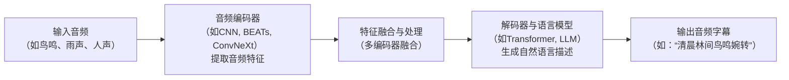

> **Audio Captioning (音频字幕生成)** 是一项让机器用文字“听懂”并“描述”声音的技术。它超越了简单的语音转文字，旨在对整体声学场景进行**语义级的理解和概括**。

## 概念

+ 通常写作 **Audio Captioning** 或 **Automated Audio Captioning, AAC**
+ 是一个在人工智能、音频处理和自然语言交叉领域里挺重要的概念。
+ 简单来说，它指的是**用自然语言文字自动描述和概括音频内容**的技术

## Audio Captioning vs. 其他相关概念

| 特性 | **Audio Captioning (音频字幕生成)** | **Speech Recognition (语音识别)** | **Sound Event Detection (声音事件检测)** | **Audio Tagging (音频标注)** |
| :--- | :--- | :--- | :--- | :--- |
| **核心任务** | **用自然语言概括音频内容** | 将语音转为**逐字的文本** | 检测**特定声音事件**及其**起止时间** | 为音频**分配预定义的标签** |
| **输出示例** | "有人在打招呼" | "你吃了没" | "狗叫声: 0.5s-1.2s" | "狗叫"、"鸟叫"、"雷声" |
| **关注点** | **整体声学场景**的抽象描述 | **说话内容**的精准转录 | **具体事件**的定位与分类 | **声音类别**的归属 |
| **处理音频** | **复杂声学场景**（可含语音、环境音、音乐） | **主要处理人类语音** | 处理各种**声音事件**（包括语音） | 处理各种**声音类别** |
| **关系** | - | - | AAC会隐含检测事件信息 | AAC会利用标签信息进行描述生成 |

从表格可以看出，Audio Captioning 的目标更“宏观”和“抽象”，它试图像人类一样，用一句话来理解并描述“听到了什么”，而不是机械地转录每个音节或列出每个声音。

## 理解 Audio Captioning 的核心

+ Audio Captioning 可以被理解成一种**高度抽象的跨模态翻译任务**：将复杂的声学场景信号，翻译成高度凝练的自然语言表述。
+ 它通常包含以下几个关键步骤，其工作流程可以概括如下：

### 🎯 1. 它的核心是什么？
+ Audio Captioning 的核心是**理解和概括声学场景**。
+ 例如：
    + 给它一段包含**鸟鸣、风吹树叶声和远处汽车声**的音频，它可能生成：“**清晨林间，鸟鸣婉转，风声低语，偶有车辆驶过**”。
    + 给它一段**只有人说话声**的音频，它可能生成：“**一段清晰的男声对话**”，而不是逐字转录出“你好，吃了没？”
它**不追求逐字逐句的精确**，而是追求**对整体声音环境的语义理解和概括**。

### ⚙️ 2. 它是如何工作的？

这个过程通常需要深度学习模型，其架构灵感多来自计算机视觉中的图像描述生成（Image Captioning）。一个典型的AAC系统包含两个核心组件：
+ **音频编码器 (Audio Encoder)**: 负责将输入的音频信号转化为计算机能理解的**特征向量**。常见的模型包括**CNN**（卷积神经网络）、**BEATs**、**ConvNeXt**等【turn0search2】。为了获得更丰富的信息，现代系统常采用**多编码器融合**策略，同时使用多个不同特性的编码器来提取互补的音频特征【turn0search2】。
+ **解码器与语言模型 (Decoder & Language Model)**: 负责根据这些特征向量，逐字或逐词地生成流畅的自然语言描述。这部分现在常会利用**Transformer**架构或更先进的**大语言模型 (LLM)** 的能力，来生成更通顺、更符合人类表达习惯的句子。

### 🏆 3. 它有什么用？

Audio Captioning 的应用场景非常广泛，许多都旨在让机器更好地“听懂”世界：
+ **辅助视听障碍人士**：为无声电影、纪录片或实时环境生成音频描述，提升其观影和感知体验。
+ **多媒体内容管理与检索**：为海量音频数据（如播客、会议录音、视频背景音）自动生成文字描述，极大提升内容的可检索性和管理效率。
+ **智能家居与物联网**：智能音箱或环境监控设备可以通过AAC技术，用自然语言向你汇报：“**厨房里有水滴声，可能是水龙头没关紧**”，而不仅仅是检测到“滴水声”。
+ **声音场景分析**：在自动驾驶、机器人导航等领域，帮助机器理解复杂的交通环境（车声、喇叭声、行人说话声），并做出安全决策。
+ **音频创作与后期**：自动为音频素材生成描述性标签，方便音乐人、视频创作者挑选和配乐。

### 📊 4. 它的挑战与进展

AAC 也面临不少挑战，当前的研究热点包括：
+ **语义准确性**：如何生成更精准、更少幻觉（即无中生有）的描述。
+ **描述丰富度**：如何生成更具细节、更生动的语言描述。
+ **效率与实时性**：如何在保证质量的同时，降低计算成本，实现实时处理。
+ **数据匮乏**：高质量的音频-描述对数据集相对稀缺，这也是模型训练的一大瓶颈。
像 **DCASE (Detection and Classification of Acoustic Scenes and Events)** 这样的国际竞赛，自2020年起设立了AAC任务，极大地推动了该领域的技术进步。最新的研究通过**多代理协作**、**混合重排序**和**LLM摘要**等技术，不断提升生成字幕的质量和流畅度。
