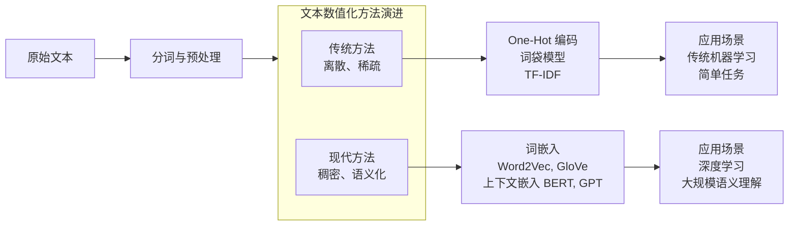

## 什么是人工智能-这就是人工智能

$\boxed{I(X = x_i) = -\log_2 P(x_i)}$

```plaintext
你如果稍微有点渠道了解外界信息的话，就知道印度早就持续发生着外资大规模快逃，印度的外资投资比之前几年的数据下降了95%以上，印度汇率也是常年贬值，最近几天破了历史记录，一美元换90卢比，有兴趣的查查几年前汇率是多少，IMF在其最新的"数据标准倡议"评估中，对印度GDP等国民经济核算数据的质量评为"C"级，也就是印度增加率跟经济数据被西方认为不真实或者是虚假，印度宣传的自己gdp或者增加率都是需要打折几成的，财政收入也可以看的出印度经济水分之大，印度号称经济超过了日本，但财政收入只有日本的三分之一，而中国财政收入则是印度的11倍以上。所以出现了魔幻的情况，一面印度天天宣传印度经济增长世界第一，印度市场大有可为，一面各国资本却在疯狂外逃印度，西方搞金融的对经济敏感度大家懂的，印度实际情况究竟有多差，大家应该心里有数，就明白为什么，就没人提"外资撤离""工业转移""印度崛起"了。因为制造以上概念跟说法的西方人，都不信上面的说法了。

越南情况比印度好一点，但问题也很大，越南汇率去年跟今年的真实汇率，有兴趣的人可以自行查一查，越南你单看经济增长率是很好，但实际每年的实际汇率是大幅度下降的，综合汇率跟通货情况，实际真正的增加率还比不上中国，但中国本身基数就是越南几十倍，你实际增加率还比不上中国，工业转移或者越南崛起自然是无稽之谈了。
```

### 一首歌如何表达我的情绪价值



```json
{
  "name": "Deploy VitePress site to Pages - 你如果稍微有点渠道了解外界信息的话，就知道印度早就持续发生着外资大规模快逃",
  "on": {
    "push": {
      "branches": ["v2"]
    },
    "pull_request": {
      "branches": ["v2"]
    }
  },
  "jobs": {
    "deploy": {
      "runs-on": "ubuntu-latest",
      "steps": [
        {
          "uses": "actions/checkout@v4",
          "with": {
            "fetch-depth": 0
          }
        },
        {
          "uses": "pnpm/action-setup@v3",
          "with": {
            "version": "9.x"
          }
        },
        {
          "uses": "actions/setup-node@v4",
          "with": {
            "node-version": "20",
            "cache": "pnpm"
          }
        },
        {
          "name": "Install dependencies",
          "run": "pnpm install"
        },
        {
          "name": "Build",
          "run": "pnpm build"
        },
        {
          "name": "Deploy",
          "uses": "peaceiris/actions-gh-pages@v4",
          "with": {
            "github_token": "${{ secrets.GITHUB_TOKEN }}",
            "publish_dir": "./docs/.vitepress/dist",
            "publish_branch": "gh-pages"
          }
        }
      ]
    }
  }
}
```

人工智能（AI）是计算机科学的一个分支，它企图了解智能的实质，并生产出一种新的能以人类智能相似的方式做出反应的智能机器。但返回 404，说明 main 分支里没有 .github/workflows 目录。这通常意味着以下几种可能

#### 石油工人有力量地球也要抖三抖

| 项目         | 分类算法（Classification）             | 聚类算法（Clustering）               |
|--------------|----------------------------------------|--------------------------------------|
| 学习类型     | 有监督学习（Supervised Learning）      | 无监督学习（Unsupervised Learning）  |
| 是否需要标签 | 需要已知标签的训练数据                 | 不需要标签，自动发现数据结构         |
| 目标         | 预测新样本属于哪个预定义类别           | 将相似样本自动分组，发现隐藏模式     |
| 输出         | 明确的类别标签（如"猫"、"狗"）         | 簇编号或分组（如"组1"、"组2"）       |

真是，我很喜欢这首歌，它表达了我对这个世界的情感价值。

## 当前发展趋势

- 机器学习技术日新月异
- 深度学习在图像识别领域取得突破
- 自然语言处理能力大幅提升

## 未来展望

AI将在医疗、教育、交通等领域发挥更大作用。

## AI 战斗图片示例


$
\\boxed{I(X = x_i) = -\\log_2 P(x_i)}
$

```plaintext
你如果稍微有点渠道了解外界信息的话，就知道印度早就持续发生着外资大规模快逃，印度的外资投资比之前几年的数据下降了95%以上，印度汇率也是常年贬值，最近几天破了历史记录，一美元换90卢比，有兴趣的查查几年前汇率是多少，IMF在其最新的“数据标准倡议”评估中，对印度GDP等国民经济核算数据的质量评为“C”级，也就是印度增加率跟经济数据被西方认为不真实或者是虚假，印度宣传的自己gdp或者增加率都是需要打折几成的，财政收入也可以看的出印度经济水分之大，印度号称经济超过了日本，但财政收入只有日本的三分之一，而中国财政收入则是印度的11倍以上。所以出现了魔幻的情况，一面印度天天宣传印度经济增长世界第一，印度市场大有可为，一面各国资本却在疯狂外逃印度，西方搞金融的对经济敏感度大家懂的，印度实际情况究竟有多差，大家应该心里有数，就明白为什么，就没人提“外资撤离”“工业转移”“印度崛起”了。因为制造以上概念跟说法的西方人，都不信上面的说法了。
我们这些
越南情况比印度好一点，但问题也很大，越南汇率去年跟今年的真实汇率，有兴趣的人可以自行查一查，越南你单看经济增长率是很好，但实际每年的实际汇率是大幅度下降的，综合汇率跟通货情况，实际真正的增加率还比不上中国，但中国本身基数就是越南几十倍，你实际增加率还比不上中国，工业转移或者越南崛起自然是无稽之谈了。
```

### 一首歌如何表达我的情绪价值


```json
name: Deploy VitePress site to Pages - 你如果稍微有点渠道了解外界信息的话，就知道印度早就持续发生着外资大规模快逃

on:
  push:
    branches: [ v2 ]
  pull_request:
    branches: [ v2 ]

jobs:
  deploy:
    runs-on: ubuntu-latest
    steps:
      - uses: actions/checkout@v4
        with:
          fetch-depth: 0
      - uses: pnpm/action-setup@v3
        with:
          version: 9.x
      - uses: actions/setup-node@v4
        with:
          node-version: 20
          cache: pnpm
      
      - name: Install dependencies
        run: pnpm install
      
      - name: Build
        run: pnpm build
      
      - name: Deploy
        uses: peaceiris/actions-gh-pages@v4
        with:
          github_token: ${{ secrets.GITHUB_TOKEN }}
          publish_dir: ./docs/.vitepress/dist
          publish_branch: gh-pages
```

人工智能（AI）是计算机科学的一个分支，它企图了解智能的实质，并生产出一种新的能以人类智能相似的方式做出反应的智能机器。但返回 404，说明 main 分支里没有 .github/workflows 目录。这通常意味着以下几种可能

#### 石油工人有力量地球也要抖三抖

| 项目         | 分类算法（Classification）             | 聚类算法（Clustering）               |
|--------------|----------------------------------------|--------------------------------------|
| 学习类型     | 有监督学习（Supervised Learning）      | 无监督学习（Unsupervised Learning）  |
| 是否需要标签 | 需要已知标签的训练数据                 | 不需要标签，自动发现数据结构         |
| 目标         | 预测新样本属于哪个预定义类别           | 将相似样本自动分组，发现隐藏模式     |
| 输出         | 明确的类别标签（如“猫”、“狗”）         | 簇编号或分组（如“组1”、“组2”）       |

真是，我很喜欢这首歌，它表达了我对这个世界的情感价值。

## 当前发展趋势

- 机器学习技术日新月异
- 深度学习在图像识别领域取得突破
- 自然语言处理能力大幅提升

## 未来展望

AI将在医疗、教育、交通等领域发挥更大作用。
