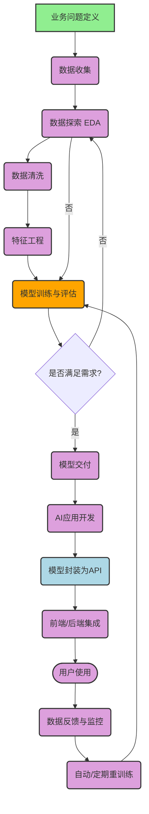

> `数据探索`、`数据清洗`、`特征工程`是属于数据科学，还是 AI 领域？

在 AI 应用开发的示例程序中，往往在程序的开头，能看到以下这种代码：

``` python
df = pd.read_csv('Seattle_Hotels.csv', encoding="latin-1")
# 数据探索
print(df.head())
print('数据集中的酒店个数：', len(df))
```

这些代码实际上构成了基本的`数据探索`步骤，帮助开发者了解数据集的规模和结构，为后续的文本处理、特征提取和相似度计算奠定基础。

这是数据科学工作流程中的标准做法，特别是在进行数据清洗和特征工程之前，先对原始数据有一个基本的了解是非常必要的。

`数据探索`、`数据清洗`、`特征工程`是否属于数据科学。它们是AI应用开发的一部分，那`数据科学`与`AI应用开发`的关系又是如何的呢？

## 数据探索、数据清洗、特征工程是否属于数据科学

是的，**数据探索（Data Exploration）**、**数据清洗（Data Cleaning）** 和 **特征工程（Feature Engineering）** 都属于 **数据科学（Data Science）** 的核心组成部分。它们通常出现在数据科学项目的前期和中期阶段。

| 步骤 | 英文 | 说明 | 所属范畴 |
| ------ | ------ | ------ | --------- |
| 数据探索 | Data Exploration / Exploratory Data Analysis (EDA) | 通过可视化和统计方法了解数据的分布、关系、异常等 | 数据科学 |
| 数据清洗 | Data Cleaning / Data Cleansing | 处理缺失值、异常值、重复数据、格式不一致等问题 | 数据科学 |
| 特征工程 | Feature Engineering | 构造、选择、转换特征（变量），提升模型效果 | 数据科学 / 机器学习 |

这些步骤通常出现在构建机器学习模型之前的“数据准备”阶段，占据了数据科学家大量工作时间（有说法是 70%-80%）。

## 数据科学的核心流程（简化版）

1. **问题定义**（Define the problem）
2. **数据收集**（Data Collection）
3. **数据探索（EDA）**
4. **数据清洗**
5. **特征工程**
6. **模型构建与训练**（Machine Learning Modeling）
7. **模型评估与优化**
8. **模型部署与监控**
9. **结果可视化与报告**

## 🌐 数据科学 → AI应用开发 流程图（使用 Mermaid 语法）

下面是一个简洁清晰的 **数据科学与AI应用开发协作流程图**，用文本形式呈现（你可以复制到支持 Markdown 或流程图工具（如 [Mermaid Live Editor](https://mermaid.live/edit)）中可视化）。



### 🔍 流程说明

1. **左侧（数据科学部分）**：
   - 从问题出发，经过数据探索、清洗、特征工程，到模型训练。
   - 强调迭代：如果模型效果不好，返回前面优化数据或特征。

2. **中间交接点**：
   - 模型通过评估后，交付给开发团队或进入部署流程。

3. **右侧（AI应用开发部分）**：
   - 将模型封装为服务（如 REST API）
   - 集成到网站、App、系统中
   - 用户开始使用

4. **闭环反馈**：
   - 用户使用产生新数据
   - 数据用于监控模型表现，并触发**自动重训练**
   - 实现 **MLOps（机器学习运维）** 的持续优化

### 🎯 关键角色分布

| 阶段 | 主要负责人 |
| ------ | ----------- |
| 数据探索、清洗、特征工程 | 数据科学家（Data Scientist） |
| 模型训练与调优 | 数据科学家 / 机器学习工程师 |
| 模型部署、API开发、系统集成 | AI工程师 / ML工程师 / 软件工程师 |
| 监控与重训练 | ML Engineer / MLOps 工程师 |

### 💡 小贴士

- 在小团队中，一个人可能负责从数据到部署的全流程。
- 在大公司中，这些环节由不同团队协作完成，强调接口标准化（如使用 **Pickle/ONNX** 保存模型，**FastAPI** 提供服务）。

## AI应用开发 与 数据科学 的关系

### 1. **数据科学（Data Science）** 是什么？

- 目标：从数据中提取知识、洞察或预测。
- 方法：统计分析、机器学习、数据可视化、实验设计（如A/B测试）等。
- 输出：分析报告、预测模型、业务建议。

### 2. **AI应用开发（AI Application Development）** 是什么？

- 目标：将AI模型（尤其是机器学习/深度学习模型）集成到实际软件产品中，解决具体问题。
- 例如：智能客服、推荐系统、图像识别App、语音助手等。
- 涉及技术：模型部署、API开发、前端/后端集成、性能优化、MLOps等。

## 两者的关系：交集与分工

| 维度 | 数据科学 | AI应用开发 |
| ------ | ---------- | ------------ |
| 关注点 | 模型准确性、数据质量、业务洞察 | 系统稳定性、响应速度、用户体验、可扩展性 |
| 主要技能 | Python/R、统计学、机器学习、SQL、Pandas、Matplotlib | 软件工程、API（如FastAPI/Flask）、Docker、云计算（AWS/GCP）、模型部署 |
| 所属角色 | 数据科学家（Data Scientist） | AI工程师 / 机器学习工程师（ML Engineer） / 软件工程师 |
| 依赖关系 | 为AI应用提供模型和数据基础 | 将数据科学成果产品化 |

🔹 **关系总结**：

> **数据科学是AI应用开发的“上游”和“基础”**。  
> 一个成功的AI应用，往往建立在扎实的数据科学工作之上（比如高质量的数据清洗和有效的特征工程）。  
> 反过来，AI应用开发让数据科学的成果真正落地，产生商业价值。

🧠 类比：  

- 数据科学 ≈ 厨师研发新菜谱（研究怎么做才好吃）  
- AI应用开发 ≈ 开餐厅，把菜谱标准化、批量做出来、服务顾客

## 实际项目中的协作

在一个AI项目中，常见协作流程：

1. **数据科学家**：
   - 进行数据探索、清洗、特征工程
   - 训练并验证模型（如用Jupyter Notebook）
2. **机器学习工程师 / AI开发者**：
   - 将模型封装成API（如用Flask）
   - 部署到服务器或云平台
   - 与前端/移动端集成
   - 实现自动化训练与监控（MLOps）
