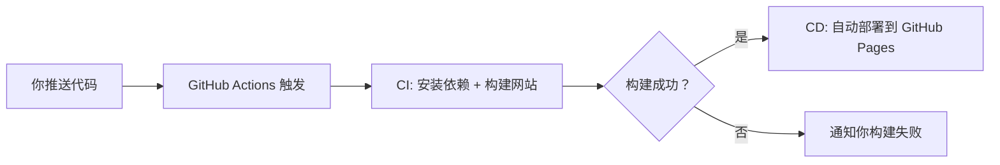

## CI/CD 是什么

+ **CI/CD** 是现代软件开发中的核心实践，代表两个紧密关联的自动化流程

### CI = Continuous Integration（持续集成）

> 提交代码后，GitHub Actions 自动运行 `npm test`，如果测试失败，立刻通知你 —— 这就是 CI。

+ **目的**：让开发者频繁地（比如每天多次）将代码变更**合并到共享主干**（如 `main` 分支），并**自动验证**这些变更是否可靠。
+ **关键动作**：
  + 自动拉取最新代码
  + 自动安装依赖
  + 自动运行**单元测试、代码检查、构建**
+ **解决的问题**：
  + 避免“在我机器上能跑”的集成地狱
  + 快速发现因代码合并导致的错误

---

### CD = Continuous Delivery / Deployment（持续交付 / 持续部署）

> 写完一篇博客，推送到 `main` 分支，GitHub Actions 自动构建网站并发布到 GitHub Pages —— 这就是 CD（通常是 Continuous Deployment）。

这两个概念常被混用，但有细微区别：

| 类型 | 全称 | 含义 | 是否全自动上线？ |
|------|------|------|------------------|
| Continuous Delivery | 持续交付 | 代码始终处于**可发布状态**，但**上线需人工批准**（如点击“发布”按钮） | ❌ 需手动触发 |
| Continuous Deployment | 持续部署 | 每次通过 CI 的变更**自动部署到生产环境** | ✅ 完全自动 |

+ **关键动作**：
  + 自动构建生产包（如静态网站、Docker 镜像）
  + 自动部署到服务器、云平台（如 Vercel、GitHub Pages、AWS）

---

### 举例：基于 VitePress 的博客

+ CI/CD 流程可能是

+ **CI 阶段**：确保的 Markdown 能正确转成 HTML，没有语法错误。
+ **CD 阶段**：把生成的 `dist/` 文件夹自动发布到线上。

## 主流 CI/CD 工具

### 第一代（自托管、需运维）

| 工具 | 特点 |
|------|------|
| **Jenkins** | 开源、插件丰富、需自运维，CI/CD 鼻祖 |
| **TeamCity**（JetBrains） | 商业+免费版，UI 友好，适合 .NET/Java 项目 |
| **Bamboo**（Atlassian） | 与 Jira/Bitbucket 深度集成，已停止新功能开发（2024 年宣布 EOL） |

> ✅ 共同点：需在自有服务器上安装，配置复杂，但控制力强。

---

### 第二代（SaaS 化、与代码平台深度集成）

| 工具 | 所属平台 | 特点 |
|------|--------|------|
| **GitHub Actions** | GitHub | 原生支持、YAML 配置、生态活跃，适合开源和个人项目 |
| **GitLab CI/CD** | GitLab | 内置 CI/CD，无需额外配置，支持从代码到部署的完整 DevOps 流程 |
| **Bitbucket Pipelines** | Atlassian | 类似 GitHub Actions，集成 Jira，适合企业 Atlassian 用户 |
| **Azure Pipelines** | Microsoft Azure | 支持 GitHub、GitLab、Azure Repos，免费额度高，跨平台强 |

> ✅ 共同点：**无需自建服务器**，配置即用，与代码仓库无缝集成。

---

### 第三代（云原生、开发者体验优先）

| 工具 | 特点 |
|------|------|
| **CircleCI** | 专注于开发者体验，配置简洁，支持 Docker/K8s，按需付费 |
| **Travis CI** | 早期 GitHub 热门工具，曾是开源项目标配，近年因商业策略变化使用减少 |
| **Drone CI** | 轻量级、基于 Docker、YAML 配置，适合 Kubernetes 环境 |
| **Buildkite** | 混合架构（控制面在云，执行器自托管），适合安全敏感企业 |
| **Vercel / Netlify CI** | 面向前端/静态站点，**提交即部署**，零配置 CI/CD |

> ✅ 共同点：**极致简化**、**快速反馈**、**面向特定场景优化**（如前端、云原生）。

---

## CI/CD 领域的演进趋势

### 📈 1. **从“自建”到“托管”再到“无感”**

+ **2000s**：团队自己搭 Jenkins，写 Shell 脚本，运维成本高。
+ **2010s**：GitHub + Travis CI 兴起，`.travis.yml` 成为标配，CI 变得民主化。
+ **2020s**：Vercel/Netlify 等平台实现 **“git push → 自动上线”**，开发者甚至**无需写 CI 配置**。

---

### 🧩 2. **从“单体流程”到“可组合、模块化”**

+ **Jenkins**：用插件串联任务，但配置分散。
+ **GitHub Actions**：引入 **Reusable Workflows** 和 **Composite Actions**，允许像搭积木一样复用逻辑。
+ **Tekton（K8s 原生 CI/CD）**：将 CI/CD 拆解为“任务 + 流水线”，完全声明式。

---

### 🌐 3. **与 DevOps、GitOps 深度融合**

+ **GitOps**（如 Argo CD、Flux）：将“部署状态”也存入 Git，CI 构建产物 → CD 自动同步到集群。
+ **安全左移**：CI 阶段自动做 SAST（代码扫描）、依赖漏洞检测（如 Dependabot、Snyk）。

---

### 📱 4. **面向开发者体验（DX）优化**

+ 快速反馈：秒级构建、实时日志
+ 本地调试：如 `act` 工具可在本地运行 GitHub Actions
+ 可视化：清晰的流水线图、失败根因分析
