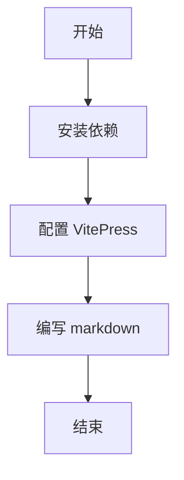
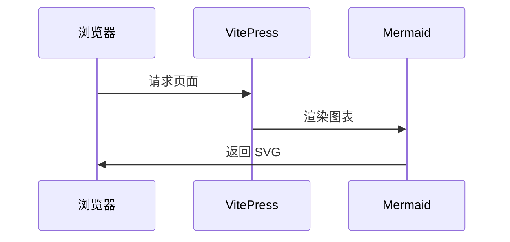
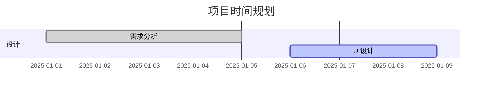

# Mermaid 测试

这是一个测试 Mermaid 图表的页面。

## 流程图

```mermaid
graph TD
    A[开始] --> B[安装依赖]
    B --> C[配置 VitePress]
    C --> D[编写 markdown]
    D --> E[结束]
```

## 序列图

```mermaid
sequenceDiagram
    participant 浏览器
    participant VitePress
    participant Mermaid
    
    浏览器->>VitePress: 请求页面
    VitePress->>Mermaid: 渲染图表
    Mermaid->>浏览器: 返回 SVG
```

## 甘特图

```mermaid
gantt
    title 项目时间规划
    dateFormat  YYYY-MM-DD
    section 设计
    需求分析 :done, des1, 2025-01-01, 2025-01-05
    UI设计   :active, des2, 2025-01-06, 3d
```