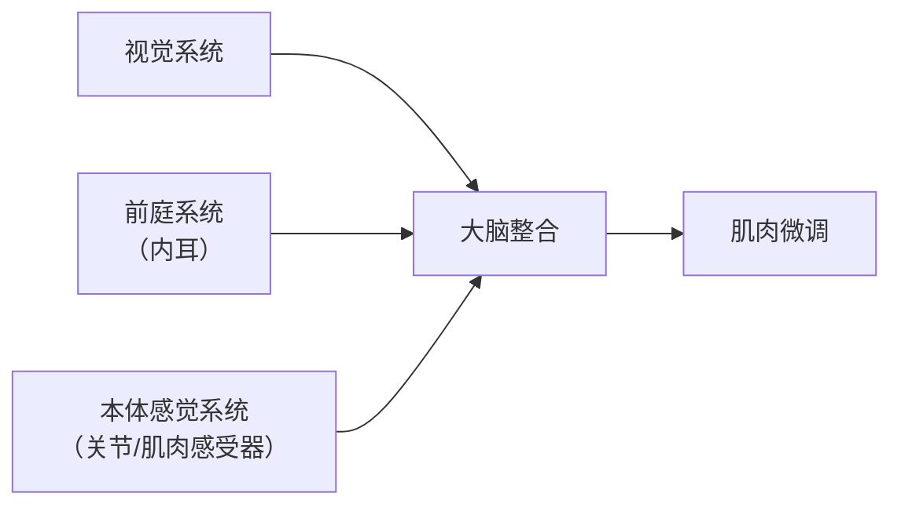
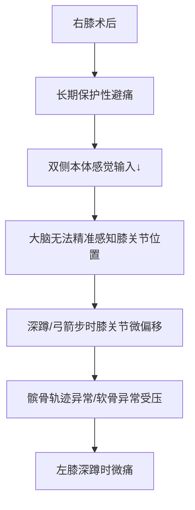

> 问题本质是"神经软件升级"而非"肌肉硬件损坏"。本体感觉可通过训练重建，且**术后1.5年仍处于神经可塑性窗口期**（通常持续2-3年）。现在干预恰逢其时，预后通常良好。

## 背景

+ 1年半前右膝做过微创手术，对膝关节软骨进行修复。术后进行了大量的康复训练，目前肌肉腿部肌肉恢复良好，日常行走、跑跳都没什么问题，爬楼梯也可以，对日常生活来说，已经无碍了。
+ 日常主要是坐着工作，每周会去健身房几次，多的时候一周五次，忙的时候可能一周也不去一次。在健身房做做力量训练（不重），也会跟着操房做一些团操课，有氧练习类课程为主（有氧杠铃、有氧搏击、臀腿训练、胸背训练等）。看上去恢复得不错。
+ 近一个月左右，发现左膝这里明显会在做徒手深蹲或单腿弓箭步（非支撑腿时）有轻微疼痛的感觉。相比之下，之前做手术的右腿膝关节倒是正常的，没有什么疼痛。做单腿弓箭步的时候，无论哪条腿支撑，都明显发现左右摇晃得很厉害。
+ 自行做了一些测试，结果发现单腿站立时`睁眼稳定、闭眼大幅摇晃`，这明确指向本体感觉（Proprioception）受损，而非肌肉力量不足。这是膝关节术后（包括对侧膝关节）最常见的代偿性问题，也是左膝疼痛的潜在根源。

## 分析
### 为什么闭眼会摇晃

人体维持平衡依赖**三大系统协同**：

+ **睁眼时**：视觉提供80%+的平衡信息，可"掩盖"本体感觉缺陷 → 表面稳定
+ **闭眼时**：视觉输入消失，完全依赖本体感觉 → 缺陷暴露 → 摇晃加剧

> 📌 **关键事实**：膝关节内含有大量**机械感受器**（尤其是前交叉韧带、关节囊），负责向大脑实时反馈"膝关节角度/压力"。  
>
> + 右膝术后，即使软骨修复成功，**关节内感受器网络已部分破坏**
> + 术后长期"保护性避痛"导致大脑对双侧膝关节的**神经映射模糊化**
> + 结果：大脑无法精准感知膝关节位置 → 闭眼时失去视觉补偿 → 摇晃

**研究证据**：ACL术后患者即使力量恢复100%，本体感觉平均仅恢复68%，且**对侧（健侧）膝关节本体感觉也会下降15-20%** —— 这解释了为何左膝（未手术侧）也出现控制问题。

---
### 本体感觉缺失 → 左膝疼痛的因果链

> 💡 **核心逻辑**：不是"左腿肌肉弱"，而是"大脑不知道左膝此刻处于什么位置" → 动作中产生微小但有害的偏移 → 软组织反复受异常应力 → 疼痛

## 训练计划

### 科学训练方案：重建本体感觉（4周渐进计划）

> ⚠️ **前提**：所有训练在**无痛或微不适**（VAS≤2/10）下进行；若引发左膝疼痛立即停止

#### 第1周：基础感知重建（每天2次，每次5分钟）

| 动作 | 操作要点 | 目标 |
|------|----------|------|
| **睁眼单腿站立** | 扶墙→脱手，支撑腿微屈15°（模拟功能角度），每侧30秒×3组 | 建立基础平衡信心 |
| **闭眼单腿站立（扶墙）** | 手轻扶墙，闭眼10秒×3组/侧 | 逐步剥夺视觉依赖 |
| **足底感知训练** | 单腿站立时，有意识感受足底"三点支撑"（ heel + 1st/5th metatarsal） | 激活足部本体感受器，向上反馈至膝 |

> 💡 **技巧**：训练时将注意力集中在**支撑腿的膝关节**，想象"膝关节像指南针一样保持指向正前方"，强化神经-关节连接。

#### 第2-3周：动态微调能力（每天15分钟）

| 动作 | 操作要点 | 进阶标志 |
|------|----------|----------|
| **闭眼单腿站立（脱手）** | 无支撑闭眼站立，目标15秒/侧 | 能稳定15秒 → 进入下一阶段 |
| **单腿站立+对侧腿点地** | 支撑腿不动，摆动腿向前/侧/后轻点地面（T字走） | 躯干晃动<5cm |
| **不稳定平面训练** | 站在枕头/折叠毛巾上单腿站立（睁眼→闭眼） | 激活更多小肌群协同控制 |

#### 第4周+：扰动训练（模拟真实生活扰动）

| 动作 | 操作要点 | 安全提示 |
|------|----------|----------|
| **轻推扰动** | 请家人轻推您肩部不同方向（前后/左右），练习快速恢复平衡 | 推力必须轻柔，避免摔倒 |
| **抛接球扰动** | 单腿站立时与家人抛接小球（增加认知负荷） | 先睁眼熟练后再尝试闭眼 |

> 📌 **关键原则**：  
>
> + **质量 > 时长**：10秒高质量稳定 > 30秒大幅摇晃  
> + **微痛可接受，锐痛必须停止**：肌肉疲劳感正常，关节刺痛/酸痛需暂停  
> + **每天训练比单次长时间更重要**：神经可塑性依赖高频次刺激

---

### 预期改善时间线

| 时间 | 预期改善 | 复评动作 |
|------|----------|----------|
| 1周后 | 闭眼单腿站立从<5秒 → 8-10秒 | 闭眼计时 |
| 2-3周后 | 闭眼稳定15秒+，睁眼点地时躯干晃动减小50% | 单腿点地录像对比 |
| 4周后 | 尝试小幅度弓箭步（深度<30°）无痛 | 功能性动作测试 |
| 6-8周后 | 深蹲疼痛显著减轻或消失 | 恢复正常训练 |

> 💡 **研究支持**：4周本体感觉专项训练可使单腿闭眼站立时间提升40-60%，且膝关节疼痛评分下降35%

---

### ⚠️ 重要安全提醒

1. **训练环境安全**：
   + 旁边放置稳固椅子（可随时扶住）
   + 地面无滑倒风险（赤脚或防滑袜）
   + 避免在疲劳/头晕时训练

2. **避免加重损伤的动作**（训练期间暂停）：
   + ❌ 深蹲至90°以下（髌股压力峰值区）
   + ❌ 单腿弓箭步（直到闭眼稳定≥15秒）
   + ❌ 跳跃/急停类动作

3. **何时就医**：
   + 训练2周后闭眼站立无改善
   + 出现膝关节肿胀/夜间痛/打软腿
   + 疼痛从"微不适"进展为"持续性酸痛"

## 训练目标解析

> 训练重建的是**神经系统对膝关节位置的感知精度**（本体感觉），以及**大脑-肌肉的快速反馈通路**（感觉运动整合）。  

### 🔬 本质机制：大脑的"身体地图"需要重新校准

人体大脑皮层中存在一张精细的**身体部位映射图**（称为"感觉运动皮层地图"）。膝关节术后，这张地图会发生两种变化：

| 变化类型 | 机制 | 后果 |
|----------|------|------|
| **地图 模糊化** | 关节感受器损伤 + 长期避痛 → 大脑接收的膝关节位置信号减少/失真 | 大脑"不知道膝盖此刻在哪" → 闭眼站立摇晃 |
| **地图 萎缩** | 神经元"用进废退"：长期不用的神经通路突触连接减弱 | 即使肌肉力量恢复，大脑也无法精准指挥肌肉微调 |

> 📌 **关键研究**：fMRI显示，膝关节术后3个月，大脑中代表该膝关节的皮层激活区域**缩小23%**；但经过6周本体感觉训练，可恢复至术前92%
>
---

### 🧠 训练如何"重建感知"？——神经可塑性三步曲

1. **重复精准刺激**  
   + 闭眼单腿站立时，膝关节微小偏移 → 关节囊/韧带感受器被激活 → 信号传入脊髓 → 大脑
   + **高频次**（每天2次）比单次长时间更有效（符合"赫布定律"：一起激活的神经元会连接在一起）

2. **突触强化**  
   + 大脑接收信号后发出纠正指令 → 肌肉微调 → 新的位置信号再次传入
   + 这种"感知-反应-再感知"循环使相关神经元连接**强化30-50%**（2-4周内）

3. **髓鞘化与自动化**  
   + 反复训练后，神经通路被"髓鞘"包裹（类似电线绝缘层）→ 信号传导速度提升**10-100倍**
   + 结果：从"需要刻意控制" → "自动微调"（如同重新学会骑自行车）

> 💡 **通俗比喻**：  
>
> + 术后状态 = 手机GPS信号弱（定位漂移10米）  
> + 训练过程 = 在同一地点反复校准GPS  
> + 康复后 = 定位精度恢复至1米内，且自动纠偏

---

### ✅ 针对您的训练如何精准刺激神经可塑性？

| 训练动作 | 刺激的神经通路 | 为什么有效 |
|----------|----------------|------------|
| **闭眼单腿站立** | 剥夺视觉 → 强制依赖本体感觉传入 | "断掉拐杖"，逼大脑重新学习用关节信号定位 |
| **不稳定平面（枕头）** | 足底感受器高频激活 → 向上反馈至膝/髋 | 激活更多感受器类型，丰富输入信号 |
| **扰动训练（轻推）** | 模拟真实生活突发扰动 → 强化快速反应通路 | 训练"预测性控制"（大脑提前预判并调整），而非仅"反应性控制" |

> 📌 **关键原则**：  
>
> + **微挑战原则**：训练难度应略高于当前能力（如闭眼从5秒→8秒），但不过度（避免摔倒）→ 最佳神经可塑性窗口
> + **专注力加持**：训练时将注意力集中在膝关节（而非刷手机），可使神经激活强度提升40%

---

### ⚠️ 常见误区澄清

| 误区 | 正确认知 |
|------|----------|
| "练到肌肉酸痛=有效" | 本体感觉训练**不需要肌肉疲劳**，重点是"感知精度"而非"力量输出" |
| "练1小时比练10分钟好" | 神经可塑性依赖**高频次短时训练**（每天2次×5分钟 > 每周1次×1小时） |
| "只要坚持就会好" | 需要**精准刺激**：错误动作模式（如膝内扣）会强化错误神经通路，适得其反 |
