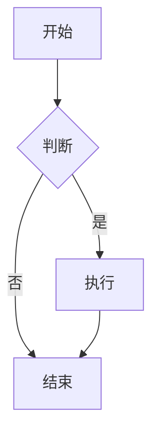

# Markdown 语法完全指南

::: info 文章信息
- **发布时间**: 2024-01-01
- **更新时间**: 2024-01-01
- **分类**: 技术教程
- **标签**: Markdown, 写作, 教程
:::

## 什么是 Markdown？

Markdown 是一种轻量级标记语言，由 John Gruber 于 2004 年创建。它的设计目标是让写作变得简单，专注于内容而不是格式。

## 为什么使用 Markdown？

- 📝 **简单易学** - 语法简洁，学习成本低
- 🔧 **通用性强** - 几乎所有平台都支持
- 📱 **跨平台** - 在任何设备上都能编辑
- 🎨 **格式丰富** - 支持标题、列表、表格、代码等
- 🔄 **转换方便** - 可以轻松转换为 HTML、PDF 等格式

## 基础语法

### 标题

使用 `#` 符号创建标题，数量表示级别：

```markdown
# 一级标题
## 二级标题
### 三级标题
#### 四级标题
##### 五级标题
###### 六级标题
```

### 段落和换行

段落之间用空行分隔：

```markdown
这是第一个段落。

这是第二个段落。
```

### 强调

```markdown
*斜体文本* 或 _斜体文本_
**粗体文本** 或 __粗体文本__
***粗斜体文本*** 或 ___粗斜体文本___
~~删除线文本~~
```

### 列表

#### 无序列表

```markdown
- 项目 1
- 项目 2
  - 子项目 2.1
  - 子项目 2.2
- 项目 3

* 也可以使用星号
+ 或者使用加号
```

#### 有序列表

```markdown
1. 第一项
2. 第二项
3. 第三项
   1. 子项 3.1
   2. 子项 3.2
```

### 链接

```markdown
[链接文本](https://example.com)
[链接文本](https://example.com "标题")
```

### 图片

```markdown


```

### 代码

#### 行内代码

```markdown
使用 `code` 标记行内代码。
```

#### 代码块

````markdown
```javascript
function hello() {
  console.log("Hello, World!");
}
```

```python
def hello():
    print("Hello, World!")
```
````

### 引用

```markdown
> 这是一个引用块。
> 
> 可以包含多个段落。
> 
>> 也可以嵌套引用。
```

### 分割线

```markdown
---
或者
***
或者
___
```

## 高级语法

### 表格

```markdown
| 列1 | 列2 | 列3 |
|-----|-----|-----|
| 内容1 | 内容2 | 内容3 |
| 内容4 | 内容5 | 内容6 |
```

### 任务列表

```markdown
- [x] 已完成任务
- [ ] 未完成任务
- [ ] 另一个任务
```

### 脚注

```markdown
这里是一段文字[^1]。

[^1]: 这是脚注的内容。
```

### 定义列表

```markdown
术语1
: 定义1

术语2
: 定义2
```

## VitePress 扩展语法

### 信息提示框

```markdown
::: tip 提示
这是一个提示信息。
:::

::: warning 警告
这是一个警告信息。
:::

::: danger 危险
这是一个危险信息。
:::

::: info 信息
这是一个信息框。
:::

::: details 详情
点击展开查看详情。
:::
```

### 代码高亮

````markdown
```js
// 这会被高亮为 JavaScript
const message = "Hello World";
console.log(message);
```
````

### 数学公式

```markdown
行内公式：$E = mc^2$

块级公式：
$$
\int_{-\infty}^{\infty} e^{-x^2} dx = \sqrt{\pi}
$$
```

### 图表

```markdown

```

## 最佳实践

### 1. 保持一致性

- 选择一种列表符号风格并坚持使用
- 统一标题的命名规范
- 保持代码块的缩进一致

### 2. 使用有意义的链接文本

```markdown
❌ 不好：[点击这里](https://example.com)
✅ 好：[查看完整文档](https://example.com)
```

### 3. 合理使用标题层级

```markdown
# 主标题
## 章节标题
### 小节标题
#### 子小节标题
```

### 4. 代码块添加语言标识

````markdown
```javascript
// 添加语言标识有助于语法高亮
function example() {
  return "Hello World";
}
```
````

### 5. 使用表格对齐

```markdown
| 左对齐 | 居中对齐 | 右对齐 |
|:-------|:--------:|-------:|
| 内容   | 内容     | 内容   |
```

## 常用工具

### 编辑器推荐

- **VS Code** - 功能强大的代码编辑器
- **Typora** - 所见即所得的 Markdown 编辑器
- **Obsidian** - 知识管理工具
- **Notion** - 协作平台

### 在线工具

- **StackEdit** - 在线 Markdown 编辑器
- **Dillinger** - 实时预览编辑器
- **Markdown Live Preview** - 实时预览

## 总结

Markdown 是一个简单而强大的标记语言，特别适合：

- 📝 技术文档编写
- 📚 博客文章创作
- 📋 项目说明文档
- 📖 学习笔记记录

掌握 Markdown 语法不仅能提高写作效率，还能让你的文档更加专业和易读。

## 相关链接

- [Markdown 官方文档](https://daringfireball.net/projects/markdown/)
- [GitHub Markdown 指南](https://docs.github.com/cn/github/writing-on-github)
- [开始使用 VitePress](./getting-started.md)

---

::: tip 练习建议
建议你创建一个 Markdown 文件，练习本文中提到的所有语法，这样能更好地掌握 Markdown 的使用。
:::
