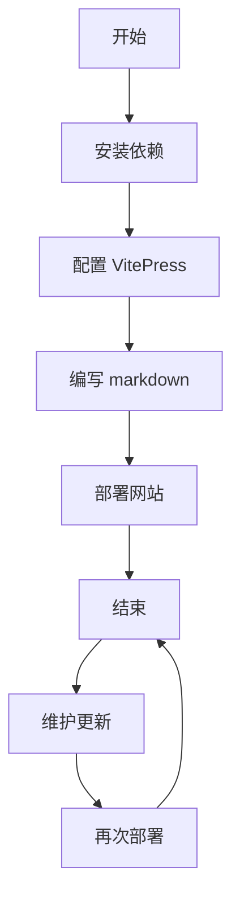
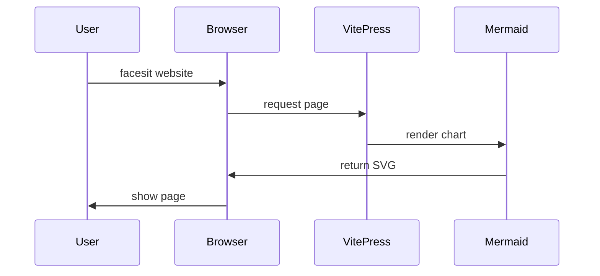
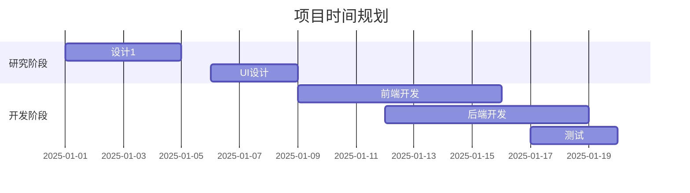
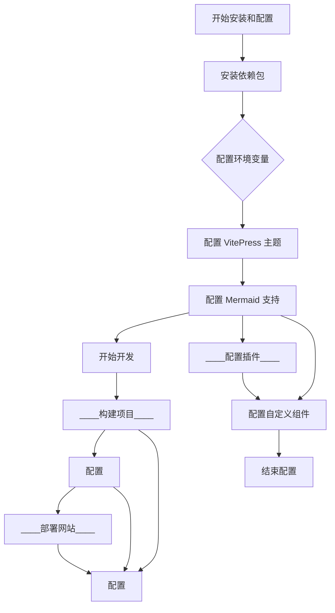

# Mermaid 弹框测试

这个页面用来测试 Mermaid 图表的点击弹框功能。

## 点击下方图表查看放大效果

### 流程图示例（默认尺寸）

### 序列图示例（自定义尺寸 80% x 70%）

### 甘特图示例（自定义尺寸 90% x 85%）

### 复杂流程图示例（自定义尺寸 95% x 90%）

## 功能描述

每个 Mermaid 图表现在都可以点击打开弹框，并放大到适合弹框的大小。点击图表任意位置即可打开弹框，点击右上角的关闭按钮或弹框外区域即可关闭。

### 新增功能：

1. **可配置弹框尺寸**：通过 `modalWidth` 和 `modalHeight` 属性设置弹框的宽度和高度，默认为 95%
2. **缩放功能**：弹框中提供 +、- 和重置按钮进行缩放，也可以使用鼠标滚轮缩放
3. **拖拽功能**：可以通过鼠标拖拽移动图表视图
4. **实时缩放比例显示**：显示当前图表的缩放比例

### 使用方法：

只需要使用标准的 mermaid 代码块语法即可，如上面的示例所示。