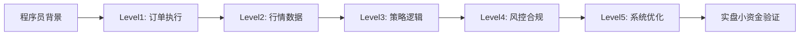

> 专为程序员转行私募/证券交易员设计，按认知路径分层整理。

## 🔰 Level 1：交易执行基础（先搞懂"怎么下单"）

| 术语 | 英文 | 核心解释 | 程序员类比 |
|------|------|----------|-----------|
| **滑点** | Slippage | 预期成交价与实际成交价的偏差，常因流动性不足或行情波动导致 | 类似"异步请求的响应延迟"，理论值≠实际值 |
| **市价单** | Market Order | 以当前市场最优价格立即成交 | `execute(price=best_available, urgency=high)` |
| **限价单** | Limit Order | 仅当价格≤指定价（买）或≥指定价（卖）时成交 | `if market_price <= limit_price: fill_order()` |
| **止损单** | Stop-Loss Order | 价格触及预设阈值时自动转为市价单平仓 | `on_price_trigger(threshold): close_position()` |
| **止盈单** | Take-Profit Order | 达到目标盈利价位后自动平仓 | 同止损，方向相反 |
| **冰山订单** | Iceberg Order | 大额订单仅显示小部分，剩余隐藏分批执行 | 类似"分页加载"，避免暴露全部意图 |
| **部分成交** | Partial Fill | 订单仅部分被撮合，剩余继续挂单 | 类似"批量接口返回部分成功" |
| **买一/卖一** | Best Bid/Ask | 订单簿中最高买价/最低卖价，即当前最优报价 | 优先队列的`peek()`操作 |
| **盘口/订单簿** | Order Book (Level-1/2) | 买卖挂单的价格-数量分布，Level-2含多档深度 | 类似"双向优先队列+快照数据" |
| **委比** | Order Imbalance | `(委买量-委卖量)/(委买量+委卖量)`，衡量短期多空力量 | 请求队列的"负载倾斜度" |

> ✅ 建议：先用模拟盘熟悉订单类型与盘口变化，理解"价格发现"的微观过程。

---

## 📈 Level 2：市场与行情理解（搞懂"数据从哪来"）

| 术语 | 英文 | 核心解释 | 关键要点 |
|------|------|----------|----------|
| **K线/OHLC** | Candlestick | 开盘(Open)、最高(High)、最低(Low)、收盘(Close)的可视化 | 回测与策略开发的基础数据单元 |
| **复权价格** | Adjusted Price | 消除分红、送股、配股影响的历史价格 | **回测必须用复权数据**，否则信号失真 |
| **前复权/后复权** | Forward/Backward Adjusted | 以当前/历史某点为基准调整价格 | 前复权适合实盘参考，后复权适合长期回测 |
| **跳空** | Gap | 因隔夜消息等导致价格不连续，K线出现空缺 | 需特殊处理，避免策略误判 |
| **流动性** | Liquidity | 资产快速买卖且价格冲击小的能力 | 小盘股/冷门合约滑点大，慎重仓 |
| **冲击成本** | Market Impact | 大额订单自身推动价格不利变动造成的隐性成本 | 与滑点相关但成因不同，算法交易核心优化目标 |
| **成交量/额** | Volume/Turnover | 成交股数/成交金额，验证价格变动的有效性 | "量在价先"是经典分析逻辑 |
| **程序化交易** | Program Trading | 通过预设算法自动执行交易，A股有专门监管要求[[49]] | 私募合规重点，需备案策略逻辑 |

> 💡 程序员优势：您熟悉`pandas`处理时间序列，K线本质就是`DataFrame`中的`[ts, O, H, L, C, V]`六列。

---

## 🧠 Level 3：策略与量化核心（搞懂"怎么赚钱"）

| 术语 | 英文 | 核心解释 | 应用场景 |
|------|------|----------|----------|
| **因子** | Factor | 能解释资产收益差异的变量（如动量、估值、波动率） | 多因子选股、智能贝塔策略 |
| **Alpha（α）** | Alpha | 超越市场基准的超额收益，策略能力的体现 | 私募产品核心卖点 |
| **Beta（β）** | Beta | 资产对市场整体波动的敏感度，系统性风险敞口 | 对冲、资产配置基础 |
| **夏普比率** | Sharpe Ratio | `(年化收益-无风险利率)/年化波动率`，衡量风险调整后收益 | 策略对比、产品评级核心指标 |
| **最大回撤** | Max Drawdown | 历史任意时点买入后可能遭受的最大亏损幅度 | 风控硬约束，客户最敏感指标 |
| **胜率/盈亏比** | Win Rate / Profit-Loss Ratio | 盈利交易占比 / 平均盈利÷平均亏损 | 策略特征刻画，非越高越好 |
| **过拟合** | Overfitting | 策略在历史数据表现优异但实盘失效 | 回测需做样本外检验、参数敏感性分析 |
| **未来函数** | Look-ahead Bias | 回测中使用了当时不可得的数据（如用收盘价决定当日开盘买卖） | **代码审查重点**，极易导致"纸上富贵" |
| **交易成本模型** | Transaction Cost Model | 综合佣金、印花税、滑点、冲击成本的估算框架 | 策略实盘可行性评估必备 |

> 🎯 私募策略开发流程：`想法→因子挖掘→回测验证→实盘小资金试跑→风控嵌入→规模放大`

---

## 🛡️ Level 4：风险与合规（搞懂"怎么不踩雷"）

| 术语 | 英文 | 核心解释 | 私募特殊性 |
|------|------|----------|-----------|
| **合格投资者** | Qualified Investor | 个人：金融资产≥300万或年收入≥50万；机构：净资产≥1000万[[8]] | 私募募集前提，销售环节必核查 |
| **开放日** | Subscription/Redemption Day | 私募产品允许申购/赎回的固定日期（如每月10日） | 流动性管理关键，非随时可进出 |
| **预警线/止损线** | Warning/Stop-loss Line | 净值下跌触发风控的阈值（如0.85预警、0.80强制止损） | 产品合同强制约定，触及需减仓或清盘 |
| **侧袋机制** | Side Pocket | 将流动性差/估值难资产隔离存放，保护主袋投资者 | 应对债券违约、停牌股等极端情况 |
| **穿透核查** | Look-through Verification | 追溯最终投资者身份与资金来源，防止代持、嵌套 | 监管检查重点，IT系统需支持标签管理 |
| **杠杆/融资** | Leverage / Margin | 借入资金放大收益（同时放大风险） | 私募证券基金杠杆比例有上限要求 |
| **敞口** | Exposure | 策略对某类风险（市场、行业、风格）的暴露程度 | 风控日报核心监控项 |

> ⚠️ 合规红线：程序化交易需向交易所报告策略类型、频率、风控措施[[50]]，"技术中立"不等于"合规免责"。

---

## ⚙️ Level 5：技术系统进阶（发挥程序员优势）

| 术语 | 英文 | 核心解释 | 技术关联 |
|------|------|----------|----------|
| **API接口** | Trading/Market Data API | 连接券商/交易所获取行情、下单的程序接口 | 您熟悉的REST/WebSocket/FIX协议 |
| **低延迟** | Low Latency | 从信号生成到订单成交的全链路毫秒级优化 | FPGA、内核旁路、共置部署等硬核技术 |
| **回测框架** | Backtesting Engine | 用历史数据模拟策略执行的系统 | 类似"单元测试+压力测试+混沌工程" |
| **事件驱动** | Event-Driven Architecture | 按行情tick、订单成交等事件触发策略逻辑 | 比向量化回测更贴近实盘，但开发复杂度高 |
| **订单路由** | Smart Order Routing (SOR) | 智能选择最优交易所/流动性源执行订单 | 类似"负载均衡+多活容灾"策略 |
| **实盘监控** | Live Monitoring & Alert | 实时跟踪策略P&L、持仓、异常行为 | 类似APM+日志告警系统，需支持秒级响应 |
| **风控引擎** | Risk Control Engine | 事前校验、事中监控、事后分析的自动化风控 | 规则引擎+流计算，需与交易系统低耦合 |

> 🛠️ 推荐技术栈（A股方向）：
> - 数据：`akshare`/`tushare`（免费）、`Wind`/`iFinD`（机构付费）
> - 回测：`backtrader`（灵活）、`vectorbt`（高速）、`Qlib`（微软开源）
> - 实盘：`vn.py`（国产开源，支持多券商）、`RQSDK`（米筐）
> - 监控：`Prometheus+Grafana` + 自定义告警规则

---

## 🗺️ 学习路径建议（程序员专属）

### 📌 三阶段行动清单：
1. **第1-2周**：用`vn.py`模拟盘跑通"限价单+止损单"，观察滑点与盘口变化
2. **第3-4周**：用`akshare`下载沪深300成分股数据，实现一个简单动量策略回测
3. **第5-6周**：阅读《私募投资基金监督管理暂行办法》，理解合格投资者、预警线等合规要求

### 📚 推荐延伸资料：
- 书籍：《主动投资组合管理》（Grinold & Kahn）、《量化交易：如何建立自己的算法交易事业》
- 法规：中国基金业协会《私募投资基金备案须知》《程序化交易管理暂行规定》
- 社区：JoinQuant聚宽、RiceQuant米筐的策略分享区（注意脱敏）

