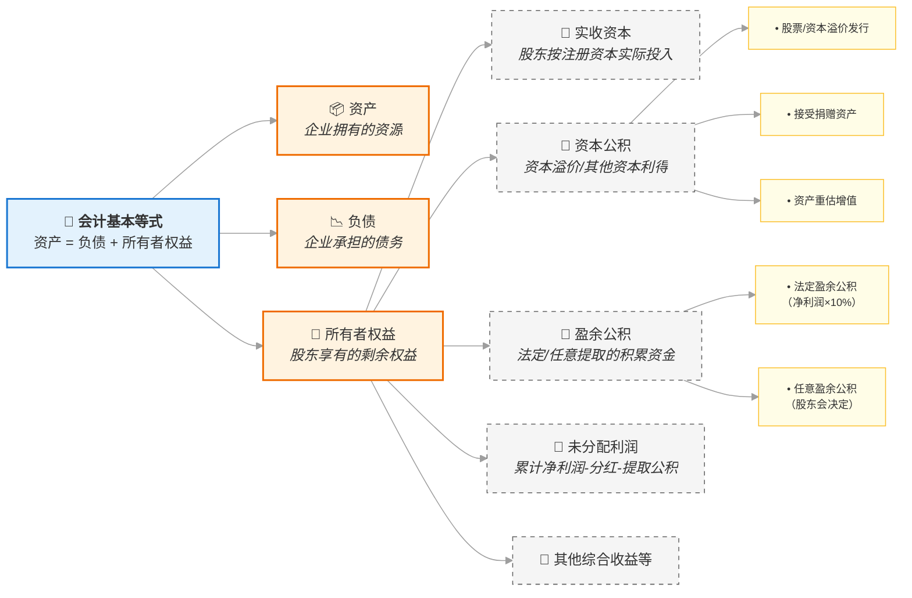

## 第一会计等式

> - 资产=负债+所有者权益
> - 会计恒等式

### 拆解三个要素

| 项目 | 通俗解释 | 典型例子 |
|------|----------|----------|
| **资产** | 企业控制的、能带来未来收益的资源 | 现金、存货、厂房、专利、应收账款 |
| **负债** | 企业欠别人的、需要偿还的债务 | 银行贷款、应付账款、预收客户款 |
| **所有者权益** | 资产减去负债后，真正属于股东的"净资产" | 实收资本、资本公积、盈余公积、未分配利润 |

### 🎯 一个生活化比喻：买房

``` plaintext
你买一套500万的房子：
- 首付150万（自己的钱）→ 所有者权益
- 贷款350万（银行的钱）→ 负债
- 房子本身500万 → 资产

✅ 资产(500万) = 负债(350万) + 所有者权益(150万)
```

> 房子增值到600万？→ 资产↑，所有者权益↑（未实现收益）  
> 你还了100万贷款？→ 资产(现金)↓，负债↓，等式依然平衡

## 会计等式与所有者权益结构图



## 公积

> 资本公积，盈余公积

- "公积" = 公共积累 - 归全体股东共同所有、不能随意分配、具有特定用途的留存收益或资本溢价
- 一个形象比喻

把企业想象成一个"家庭储蓄罐"：

| 项目 | 对应比喻 |
|------|---------|
| 实收资本 | 父母最初给的"启动资金"（写明了每人出多少） |
| 资本公积 | 亲戚额外塞的"红包"，说"这钱算大家的，别乱花" |
| 盈余公积 | 家里每年结余的工资，按规矩先存10%进"应急罐" |
| 未分配利润 | 剩下的结余，可以商量是继续存、装修还是分红包 |

> "公积"就是这个**不能随便动、有规矩的公共储蓄部分**。

## 股票`股本`与`面值`

- 股本 = 股票面值 × 股份总数，代表股东投入企业的法定注册资本

- 举个例子

> 某公司注册资本1亿元，每股面值1元，共发行1亿股 → **股本 = 1亿元**  
> 若你持有100万股，就占股本的1%，对应1%的表决权和分红权（同股同权前提下）

- A股绝大多数股票面值是1元/股，但法律并未强制统一为1元

- 面值 ≠ 发行价 ≠ 市价

```
📌 面值（票面金额）：印在股票上的"名义价值"，固定不变，A股多为1元
📌 发行价：IPO时卖给投资者的价格，通常＞面值（溢价发行）
📌 市价：二级市场交易价格，由供需决定，可远高于或低于面值
```

- 举例说明（以贵州茅台为例）

| 项目 | 数值 | 说明 |
|------|------|------|
| 面值 | 1元/股 | 法定名义价值，几十年不变 |
| 发行价（2001年IPO） | 31.39元/股 | 溢价30倍+，反映当时估值 |
| 当前市价（示例） | ~1500元/股 | 市场供需决定，与面值无直接关系 |

- 记忆口诀

```
面值是"名义"，1元是惯例；
股本看总数，权益按比例；
发行可溢价，市价随波流；
退市看1元，规则要记熟。
```

## 贴现 - 时间就是金钱

> - 贴现就是将未来的钱，按照一定利率（贴现率）折算成今天的价值。
> - 未来的钱不如现在的钱值钱

- 比如，现在给你 100 元，和一年后给你 100 元，你肯定选现在。  
  因为现在的 100 元可以存银行赚利息，一年后变成 105 元（假设利率 5%）。
- 反过来问：**一年后的 105 元，相当于现在的多少钱？**  
  计算：  
  $$
  105 \div (1+5\%) = 100
  $$
  这个过程就叫 **贴现** —— 把未来的金额，换算成“现在的价值”（现值）。

## 内在价值法

### 定义

**内在价值法** 是一种评估一家公司（或一项资产）真正值多少钱的方法。它的核心逻辑有两点：

- **资产的价值源于其未来能创造的收益**：买一家公司的股票，本质上是买它未来能给你带来的所有回报（比如分红、公司最终清算的价值等）。
- **未来的钱不如现在的钱值钱**：未来的回报需要用一个合理的“折扣率”（贴现率）折算成今天的价值，然后加总起来。

这个加总起来的“今天的总价值”，就是该资产的理论“内在价值”。

---

### 打个比方理解

假设你有一个“聚宝盆”，它承诺：

- 明年给你 100 元
- 后年再给你 100 元
- 大后年又给你 100 元
- … 并且每年都给你 100 元，永远不会停。

**问题：这个聚宝盆今天值多少钱？**

**不能简单地说“无穷多个100元加起来等于无穷大”**，因为未来的钱要打折扣。

- 明年的 100 元，今天可能只值 95 元（因为你存银行一年也能赚5元利息）
- 后年的 100 元，今天可能只值 90 元
- 以此类推...

**内在价值法** 做的就是这件事：

1. 预测聚宝盆未来每一年能给的现金（100元，100元，100元...）
2. 选择一个合适的“折扣率”（比如5%）
3. 把每一年的100元都按5%的折扣率，折算成“今天的价值”
4. 把这些“今天的价值”全部加起来

这个加总的结果，就是这个聚宝盆的“内在价值”。

---

### 对股票股价的分析

把上面的“聚宝盆”换成“一家公司”，然后需要考虑：持有这家公司的股票，未来的回报是什么？

常见的分析框架下，未来的回报可以是：

1. **每年分到的现金红利** → 对应的模型叫 **股利贴现模型**
2. **公司自由现金流的归属** → 对应的模型叫 **自由现金流贴现模型**
3. **公司股权层面的自由现金流** → 对应的模型叫 **股权资本自由现金流贴现模型**

无论用哪种模型，整个评估过程都是：

> 预测未来若干年（甚至永久）的某种现金流 →  
> 选择一个反映风险的贴现率 →  
> 把未来每一笔现金流都折算成今天的价值 →  
> 把这些现值加起来

这个最终加出来的总和，就是公司的 **内在价值**。如果这个内在价值 **高于** 当前的股票市场价格，那股票可能被低估了，值得买入；如果 **低于** 市场价格，可能被高估了。


