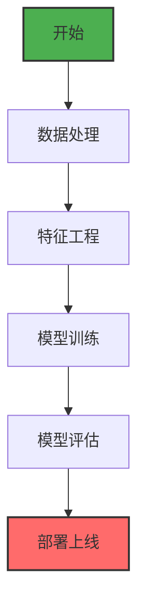

# 项目开发规范

本文档定义了面向开发人员的项目开发规范，确保代码质量和一致性。

## 1. Mermaid 图表规范

### 1.1 基本配置

- 本项目使用 `vitepress-plugin-mermaid` 插件
- 已配置全局 CSS 样式和 JavaScript 交互功能
- 支持鼠标滚轮缩放（0.1x - 5x）和拖拽移动
- 支持触摸设备（单指拖拽，双指缩放）
- 双击重置到默认状态

### 1.2 编写规范

- 使用标准的 Mermaid 语法，参考 [Mermaid 官方文档](https://mermaid.js.org/intro/)
- 图表类型支持：`flowchart`、`graph`、`sequence`、`classDiagram`、`stateDiagram`、`erDiagram`、`pie`、`gantt`
- **节点定义**：使用有意义的标识符，如 `A[开始]`、`B[数据处理]`、`C[输出]`
- **连接关系**：使用清晰的箭头描述，如 `-->`、`--->`、`-.->`
- **子图和分组**：合理使用 `subgraph` 来组织复杂图表结构
- **样式定制**：可以通过 class 定义样式，但保持简洁

### 1.3 示例模板



### 1.4 交互功能使用

- **缩放**：鼠标滚轮向前滚动放大，向后滚动缩小
- **拖拽**：按住左键拖拽移动图表
- **重置**：双击图表恢复原始大小和位置
- **触摸**：移动设备支持触摸操作

## 2. LaTeX 数学公式规范

### 2.1 基本配置

- 本项目使用 `@mdit/plugin-katex` 插件
- 已配置 LaTeX 样式：`https://cdn.jsdelivr.net/npm/katex@0.16.8/dist/katex.min.css`
- 详细的 LaTeX 规范请参考：`docs-source/other/latex-spec.md`

### 2.2 编写规范

- **行内公式**：使用单个 `$` 包围
  - **行间公式**：使用 `$$` 包围（独占一行）
- **向量和矩阵**：使用 `\mathbf{}` 表示粗体，`\mathit{}` 表示斜体
- **特殊符号**：使用标准 LaTeX 命令，如 `\frac`、`\sqrt`、`\sum`、`\int`
- **希腊字母**：使用 `\alpha`、`\beta`、`\gamma`、`\theta` 等
- **上下标**：使用 `^` 表示上标，`_` 表示下标

### 2.3 最佳实践

- **避免中文符号**：在数学公式中避免使用中文标点符号
- **使用标准命令**：优先使用 `\frac` 而不是手动构造分数
- **矩阵格式**：使用 `\begin{pmatrix}` 和 `\end{pmatrix}`
- **公式解释**：复杂公式后可以添加文字说明

### 2.4 常用公式模板

```markdown
<!-- 行内公式 -->
$E = mc^2$

<!-- 独占一行的公式 -->
$$F = ma$$

<!-- 分数 -->
$$\frac{d}{dx}\left(\int_{0}^{x} f(t) dt\right) = f(x)$$

<!-- 矩阵 -->
$$\mathbf{A} = \begin{pmatrix} 1 & 2 \\ 3 & 4 \end{pmatrix}$$
```

## 3. 代码编写规范

### 3.1 文件结构

- `docs-source/` - 源文档目录，存放所有 Markdown 文件
- `docs-source/.vitepress/` - VitePress 配置和主题文件
- `docs-source/assets/` - 静态资源文件（图片、文档等）

### 3.2 命名规范

- 使用 kebab-case：`embeddings-02.md`、`machine-learning.md`
- 避免特殊字符和空格
- 文件名应简明反映内容主题

### 3.3 Front Matter 规范

```yaml
---
title: 文章标题
description: 简短描述
date: YYYY-MM-DD
tags: [标签1, 标签2]
---
```

### 3.4 内容结构

- 使用 `<BlogPost>` 组件包装内容
- 标题层级：使用 `#` 表示一级标题，`##` 表示二级标题
- 代码块：使用三个反引号标识语言类型
- 图片：使用相对路径，放在 `assets/` 目录下

### 3.5 组件使用

项目包含丰富的 Vue 组件库，按功能分类如下：

#### 布局组件 (Layout Components)

- `<Layout>` - 主布局组件，提供固定标题功能和侧边栏集成
- `<PostLayout>` - 文章专用布局，包含相关文章侧边栏
- `<fixed-title>` - 固定标题组件，滚动时显示页面标题

#### 博客/文章组件 (Blog/Article Components)

- `<BlogPost>` - 文章头部组件，包含日期格式化和元数据
- `<ArticleList>` - 文章列表组件，支持年月分组和折叠功能
- `<ArticleListPage>` - 专用文章列表页面组件
- `<TimeArticleList>` - 基于时间的文章列表组件
- `<RecentArticles>` - 最新文章显示组件，集成RSS订阅和模态框
- `<HistoryTimeline>` - 文章历史时间轴组件

#### 侧边栏组件 (Sidebar Components)

- `<SidebarArticleList>` - 侧边栏文章列表，支持按目录过滤
- `<TestSidebar>` - 开发测试用侧边栏组件

#### UI 组件 (UI Components)

- `<ImageModal>` - 图片模态框组件，支持点击放大查看
- `<CategoryCards>` - 分类卡片网格组件，带导航功能
- `<TabbedSection>` - 标签页内容区域组件
- `<ShowAllTitle>` - "显示全部"标题组件

#### 日期/时间组件 (Date/Time Components)

- `<PostDate>` - 文章日期格式化组件
  - 两个版本：`docs-source/.vitepress/theme/components/` 和 `docs-source/.vitepress/components/`

#### 页脚/文档组件 (Footer/Documentation Components)

- `<DocFooter>` - 文档页脚组件
- `<VPDocFooter>` - VitePress 文档页脚组件
- `<DocLayout>` - 文档布局组件

#### 组件特点

- **数据集成**：所有组件与 JSON 数据文件集成（`/data/list.json`、`/data/category.json`）
- **错误处理**：包含加载状态、错误处理和重试功能
- **响应式设计**：支持移动端和桌面端
- **交互功能**：丰富的用户交互体验

#### 使用示例

```vue
<!-- 使用文章列表组件 -->
<ArticleList :articles="articles" />

<!-- 使用图片模态框 -->
<ImageModal :src="imageSrc" :alt="imageAlt" />

<!-- 使用分类卡片 -->
<CategoryCards :categories="categories" />
```

## 4. 构建和部署规范

### 4.1 开发环境脚本

项目支持三种运行模式：开发、预览和生产。

#### 开发模式 (`npm run dev`)

- 用于本地开发和调试
- 启动热重载服务器
- 自动更新数据文件：`npm run update:data:fixed`
- 适用于开发过程中的实时预览

#### 预览模式 (`npm run preview`)

- 模拟生产环境的本地预览
- 与生产版本代码完全一致
- 构建完成后复制到 `publish` 目录
- 在端口 5174 启动静态服务器
- 推荐在部署前使用此模式验证

#### 生产模式 (`npm run build`)

- 构建生产就绪的静态文件
- 优化资源大小和性能
- 构建完成后复制到 `docs` 目录（用于 GitHub Pages 部署）

#### 清理命令 (`npm run clean`)

- 清理构建输出目录（publish 和 docs）
- 在执行预览或生产构建前建议先运行此命令
- 确保构建环境的清洁性

#### 使用流程

```bash
# 标准构建流程
npm run clean    # 可选：清理旧构建文件
npm run preview  # 本地预览，验证构建结果
npm run build    # 构建生产版本

# 开发流程
npm run dev      # 开发模式，实时预览
```

### 4.2 静态资源管理

#### docs-source/public 目录

- `docs-source/public` 目录存放需要在不同构建环境中使用的静态文件
- **预览环境**：文件自动复制到 `publish` 目录
- **生产环境**：文件自动复制到 `docs` 目录
- 确保文件在所有构建环境中都能正确访问

#### 当前包含的文件

- `favicon.ico` - 网站图标
- `mermaid-interaction.js` - Mermaid 图表交互功能脚本

#### 使用指南

- 将需要在所有环境中访问的静态文件放入此目录
- 避免在页面中硬编码路径，应使用 `withBase` 函数处理路径

### 4.3 数据文件访问规范

#### withBase 函数使用

- 项目中的数据文件存放在 `docs-source/data` 目录
- 在页面中访问数据文件时，必须使用 `withBase` 函数确保正确的路径解析
- **目的**：保证在预览和生产环境中都能正确访问到数据文件

#### 数据文件列表

- `category.json` - 分类信息数据
- `history.json` - 历史记录数据
- `list.json` - 文章列表数据

#### 使用示例

```javascript
// 错误方式 - 可能在某些环境中失效
const data = await fetch('/data/list.json')

// 正确方式 - 使用 withBase 确保路径正确
const data = await fetch(withBase('/data/list.json'))
```

### 4.4 环境变量

- `NODE_ENV=production` - 生产环境
- `DEPLOY_ENV=GITHUB_PAGES` - GitHub Pages 部署

## 5. 代码质量规范

### 5.1 通用原则

- 保持代码简洁明了
- 添加必要的注释
- 避免过度工程化
- 遵循现有项目风格

### 5.2 Markdown 编写

- 使用标准 Markdown 语法
- 合理使用标题层级
- 保持段落简短
- 正确使用代码块和引用

### 5.3 性能考虑

- 避免过大的图片资源
- 合理使用 Mermaid 图表复杂度
- 优化 LaTeX 公式渲染性能

## 6. 常见问题解决

### 6.1 Mermaid 图表问题

- **问题**：图表显示不完整或样式异常
- **解决**：
  1. 检查语法是否符合 Mermaid 规范
  2. 使用浏览器开发者工具检查渲染结果
  3. 参考 Mermaid 官方文档
  4. 使用交互功能进行调试

### 6.2 LaTeX 公式问题

- **问题**：公式无法正确渲染或显示异常
- **解决**：
  1. 检查 LaTeX 语法是否正确
  2. 参考 `docs-source/other/latex-spec.md` 规范
  3. 使用简化版本进行测试
  4. 检查括号匹配和特殊字符转义

### 6.3 构建问题

- **问题**：构建失败或页面无法访问
- **解决**：
  1. 检查 VitePress 配置文件语法
  2. 检查依赖是否正确安装
  3. 清理构建缓存：`rm -rf node_modules/.vite`
  4. 检查端口占用情况

## 7. BlogPost 组件替代方案

### 7.1 问题背景

- **LSP解析错误**：使用 `<BlogPost>` Vue组件标签时出现 "Document has been closed" 错误
- **错误原因**：语言服务器在处理Vue组件标签时可能出现文档状态管理问题
- **解决方案**：使用markdown容器语法替代Vue组件标签

### 7.2 实现原理

- **核心插件**：`markdown-it-container` 插件处理自定义容器语法
- **语法格式**：使用 `::: blog-post` 和 `:::` 包裹内容
- **转换机制**：markdown-it 将容器语法转换为 `<ClientOnly><VPCustomContainer>...</VPCustomContainer></ClientOnly>`
- **组件功能**：`VPCustomContainer.vue` 访问页面frontmatter数据并渲染相同结构

### 7.3 语法使用

```markdown
::: blog-post

## 文章标题

这里是文章内容...

:::
```

### 7.4 技术优势

- **LSP友好**：避免Vue组件标签触发的语言服务器解析问题
- **功能保持**：完全保持原有标题、日期、描述的显示功能
- **样式兼容**：应用相同的CSS样式，保持视觉效果一致
- **共存性**：新旧语法可以在项目中同时使用

### 7.5 组件结构

- **VPCustomContainer.vue**：核心组件，处理frontmatter数据
- **config.ts配置**：注册markdown-it-container插件
- **theme/index.js**：注册Vue组件

### 7.6 使用建议

1. **逐步迁移**：可选择性地将markdown文件的 `<BlogPost>` 标签替换为 `::: blog-post` 语法
2. **保持一致性**：在新创建的文件中优先使用容器语法
3. **测试验证**：确保标题、日期、描述等frontmatter信息正确显示

---

## 8. 工具和资源

### 8.1 开发工具推荐

- **IDE**：VS Code（推荐安装相关插件）
- **浏览器**：Chrome 或 Firefox（开发者工具）
- **版本控制**：Git

### 8.2 有用链接

- [VitePress 官方文档](https://vitepress.dev/)
- [Mermaid 官方文档](https://mermaid.js.org/)
- [KaTeX 文档](https://katex.org/)
- [Markdown 语法指南](https://www.markdownguide.org/)

### 8.3 模板和示例

- 查看 `docs-source/` 目录下的现有文件作为参考
- 特别是包含 Mermaid 图表和 LaTeX 公式的文件
- 使用项目中的组件作为模板

---

**更新日志**：

- 2025-12-04: 新增 BlogPost 组件替代方案章节，解决LSP解析错误问题
- 2025-12-01: 新增构建脚本详细说明、静态资源管理规范、数据文件访问规范、Vue组件完整列表
- 2025-11-29: 初始版本，包含 Mermaid 和 LaTeX 规范
