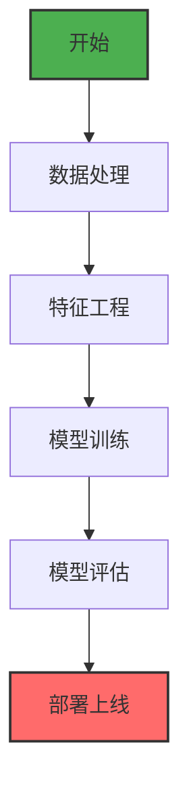

# 项目开发规范

本文档定义了面向开发人员的项目开发规范，确保代码质量和一致性。

## 1. Mermaid 图表规范

### 1.1 基本配置
- 本项目使用 `vitepress-plugin-mermaid` 插件
- 已配置全局 CSS 样式和 JavaScript 交互功能
- 支持鼠标滚轮缩放（0.1x - 5x）和拖拽移动
- 支持触摸设备（单指拖拽，双指缩放）
- 双击重置到默认状态

### 1.2 编写规范
- 使用标准的 Mermaid 语法，参考 [Mermaid 官方文档](https://mermaid.js.org/intro/)
- 图表类型支持：`flowchart`、`graph`、`sequence`、`classDiagram`、`stateDiagram`、`erDiagram`、`pie`、`gantt`
- **节点定义**：使用有意义的标识符，如 `A[开始]`、`B[数据处理]`、`C[输出]`
- **连接关系**：使用清晰的箭头描述，如 `-->`、`--->`、`-.->`
- **子图和分组**：合理使用 `subgraph` 来组织复杂图表结构
- **样式定制**：可以通过 class 定义样式，但保持简洁

### 1.3 示例模板


### 1.4 交互功能使用
- **缩放**：鼠标滚轮向前滚动放大，向后滚动缩小
- **拖拽**：按住左键拖拽移动图表
- **重置**：双击图表恢复原始大小和位置
- **触摸**：移动设备支持触摸操作

## 2. LaTeX 数学公式规范

### 2.1 基本配置
- 本项目使用 `@mdit/plugin-katex` 插件
- 已配置 LaTeX 样式：`https://cdn.jsdelivr.net/npm/katex@0.16.8/dist/katex.min.css`
- 详细的 LaTeX 规范请参考：`docs-source/other/latex-spec.md`

### 2.2 编写规范
- **行内公式**：使用单个 `$` 包围
  - **行间公式**：使用 `$$` 包围（独占一行）
- **向量和矩阵**：使用 `\mathbf{}` 表示粗体，`\mathit{}` 表示斜体
- **特殊符号**：使用标准 LaTeX 命令，如 `\frac`、`\sqrt`、`\sum`、`\int`
- **希腊字母**：使用 `\alpha`、`\beta`、`\gamma`、`\theta` 等
- **上下标**：使用 `^` 表示上标，`_` 表示下标

### 2.3 最佳实践
- **避免中文符号**：在数学公式中避免使用中文标点符号
- **使用标准命令**：优先使用 `\frac` 而不是手动构造分数
- **矩阵格式**：使用 `\begin{pmatrix}` 和 `\end{pmatrix}`
- **公式解释**：复杂公式后可以添加文字说明

### 2.4 常用公式模板
```markdown
<!-- 行内公式 -->
$E = mc^2$

<!-- 独占一行的公式 -->
$$F = ma$$

<!-- 分数 -->
$$\frac{d}{dx}\left(\int_{0}^{x} f(t) dt\right) = f(x)$$

<!-- 矩阵 -->
$$\mathbf{A} = \begin{pmatrix} 1 & 2 \\ 3 & 4 \end{pmatrix}$$
```

## 3. 代码编写规范

### 3.1 文件结构
- `docs-source/` - 源文档目录，存放所有 Markdown 文件
- `docs-source/.vitepress/` - VitePress 配置和主题文件
- `docs-source/assets/` - 静态资源文件（图片、文档等）

### 3.2 命名规范
- 使用 kebab-case：`embeddings-02.md`、`machine-learning.md`
- 避免特殊字符和空格
- 文件名应简明反映内容主题

### 3.3 Front Matter 规范
```yaml
---
title: 文章标题
description: 简短描述
date: YYYY-MM-DD
tags: [标签1, 标签2]
---
```

### 3.4 内容结构
- 使用 `<BlogPost>` 组件包装内容
- 标题层级：使用 `#` 表示一级标题，`##` 表示二级标题
- 代码块：使用三个反引号标识语言类型
- 图片：使用相对路径，放在 `assets/` 目录下

### 3.5 组件使用
- 已有组件：
  - `<PostDate>` - 显示文章日期
  - `<ImageModal>` - 图片模态框
  - `<ArticleList>` - 文章列表
  - `<SidebarArticleList>` - 侧边栏文章列表

## 4. Git 工作流规范

### 4.1 分支管理
- 主分支：`main`
- 功能分支：`feature/功能名称`
- 修复分支：`fix/问题描述`
- 发布分支：`release/版本号`

### 4.2 提交信息规范
```bash
git commit -m "type(scope): subject

body

detailed explanation

🤖 Generated with [Claude Code](https://claude.com/claude-code)

Co-Authored-By: Claude <noreply@anthropic.com>"
```

**类型**：
- `feat`: 新功能
- `fix`: 修复问题
- `docs`: 文档更新
- `style`: 代码格式调整
- `refactor`: 代码重构
- `test`: 测试相关

**示例**：
- `feat(mermaid): add zoom and pan functionality`
- `fix(latex): resolve equation rendering issue`
- `docs(readme): update project documentation`

## 5. 构建和部署规范

### 5.1 开发环境
```bash
# 安装依赖
npm install

# 本地开发
npm run dev

# 构建生产版本
npm run build

# 预览构建结果
npm run preview
```

### 5.2 环境变量
- `NODE_ENV=production` - 生产环境
- `DEPLOY_ENV=GITHUB_PAGES` - GitHub Pages 部署

## 6. 代码质量规范

### 6.1 通用原则
- 保持代码简洁明了
- 添加必要的注释
- 避免过度工程化
- 遵循现有项目风格

### 6.2 Markdown 编写
- 使用标准 Markdown 语法
- 合理使用标题层级
- 保持段落简短
- 正确使用代码块和引用

### 6.3 性能考虑
- 避免过大的图片资源
- 合理使用 Mermaid 图表复杂度
- 优化 LaTeX 公式渲染性能

## 7. 常见问题解决

### 7.1 Mermaid 图表问题
- **问题**：图表显示不完整或样式异常
- **解决**：
  1. 检查语法是否符合 Mermaid 规范
  2. 使用浏览器开发者工具检查渲染结果
  3. 参考 Mermaid 官方文档
  4. 使用交互功能进行调试

### 7.2 LaTeX 公式问题
- **问题**：公式无法正确渲染或显示异常
- **解决**：
  1. 检查 LaTeX 语法是否正确
  2. 参考 `docs-source/other/latex-spec.md` 规范
  3. 使用简化版本进行测试
  4. 检查括号匹配和特殊字符转义

### 7.3 构建问题
- **问题**：构建失败或页面无法访问
- **解决**：
  1. 检查 VitePress 配置文件语法
  2. 检查依赖是否正确安装
  3. 清理构建缓存：`rm -rf node_modules/.vite`
  4. 检查端口占用情况

## 8. 工具和资源

### 8.1 开发工具推荐
- **IDE**：VS Code（推荐安装相关插件）
- **浏览器**：Chrome 或 Firefox（开发者工具）
- **版本控制**：Git

### 8.2 有用链接
- [VitePress 官方文档](https://vitepress.dev/)
- [Mermaid 官方文档](https://mermaid.js.org/)
- [KaTeX 文档](https://katex.org/)
- [Markdown 语法指南](https://www.markdownguide.org/)

### 8.3 模板和示例
- 查看 `docs-source/` 目录下的现有文件作为参考
- 特别是包含 Mermaid 图表和 LaTeX 公式的文件
- 使用项目中的组件作为模板

---

**更新日志**：
- 2025-11-29: 初始版本，包含 Mermaid 和 LaTeX 规范